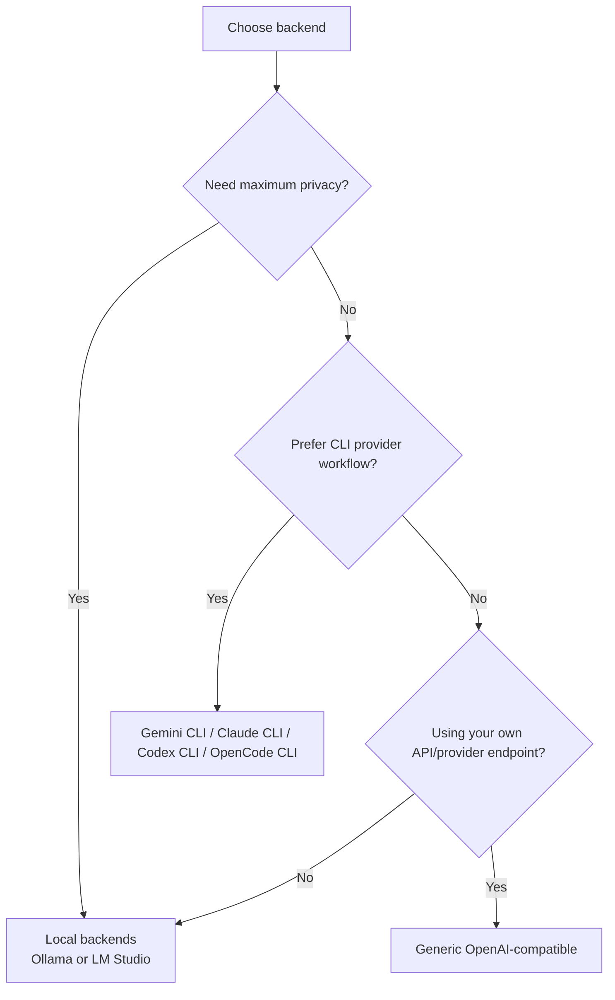

# Backends Overview

Burp AI Agent is backend-agnostic. You can run local models, cloud CLI providers, or OpenAI-compatible HTTP providers.

## Backend Selection Guide

## Supported Backends

| Backend | Type | Privacy Posture | Typical Use |
| :--- | :--- | :--- | :--- |
| **Ollama** | Local HTTP | High | Offline or strict data control. |
| **LM Studio** | Local HTTP | High | Local models with GUI management. |
| **Generic (OpenAI-compatible)** | HTTP | Medium | Any compatible provider endpoint. |
| **Gemini CLI** | Cloud CLI | Medium | Large-context cloud workflows. |
| **Claude CLI** | Cloud CLI | Medium | Reasoning-heavy analysis. |
| **Codex CLI** | Cloud CLI | Medium | Code/security analysis and PoCs. |
| **OpenCode CLI** | Cloud CLI | Medium | Multi-provider via one CLI. |

## Setup Path

1. Open the **AI Backend** tab in Settings.
2. Select **Preferred Backend** for new sessions.
3. Configure command/URL/model/auth fields for that backend.
4. Use **Test connection** where available.
5. Start with [Privacy Modes](../privacy/privacy-modes.md) set appropriately.



Configure executable command and ensure authentication is already completed in the same runtime environment as Burp.

Windows tip: with npm-installed tools, prefer full shim paths like `C:\\Users\\<you>\\AppData\\Roaming\\npm\\claude.cmd`.



Configure base URL, model, optional API key, and extra headers.

For local servers, verify the service is running and port is reachable from Burp.



Drop custom backend JARs implementing `AiBackendFactory` into:

`~/.burp-ai-agent/backends/`

Restart Burp to load them.



## Cross-Platform CLI Detection

CLI backends depend on environment inheritance from the Burp process.

* If Burp starts from GUI, shell `PATH` and env vars may differ.
* Use explicit command paths when detection fails.
* For Windows + WSL bridge patterns, see backend-specific pages and [Troubleshooting](../reference/troubleshooting.md).

## Burp Edition Notes

Backends are available in both Community and Professional editions. MCP tool availability still depends on Burp edition and tool safety gates.

## Next Steps

* [Ollama (Local)](ollama.md)
* [LM Studio (Local)](lm-studio.md)
* [Generic (OpenAI-compatible)](openai-compatible.md)
* [Gemini CLI](gemini-cli.md)
* [Claude CLI](claude-cli.md)
* [Codex CLI](codex-cli.md)
* [OpenCode CLI](opencode-cli.md)
