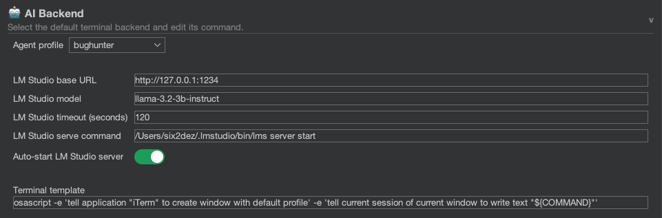

# Overview

The Burp AI Agent is model-agnostic. It uses a "Supervisor" system to manage connections to various AI providers. You can choose the backend that best fits your security, cost, and performance needs.

## Supported Backends

| Backend        | Type  | Privacy | Best For                                       |
| -------------- | ----- | ------- | ---------------------------------------------- |
| **Ollama**     | Local | High    | Offline analysis, strict privacy requirements. |
| **LM Studio**  | Local | High    | GUI-based model management, Windows users.     |
| **Gemini CLI** | Cloud | Medium  | Large context window analysis.                 |
| **Claude CLI** | Cloud | Medium  | Reasoning and logic analysis.                  |
| **Codex CLI**  | Cloud | Medium  | Code analysis and PoC generation.              |
| **OpenCode**   | Cloud | Medium  | Multi-provider support via single CLI.         |

## General Configuration

1. Navigate to **Settings** → **AI Backend**.
2. **Preferred Backend**: Choose the backend you want to use for _new_ chat sessions.
3. **Command / URL**:
   * **CLI Backends**: Provide the shell command (e.g., `gemini`, `claude`). Ensure these tools are installed and authenticated in your OS terminal.
   * **HTTP Backends**: Provide the URL (e.g., `http://127.0.0.1:11434` for Ollama).

## Backend Types

### CLI Backends

CLI backends (Gemini, Claude, Codex, OpenCode) are launched as subprocesses. The extension's **Supervisor** manages their lifecycle, including health checks, auto-restart on crash, and session binding.

### HTTP Backends

HTTP backends (Ollama, LM Studio) communicate via direct HTTP API calls. No subprocess is spawned. The extension connects to an already-running server, or can optionally auto-start it.

## Custom Backends (Drop-in JARs)

The extension supports **external backend plugins** via Java's ServiceLoader mechanism. To add a custom backend:

1. Implement the `AiBackendFactory` interface in a JAR.
2. Include a `META-INF/services` file pointing to your implementation.
3. Drop the JAR into `~/.burp-ai-agent/backends/`.
4. Restart Burp Suite. The new backend will appear in the dropdown.

This allows teams to integrate proprietary or enterprise AI services without modifying the extension's source code.

## Burp Pro vs Community

All backends work with both Burp Suite Community and Professional editions. However, some MCP tools exposed to backends (like Scanner-related tools) are only available on Burp Pro.
