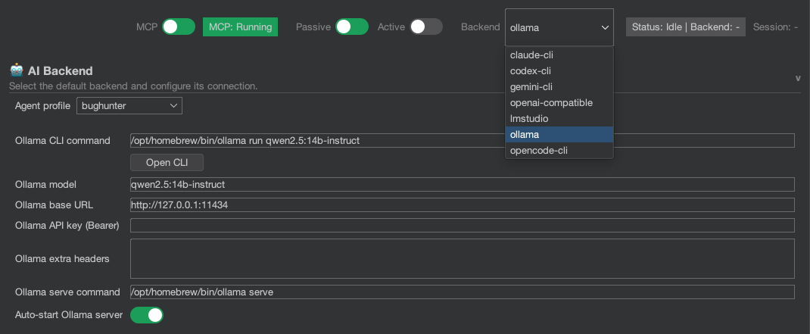

# Backends Overview

The Burp AI Agent is model-agnostic. It uses a "Supervisor" system to manage connections to various AI providers. You can choose the backend that best fits your security, cost, and performance needs.

## Model Capability Matrix

| Task | Recommended Model | Reason |
| :--- | :--- | :--- |
| **Complex JS Analysis** | Gemini 1.5 Pro | Massive context window (1M+ tokens). |
| **PoC Generation** | Claude 3.5 Sonnet | Market leader in logic and coding. |
| **Quick Summaries** | Llama 3.1 8B (Ollama) | Extremely fast and 100% private. |
| **General Audit** | GPT-4o / Codex | Very balanced and versatile. |

## Estimated Cost Comparison

If using cloud backends, these are the approximate costs per 1,000 requests of medium size (~2K tokens per interaction):

| Provider | Model | Approx. Cost (1K reqs) | Advantage |
| :--- | :--- | :--- | :--- |
| **Anthropic** | Claude 3.5 Sonnet | ~$6.00 USD | Superior technical quality. |
| **Google Cloud** | Gemini 1.5 Flash | ~$0.15 USD | Extremely inexpensive. |
| **OpenAI** | GPT-4o | ~$5.00 USD | Highly reliable. |
| **Ollama** | Llama 3 / Mistral | **$0.00 USD** | Total privacy, electricity cost only. |

*Prices based on official API rates as of early 2025: Claude Sonnet ($3/M input), Gemini Flash ($0.075/M input).*

## Comparison Table

| Backend | Type | Privacy | Cost | Best For |
| :--- | :--- | :--- | :--- | :--- |
| **Ollama** | Local | ⭐⭐⭐⭐⭐ (High) | Free | Offline analysis, high privacy requirements. |
| **LM Studio** | Local | ⭐⭐⭐⭐⭐ (High) | Free | Windows users, easy UI-based model management. |
| **Gemini CLI** | Cloud | ⭐⭐⭐ (Medium) | Varies (Free tier avail) | Large context window (1M+ tokens), multimodal analysis. |
| **Claude CLI** | Cloud | ⭐⭐⭐ (Medium) | Paid | High-quality reasoning, complex logic analysis. |
| **Codex CLI** | Cloud | ⭐⭐⭐ (Medium) | Paid | Code analysis, generating specific exploits. |
| **OpenCode** | Cloud | ⭐⭐⭐ (Medium) | Paid | Open-source models via API. |

## General Configuration

1.  Navigate to **Settings** → **AI Backend**.
2.  **Preferred Backend**: Choose the backend you want to use for *new* chat sessions.
3.  **Command / URL**:
    *   **CLI Backends**: Provide the shell command (e.g., `gemini`, `claude`). Ensure these tools are installed and authenticated in your OS terminal.
    *   **HTTP Backends**: Provide the URL (e.g., `http://127.0.0.1:11434` for Ollama).

## Backend Types

### CLI Backends
CLI backends (Gemini, Claude, Codex, OpenCode) are launched as subprocesses. The extension's **Supervisor** manages their lifecycle, including health checks, auto-restart on crash, and session binding.

### HTTP Backends
HTTP backends (Ollama, LM Studio) communicate via direct HTTP API calls. No subprocess is spawned. The extension connects to an already-running server, or can optionally auto-start it.

## External Terminal Mode

All CLI backends support two launch modes:
*   **Embedded**: The extension manages the process internally and streams output to the chat panel.
*   **External Terminal**: The CLI opens in your system's terminal application. Useful for interactive debugging.

Default terminal templates:
*   **macOS**: iTerm2
*   **Windows**: `cmd.exe`
*   **Linux**: `x-terminal-emulator`

Configure via **Settings → AI Backend → External Terminal Template**.

## Custom Backends (Drop-in JARs)

The extension supports **external backend plugins** via Java's ServiceLoader mechanism. To add a custom backend:

1.  Implement the `AiBackendFactory` interface in a JAR.
2.  Include a `META-INF/services` file pointing to your implementation.
3.  Drop the JAR into `~/.burp-ai-agent/backends/`.
4.  Restart Burp Suite. The new backend will appear in the dropdown.

This allows teams to integrate proprietary or enterprise AI services without modifying the extension's source code.

## Burp Pro vs Community

All backends work with both Burp Suite Community and Professional editions. However, some MCP tools exposed to backends (like Scanner-related tools) are only available on Burp Pro.
