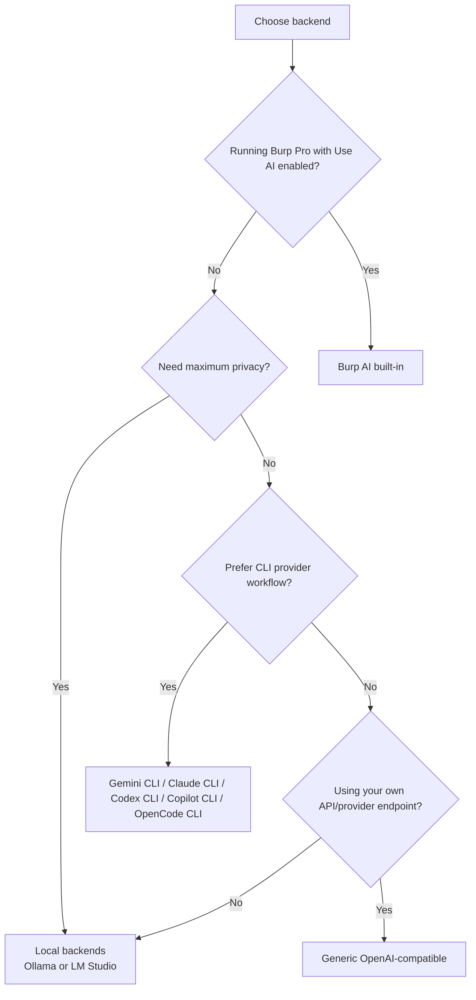

# Backends Overview

Custom AI Agent is backend-agnostic. You can run the built-in Burp AI backend, local models, cloud CLI providers, or OpenAI-compatible HTTP providers. Ten backends ship with the extension, and additional ones can be dropped in as JARs.

## Backend Selection Guide

```mermaid
flowchart TD
    Start[Choose backend]
    BurpPro{Running Burp Pro with Use AI enabled?}
    Privacy{Need maximum privacy?}
    Cli{Prefer CLI provider workflow?}
    OwnApi{Using your own API/provider endpoint?}

    Start --> BurpPro
    BurpPro -->|Yes| BurpAi[Burp AI built-in]
    BurpPro -->|No| Privacy

    Privacy -->|Yes| Local[Local backends\nOllama or LM Studio]
    Privacy -->|No| Cli

    Cli -->|Yes| CloudCli[Gemini CLI / Claude CLI / Codex CLI / Copilot CLI / OpenCode CLI]
    Cli -->|No| OwnApi

    OwnApi -->|Yes| Generic[Generic OpenAI-compatible]
    OwnApi -->|No| Local
```

## Supported Backends

| Backend | Type | Privacy Posture | Typical Use |
| :--- | :--- | :--- | :--- |
| **Burp AI (built-in)** | In-process (Burp Pro) | High (no extra outbound) | Burp Pro users with AI credits and **Use AI for extensions** enabled. |
| **Ollama** | Local HTTP | High | Offline or strict data control. |
| **LM Studio** | Local HTTP | High | Local models with GUI management. |
| **NVIDIA NIM** | Cloud HTTP | Medium | NVIDIA-hosted models (e.g. `moonshotai/kimi-k2.5`) via `integrate.api.nvidia.com`. |
| **Generic (OpenAI-compatible)** | HTTP | Medium | Any compatible provider endpoint. |
| **Gemini CLI** | Cloud CLI | Medium | Large-context cloud workflows. |
| **Claude CLI** | Cloud CLI | Medium | Reasoning-heavy analysis. |
| **Codex CLI** | Cloud CLI | Medium | Code/security analysis and PoCs. |
| **Copilot CLI** | Cloud CLI | Medium | Multi-model analysis via GitHub infrastructure. |
| **OpenCode CLI** | Cloud CLI | Medium | Multi-provider via one CLI. |

### Capability Matrix

| Backend | Streaming | JSON mode | System role | Auto-start |
| :--- | :-: | :-: | :-: | :-: |
| **Burp AI (built-in)** | No (single `execute`) | No — enforced via prompt | Yes | N/A |
| **Ollama** | Yes (SSE) | Yes (`format=json`) | Yes | Yes (`ollama serve`) |
| **LM Studio** | Yes (SSE) | Yes (`response_format=json_object`) | Yes | Yes (`lms server start`) |
| **NVIDIA NIM** | Yes (SSE) | Yes (`response_format=json_object`) | Yes | N/A |
| **Generic OpenAI-compatible** | Yes (SSE) | Yes (`response_format=json_object`) | Yes | N/A |
| **Gemini CLI** | Line-by-line stdout | No | No (prepended) | N/A |
| **Claude CLI** | Line-by-line stdout | No | No (prepended) | N/A |
| **Codex CLI** | Line-by-line stdout | No | No (prepended) | N/A |
| **Copilot CLI** | Line-by-line stdout | No | No (prepended) | N/A |
| **OpenCode CLI** | Line-by-line stdout | No | No (prepended) | N/A |

See [Agent Profiles → How It Works](../user-guide/agent-profiles.md#how-it-works) for how the system-role difference affects profile delivery.

## Setup Path

1. Open the **AI Backend** tab in Settings.
2. Select **Preferred Backend** for new sessions.
3. Configure command/URL/model/auth fields for that backend.
4. Use **Test connection** where available.
5. Start with [Privacy Modes](../privacy/privacy-modes.md) set appropriately.



Configure executable command and ensure authentication is already completed in the same runtime environment as Burp.

Windows tip: with npm-installed tools, prefer full shim paths like `C:\\Users\\<you>\\AppData\\Roaming\\npm\\claude.cmd`.



Configure base URL, model, optional API key, and extra headers.

For local servers, verify the service is running and port is reachable from Burp.



Drop custom backend JARs implementing `AiBackendFactory` into:

`~/.burp-ai-agent/backends/`

Restart Burp to load them.



## Cross-Platform CLI Detection

CLI backends depend on environment inheritance from the Burp process.

* If Burp starts from GUI, shell `PATH` and env vars may differ.
* Use explicit command paths when detection fails.
* For Windows + WSL bridge patterns, see backend-specific pages and [Troubleshooting](../reference/troubleshooting.md).

### Windows npm Shim Resolution

On Windows, npm-installed CLI tools (Codex, Gemini, OpenCode, Copilot) install as shell script shims that Java cannot execute directly. The extension automatically resolves these:

1. **`.cmd` sibling detection**: If the resolved path points to a non-executable shim, the resolver looks for a `.cmd` sibling (e.g., `codex` -> `codex.cmd`).
2. **npm directory scanning**: Checks `%APPDATA%\npm`, `%LOCALAPPDATA%\npm`, and `%USERPROFILE%\AppData\Roaming\npm` for `.cmd` shims.
3. **Fallback wrapper**: If no `.cmd` sibling is found, wraps the command with `cmd /c`.

This eliminates the `CreateProcess error=193` that occurs when Java tries to execute shell script shims directly.

## Burp Edition Notes

Backends are available in both Community and Professional editions. MCP tool availability still depends on Burp edition and tool safety gates.

## Retry Behavior

HTTP backends (Ollama, LM Studio, OpenAI-compatible, NVIDIA NIM) include automatic retry logic with bounded stepped backoff:

* **Maximum attempts**: 6.
* **Retryable errors**: Connection timeouts, connection refused, and other transient network failures.
* **Backoff schedule** (fixed, per attempt number): `500 ms`, `1000 ms`, `1500 ms`, `2000 ms`, `3000 ms`, `4000 ms`. The delay does not grow exponentially; it is capped at 4 seconds so retries stay bounded.
* **Diagnostics**: Each retry attempt is logged to the [AI Request Logger](../privacy/ai-request-logger.md) as a `RETRY` activity with the attempt number, delay, and reason.

### Circuit Breaker

HTTP backends are additionally wrapped in a circuit breaker:

* **Failure threshold**: 5 consecutive failures open the circuit.
* **Reset timeout**: 30 seconds before the breaker transitions to half-open.
* **Half-open probes**: a single attempt is allowed; success closes the breaker, failure reopens it.
* When the circuit is open the backend fails fast with `"<backend> backend is temporarily unavailable (circuit open)"`.

The **Burp AI (built-in)** backend uses Burp Pro's own retry and error handling, so the schedule above does not apply to it. CLI backends handle failures through the supervisor restart mechanism rather than per-request retries.

## Output Token Limits

HTTP backends (Ollama, LM Studio, OpenAI-compatible) automatically set output token limits per request type to ensure complete responses:

| Request Type | Max Output Tokens |
| :--- | :--- |
| **Chat** | 4096 |
| **Scanner (single request)** | 2048 |
| **Scanner (batch analysis)** | 4096 |
| **Payload generation** | 1024 |

CLI backends manage their own output limits through their respective configurations and are not subject to these values.

## Next Steps

* [Burp AI (Built-in)](burp-ai.md)
* [Ollama (Local)](ollama.md)
* [LM Studio (Local)](lm-studio.md)
* [NVIDIA NIM](nvidia-nim.md)
* [Generic (OpenAI-compatible)](openai-compatible.md)
* [Gemini CLI](gemini-cli.md)
* [Claude CLI](claude-cli.md)
* [Codex CLI](codex-cli.md)
* [Copilot CLI](copilot-cli.md)
* [OpenCode CLI](opencode-cli.md)
