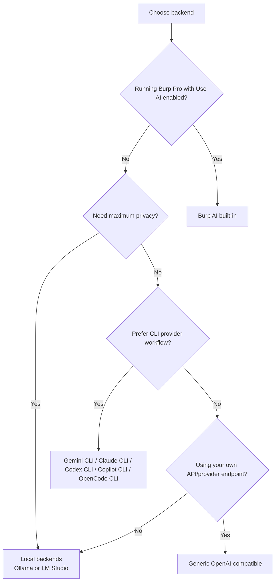

# Backends Overview

Custom AI Agent is backend-agnostic. You can run the built-in Burp AI backend, local models, cloud CLI providers, or OpenAI-compatible HTTP providers. Twelve backends ship with the extension, and additional ones can be dropped in as JARs.

## Backend Selection Guide

```mermaid
flowchart TD
    Start[Choose backend]
    BurpPro{Running Burp Pro with Use AI enabled?}
    Privacy{Need maximum privacy?}
    Cli{Prefer CLI provider workflow?}
    OwnApi{Using your own API/provider endpoint?}

    Start --> BurpPro
    BurpPro -->|Yes| BurpAi[Burp AI built-in]
    BurpPro -->|No| Privacy

    Privacy -->|Yes| Local["Local backends<br/>Ollama or LM Studio"]
    Privacy -->|No| Cli

    Cli -->|Yes| CloudCli[Gemini CLI / Claude CLI / Codex CLI / Copilot CLI / OpenCode CLI]
    Cli -->|No| OwnApi

    OwnApi -->|Yes| Generic[Generic OpenAI-compatible]
    OwnApi -->|No| Local
```

## Supported Backends

| Backend | Type | Privacy Posture | Typical Use |
| :--- | :--- | :--- | :--- |
| **Burp AI (built-in)** | In-process (Burp Pro) | High (no extra outbound) | Burp Pro users with AI credits and **Use AI for extensions** enabled. |
| **Ollama** | Local HTTP | High | Offline or strict data control. |
| **LM Studio** | Local HTTP | High | Local models with GUI management. |
| **NVIDIA NIM** | Cloud HTTP | Medium | NVIDIA-hosted models (e.g. `moonshotai/kimi-k2.5`) via `integrate.api.nvidia.com`. |
| **Perplexity** | Cloud HTTP | Medium | Sonar family of web-aware reasoning models via `api.perplexity.ai`. |
| **Anthropic** | Cloud HTTP | Medium | Native Anthropic Messages API (Claude) via `api.anthropic.com`; encrypted key + token counting (v0.9.0). |
| **Generic (OpenAI-compatible)** | HTTP | Medium | Any compatible provider endpoint. |
| **Gemini CLI** | Cloud CLI | Medium | Large-context cloud workflows. |
| **Claude CLI** | Cloud CLI | Medium | Reasoning-heavy analysis. |
| **Codex CLI** | Cloud CLI | Medium | Code/security analysis and PoCs. |
| **Copilot CLI** | Cloud CLI | Medium | Multi-model analysis via GitHub infrastructure. |
| **OpenCode CLI** | Cloud CLI | Medium | Multi-provider via one CLI. |


**Network transport:** normal chat and scanner requests from every built-in HTTP backend use Burp's `MontoyaHttpTransport`, so those requests respect Burp's upstream proxy/TLS configuration and are visible in Proxy history. There is one current health-check exception: while **Perplexity** is selected, its five-second status check sends a fixed, minimal `"Hey"` chat completion through the shared direct HTTP client rather than Montoya. It carries no captured Burp context, but it bypasses Burp's upstream proxy and may count toward provider usage. NVIDIA NIM uses a similar live completion for health, but routes it through Montoya. Anthropic performs no live health request; a non-empty key is treated as healthy until an actual request proves otherwise.


### Capability Matrix

| Backend | Response delivery in current runtime | JSON mode | System role | Auto-start |
| :--- | :-: | :-: | :-: | :-: |
| **Burp AI (built-in)** | No (single `execute`) | No — enforced via prompt | Yes | N/A |
| **Ollama** | Single chunk (`stream=false`) | Yes (`format=json`) | Yes | Yes (`ollama serve`) |
| **LM Studio** | Single chunk (`stream=false`) | Yes (`response_format=json_object`) | Yes | Yes (`lms server start`) |
| **NVIDIA NIM** | Single parsed response; see caveat below | Yes (`response_format=json_object`) | Yes | N/A |
| **Perplexity** | Single parsed response; see caveat below | **No** (Sonar API rejects `response_format=json_object`) | Yes | N/A |
| **Anthropic** | Single chunk (`stream=false`, proxy-visible) | No — enforced via prompt | Yes (native `system`) | N/A |
| **Generic OpenAI-compatible** | Single chunk (`stream=false`) | Yes (`response_format=json_object`) | Yes | N/A |
| **Gemini CLI** | Buffered process output, then one chunk | No | No (prepended) | N/A |
| **Claude CLI** | Buffered process output, then one chunk | No | No (prepended) | N/A |
| **Codex CLI** | Buffered process/output file, then one chunk | No | No (prepended) | N/A |
| **Copilot CLI** | Buffered process output, then one chunk | No | No (prepended) | N/A |
| **OpenCode CLI** | Buffered process output, then one chunk | No | No (prepended) | N/A |

The `AgentConnection` API supports repeated `onChunk` callbacks, but the current built-ins call it once after a complete response has been buffered and parsed. NVIDIA NIM and Perplexity currently set `stream: true` in their normal chat-completions payload while the shared Montoya path parses the returned body as one JSON document; a provider that returns actual SSE `data:` frames is not decoded by that path. Treat this as a current compatibility limitation, not working UI streaming.

See [Agent Profiles → How It Works](../user-guide/agent-profiles.md#how-it-works) for how the system-role difference affects profile delivery.

## Setup Path

1. Open the **AI Backend** tab in Settings.
2. Select **Preferred Backend** for new sessions.
3. Configure command/URL/model/auth fields for that backend.
4. Use **Test connection** where available.
5. Start with [Privacy Modes](../privacy/privacy-modes.md) set appropriately.



Configure executable command and ensure authentication is already completed in the same runtime environment as Burp.

Windows tip: with npm-installed tools, prefer full shim paths like `C:\\Users\\<you>\\AppData\\Roaming\\npm\\claude.cmd`.



Configure base URL, model, optional API key, and extra headers.

For local servers, verify the service is running and port is reachable from Burp.



Drop custom backend JARs implementing `AiBackendFactory` into:

`~/.burp-ai-agent/backends/`

Restart Burp to load them.



## Cross-Platform CLI Detection

CLI backends depend on environment inheritance from the Burp process.

* If Burp starts from GUI, shell `PATH` and env vars may differ.
* Use explicit command paths when detection fails.
* For Windows + WSL bridge patterns, see backend-specific pages and [Troubleshooting](../reference/troubleshooting.md).

### Windows npm Shim Resolution

On Windows, npm-installed CLI tools (Codex, Gemini, OpenCode, Copilot) install as shell script shims that Java cannot execute directly. The extension automatically resolves these:

1. **`.cmd` sibling detection**: If the resolved path points to a non-executable shim, the resolver looks for a `.cmd` sibling (e.g., `codex` -> `codex.cmd`).
2. **npm directory scanning**: Checks `%APPDATA%\npm`, `%LOCALAPPDATA%\npm`, and `%USERPROFILE%\AppData\Roaming\npm` for `.cmd` shims.
3. **Fallback wrapper**: If no `.cmd` sibling is found, wraps the command with `cmd /c`.

This eliminates the `CreateProcess error=193` that occurs when Java tries to execute shell script shims directly.

## Burp Edition Notes

Backends are available in both Community and Professional editions. MCP tool availability still depends on Burp edition and tool safety gates. Every backend except **Burp AI (built-in)** runs on Burp Community without any change in behaviour — the *Use AI for extensions* setting and the AI-credits requirement are specific to the Burp AI backend, which delegates inference to Burp's bundled AI provider.

## Health States

The UI polls the selected backend every **5 seconds** and renders the backend-specific result as a colored pill in the top bar. Separately, the supervisor checks an already-running agent connection every 2 seconds for crash/restart handling; that liveness monitor does not drive the pill.

| Pill | Internal state | Meaning | Typical cause |
| :--- | :--- | :--- | :--- |
| **AI: OK** (green) | `Healthy` | The backend-specific check passed. This can mean HTTP reachability/live completion, an executable CLI command, Burp AI enabled, or—for Anthropic—only that a key is present. It does not guarantee the next inference will succeed. | Normal configured state. |
| **AI: Degraded** (amber) | `Degraded` | A live HTTP check reached the endpoint but received an authentication failure; NVIDIA NIM and Perplexity also map HTTP 429 to this state. The tooltip carries the status. | Invalid/expired API key or rate limiting on a live cloud health completion. |
| **AI: Offline** (red) | `Unavailable` | The configured check failed or required configuration is absent. The *Use AI for extensions* gate affects only **Burp AI (built-in)**. | Missing URL/model, unreachable endpoint, unresolved CLI executable, or Burp AI disabled. |

The check runs off the Swing event thread. Status transitions themselves are not written to the AI Request Logger; actual prompt failures and transport retries are.

If a backend stays `Offline` longer than expected, see [Backend Troubleshooting](troubleshooting.md) for per-backend error signatures.

## Retry Behavior

HTTP backends (Ollama, LM Studio, OpenAI-compatible, NVIDIA NIM, Perplexity, Anthropic) include automatic retry logic with bounded stepped backoff:

* **Maximum attempts**: 6 total (the initial attempt plus at most 5 retries).
* **Retryable errors**: Transport exceptions classified as transient, including connection timeout/refused, unexpected end of stream, stream reset, and end-of-input conditions. HTTP error responses are returned immediately rather than retried inside the same call.
* **Backoff before the five retries**: `500 ms`, `1000 ms`, `1500 ms`, `2000 ms`, `3000 ms`.
* **Diagnostics**: Each retry attempt is logged to the [AI Request Logger](../privacy/ai-request-logger.md) as a `RETRY` activity with the attempt number, delay, and reason.

### Circuit Breaker

Each launched HTTP connection has its own circuit breaker:

* **Failure threshold**: 5 recorded transient failures open the circuit. Transport exceptions count per failed attempt; HTTP 429 and 5xx responses count once, while other 4xx responses do not.
* **Reset timeout**: 30 seconds before the next model request can become the one half-open attempt.
* **Half-open request**: success closes the breaker; failure reopens it.
* When the circuit is open the backend fails fast with `"<backend> backend is temporarily unavailable (circuit open)"`.

The top-bar health checker is independent of this per-connection breaker. Starting a new chat session creates a new connection; it does not mutate the breaker held by an existing session.

The **Burp AI (built-in)** backend uses Burp Pro's own retry and error handling, so the schedule above does not apply to it. CLI backends handle failures through the supervisor restart mechanism rather than per-request retries.

CLI processes also have a shared **120-second hard runtime ceiling**. OpenCode adds a separate 30-second idle-output timeout; either limit can terminate its run first. The current settings panel does not expose the shared CLI timeout as an editable field.

## Output Token Limits

HTTP backends (Ollama, LM Studio, OpenAI-compatible, NVIDIA NIM, Perplexity, Anthropic) pass output-token limits per request type to bound response size. A limit cannot guarantee that a model completes the requested answer:

| Request Type | Max Output Tokens |
| :--- | :--- |
| **Chat** | 4096 |
| **Scanner (single request)** | 2048 |
| **Scanner (batch analysis)** | 4096 |
| **Payload generation** | 1024 |

CLI backends manage their own output limits through their respective configurations and are not subject to these values.

## Next Steps

* [Burp AI (Built-in)](burp-ai.md)
* [Ollama (Local)](ollama.md)
* [LM Studio (Local)](lm-studio.md)
* [NVIDIA NIM](nvidia-nim.md)
* [Perplexity](perplexity.md)
* [Anthropic (API)](anthropic.md)
* [Generic (OpenAI-compatible)](openai-compatible.md)
* [Gemini CLI](gemini-cli.md)
* [Claude CLI](claude-cli.md)
* [Codex CLI](codex-cli.md)
* [Copilot CLI](copilot-cli.md)
* [OpenCode CLI](opencode-cli.md)
