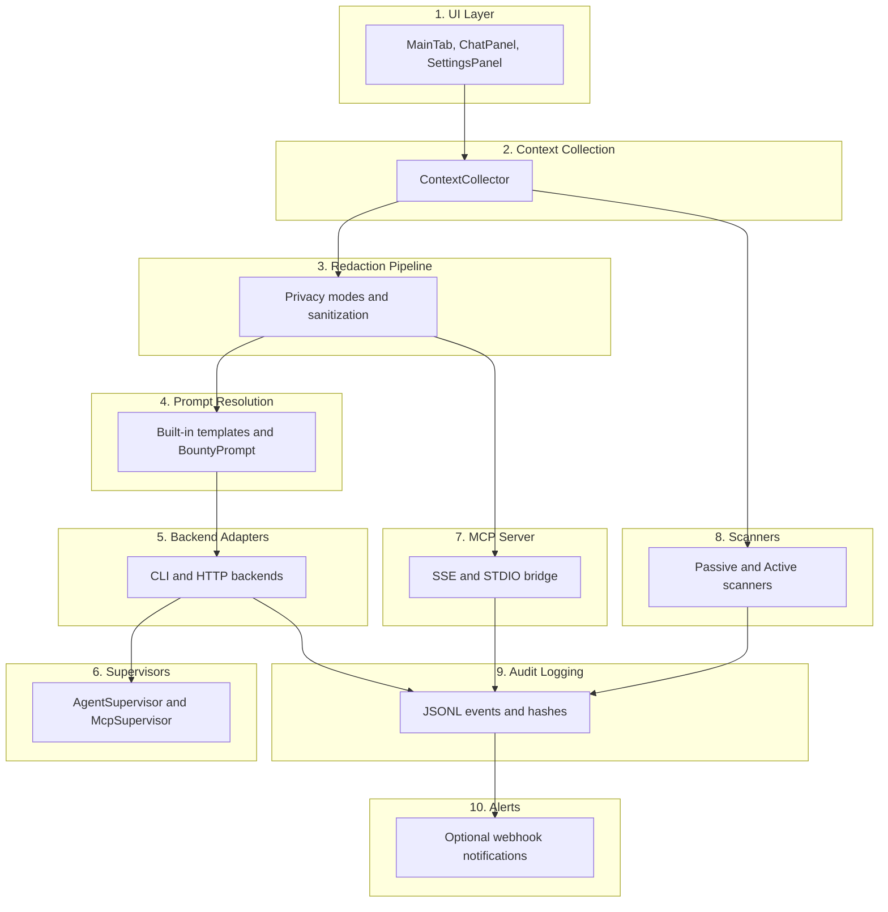
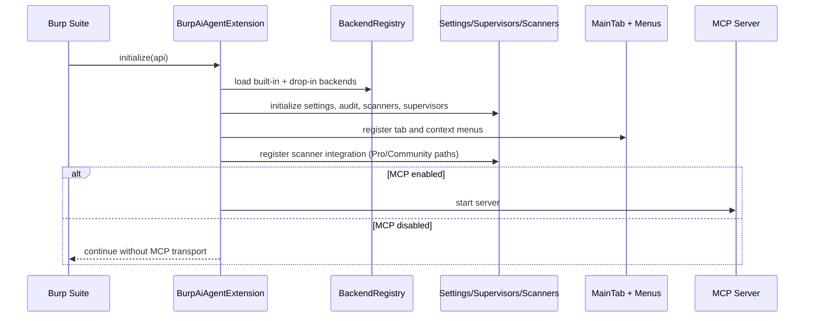

# Architecture

Burp AI Agent is implemented in Kotlin on the JVM using the Burp Montoya API. The architecture is intentionally layered so UI, context collection, redaction, backend execution, scanning, MCP, and audit concerns can evolve independently.

## Layered Design

## Initialization Sequence

`BurpAiAgentExtension.initialize(MontoyaApi)` performs startup in a strict order.

## Design Goals

* **Modularity**: separate concerns to reduce coupling.
* **Testability**: keep parsing and privacy logic unit-testable.
* **Extensibility**: backend/tool additions should not require core refactors.
* **Determinism**: stable ordering and stable anonymization when configured.
* **Privacy-first**: redaction happens before outbound backend or MCP output.

## Key Modules

| Package | Purpose |
| :--- | :--- |
| `ui/*` | Swing UI, settings panels, interaction components. |
| `ui/UiActions` | Context menu wiring for request/response and issue actions. |
| `context/*` | Context collection from Burp selections. |
| `redact/*` | Privacy policy and redaction engine. |
| `prompts/bountyprompt/*` | Curated prompt loader, resolver, parser, and catalog. |
| `backends/*` | Backend registry, built-in adapters, diagnostics. |
| `supervisor/*` | Backend and MCP lifecycle supervision. |
| `mcp/*` | MCP manager, catalog, limiter, and transports. |
| `scanner/*` | Passive/active scanner engines and analyzers. |
| `audit/*` | JSONL writer and integrity hashes. |
| `alerts/*` | Optional webhook notifications. |
| `config/*` | Settings model, persistence, defaults, migration. |

## Related Pages

* [Data Flow](data-flow.md)
* [Redaction Pipeline](redaction-pipeline.md)
* [Supervisor & Backends](supervisor-backends.md)
* [Feature Coverage (0.3.0)](feature-coverage-0.3.md)
