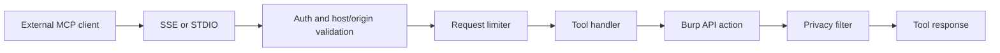

# Data Flow

This page describes how data moves from Burp context to AI output, scanner findings, and MCP responses.

## Standard Chat Flow (Context Menu to AI Response)

```mermaid
flowchart TD
    Sel[User selection in Burp]\nRequest, response, or issue
    Act[Context action]\nFind vulnerabilities, Explain JS, etc.
    Col[ContextCollector]\ncollects selected data
    Red[Redaction Pipeline]\nSTRICT or BALANCED or OFF
    Cap[Manual context controls]\nbody caps and compact JSON
    Prompt[Prompt composition]\ntemplate and context
    Backend[Backend adapter]\nCLI or HTTP
    Chat[Chat panel]\nstreamed response
    Audit[Audit log]\nprompt and chunks

    Sel --> Col
    Act --> Col
    Col --> Red --> Cap --> Prompt --> Backend
    Backend --> Chat
    Backend --> Audit
```

**Operational notes**:

1. Context is collected from the selected Burp item(s).
2. Redaction is applied before any outbound AI call.
3. Manual context size controls are applied for context-menu actions.
4. Audit logging (when enabled) records prompt and stream events.

## BountyPrompt Flow (Request/Response Actions)

```mermaid
flowchart TD
    Start[User selects BountyPrompt action]
    Load[BountyPrompt loader]\ncurated JSON prompts and enabled IDs
    Resolve[Tag resolver]\nredaction-aware HTTP tags
    Compose[Prompt composer]\nsystem and user prompt
    Run[Backend stream to chat]
    Parse[Output parser]\nJSON extraction and fallback
    Gate{Confidence >= threshold?}
    Issue[Create Burp issue]\nAI/BountyPrompt prefix
    ChatOnly[Chat only]\nno issue creation

    Start --> Load --> Resolve --> Compose --> Run --> Parse --> Gate
    Gate -->|Yes| Issue
    Gate -->|No| ChatOnly
```

## Passive Scanner Flow

```mermaid
flowchart LR
    T[Proxy traffic]
    F[Filters]\nMIME, scope, size, stream patterns
    L[Local checks]\ncsrf, smuggling, upload, deserialization
    D[Dedup filters]\nendpoint and fingerprint windows
    C[Prompt cache lookup]
    Hit[Cached findings]
    AI[AI analysis]
    Conf{Confidence >= 85%?}
    Issue[Burp issue]\n[AI Passive]
    Queue{Auto-queue to active enabled?}
    ActiveQ[Active scanner queue]

    T --> F --> L --> D --> C
    C -->|Hit| Hit --> Conf
    C -->|Miss| AI --> Conf
    Conf -->|No| EndNoIssue[No issue creation]
    Conf -->|Yes| Issue --> Queue
    Queue -->|Yes| ActiveQ
    Queue -->|No| EndDone[Done]
```

## Active Scanner Flow

```mermaid
flowchart LR
    Target[Target request]
    Points[Injection point extraction]\nurl, body, header, cookie, json, xml, path
    Payloads[Payload selection]\nby risk level and scan mode
    Send[Request execution]\nrate and timeout controlled
    Analyze[Response analysis]\nerror, reflection, timing, OAST
    Confirm{Confirmed finding?}
    Issue[Burp issue]\n[AI Active]

    Target --> Points --> Payloads --> Send --> Analyze --> Confirm
    Confirm -->|Yes| Issue
    Confirm -->|No| NoIssue[No issue]
```

## MCP Tool Flow


