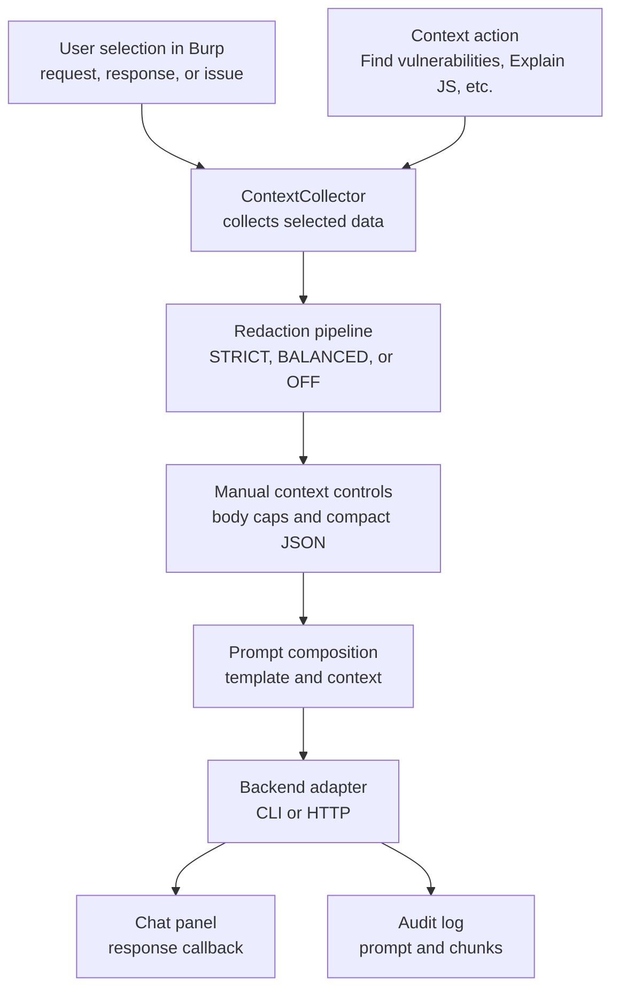
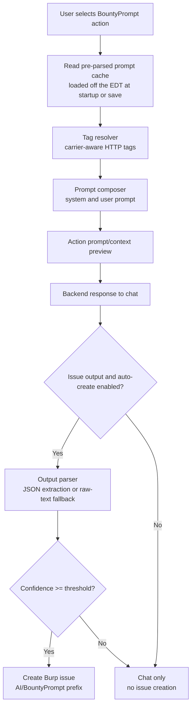
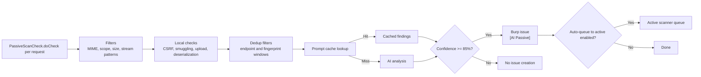
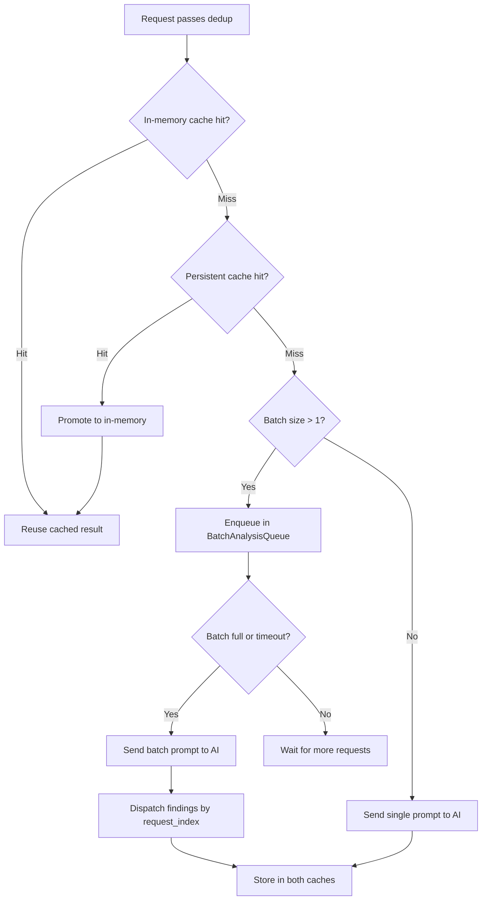
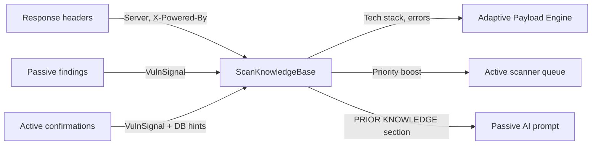
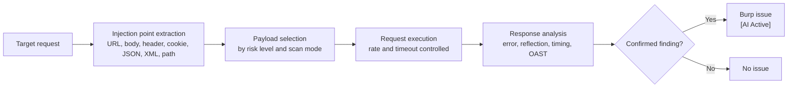
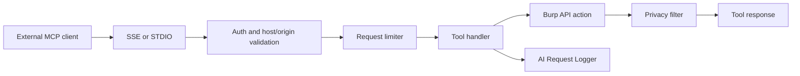
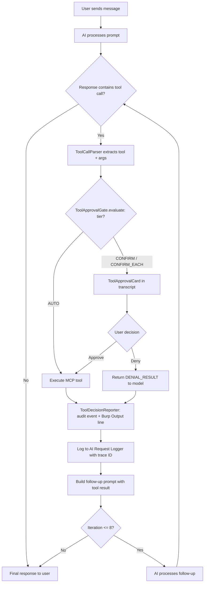
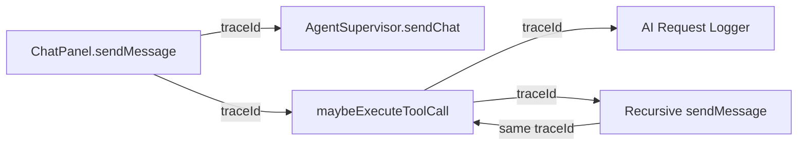

# Data Flow

This page describes how data moves from Burp context to AI output, scanner findings, and MCP responses.

## Standard Chat Flow (Context Menu to AI Response)

```mermaid
flowchart TD
    Sel["User selection in Burp<br/>request, response, or issue"]
    Act["Context action<br/>Find vulnerabilities, Explain JS, etc."]
    Col["ContextCollector<br/>collects selected data"]
    Red["Redaction pipeline<br/>STRICT, BALANCED, or OFF"]
    Cap["Manual context controls<br/>body caps and compact JSON"]
    Prompt["Prompt composition<br/>template and context"]
    Backend["Backend adapter<br/>CLI or HTTP"]
    Chat["Chat panel<br/>response callback"]
    Audit["Audit log<br/>prompt and chunks"]

    Sel --> Col
    Act --> Col
    Col --> Red --> Cap --> Prompt --> Backend
    Backend --> Chat
    Backend --> Audit
```

**Operational notes**:

1. Context is collected from the selected Burp item(s).
2. The manual-context path applies the active policy before the outbound AI call. The preview represents this action's composed context; other scanner and MCP carriers have their own producer controls.
3. Manual context size controls are applied for context-menu actions.
4. Audit logging (when enabled) records prompt and stream events.

## BountyPrompt Flow (Request/Response Actions)

```mermaid
flowchart TD
    Start[User selects BountyPrompt action]
    Cache["Read pre-parsed prompt cache<br/>loaded off the EDT at startup or save"]
    Resolve["Tag resolver<br/>carrier-aware HTTP tags"]
    Compose["Prompt composer<br/>system and user prompt"]
    Preview[Action prompt/context preview]
    Run[Backend response to chat]
    Type{Issue output and auto-create enabled?}
    Parse["Output parser<br/>JSON extraction or raw-text fallback"]
    Gate{Confidence >= threshold?}
    Issue["Create Burp issue<br/>AI/BountyPrompt prefix"]
    ChatOnly["Chat only<br/>no issue creation"]

    Start --> Cache --> Resolve --> Compose --> Preview --> Run --> Type
    Type -->|Yes| Parse --> Gate
    Type -->|No| ChatOnly
    Gate -->|Yes| Issue
    Gate -->|No| ChatOnly
```

## Passive Scanner Flow

The AI passive scanner is registered as a Montoya `PassiveScanCheck` (via `api.scanner().registerPassiveScanCheck(check, ScanCheckType.PER_REQUEST)`), so Burp Scanner drives it per request. It is a Burp Pro feature; on Community the registration fails silently and is logged.

```mermaid
flowchart LR
    T[PassiveScanCheck.doCheck per request]
    F["Filters<br/>MIME, scope, size, stream patterns"]
    L["Local checks<br/>CSRF, smuggling, upload, deserialization"]
    D["Dedup filters<br/>endpoint and fingerprint windows"]
    C[Prompt cache lookup]
    Hit[Cached findings]
    AI[AI analysis]
    Conf{Confidence >= 85%?}
    Issue["Burp issue<br/>[AI Passive]"]
    Queue{Auto-queue to active enabled?}
    ActiveQ[Active scanner queue]

    T --> F --> L --> D --> C
    C -->|Hit| Hit --> Conf
    C -->|Miss| AI --> Conf
    Conf -->|No| EndNoIssue[No issue creation]
    Conf -->|Yes| Issue --> Queue
    Queue -->|Yes| ActiveQ
    Queue -->|No| EndDone[Done]
```

### Batch Analysis & Persistent Cache Flow

```mermaid
flowchart TD
    Req[Request passes dedup]
    Batch{Batch size > 1?}
    Enqueue[Enqueue in BatchAnalysisQueue]
    Flush{Batch full or timeout?}
    BatchAI[Send batch prompt to AI]
    Dispatch[Dispatch findings by request_index]
    SingleAI[Send single prompt to AI]
    MemCache{In-memory cache hit?}
    DiskCache{Persistent cache hit?}
    Promote[Promote to in-memory]
    Store[Store in both caches]

    Req --> MemCache
    MemCache -->|Hit| Reuse[Reuse cached result]
    MemCache -->|Miss| DiskCache
    DiskCache -->|Hit| Promote --> Reuse
    DiskCache -->|Miss| Batch
    Batch -->|Yes| Enqueue --> Flush
    Flush -->|Yes| BatchAI --> Dispatch --> Store
    Flush -->|No| Wait[Wait for more requests]
    Batch -->|No| SingleAI --> Store
```

### Cross-Scanner Knowledge Base Flow

```mermaid
flowchart LR
    PH[Response headers] -->|Server, X-Powered-By| KB[ScanKnowledgeBase]
    PA[Passive findings] -->|VulnSignal| KB
    AF[Active confirmations] -->|VulnSignal + DB hints| KB
    KB -->|Tech stack, errors| AP[Adaptive Payload Engine]
    KB -->|Priority boost| AQ[Active scanner queue]
    KB -->|PRIOR KNOWLEDGE section| PP[Passive AI prompt]
```

## Active Scanner Flow

```mermaid
flowchart LR
    Target[Target request]
    Points["Injection point extraction<br/>URL, body, header, cookie, JSON, XML, path"]
    Payloads["Payload selection<br/>by risk level and scan mode"]
    Send["Request execution<br/>rate and timeout controlled"]
    Analyze["Response analysis<br/>error, reflection, timing, OAST"]
    Confirm{Confirmed finding?}
    Issue["Burp issue<br/>[AI Active]"]

    Target --> Points --> Payloads --> Send --> Analyze --> Confirm
    Confirm -->|Yes| Issue
    Confirm -->|No| NoIssue[No issue]
```

Issue details are built under the privacy mode active at creation time. Burp `AuditIssue` instances are immutable for this purpose, and consolidation can retain an older issue, so changing privacy mode does not rewrite findings already stored.

## MCP Tool Flow

```mermaid
flowchart LR
    Client[External MCP client]
    Transport[SSE or STDIO]
    Auth[Auth and host/origin validation]
    Limit[Request limiter]
    Handler[Tool handler]
    Burp[Burp API action]
    Privacy[Privacy filter]
    Resp[Tool response]
    Log[AI Request Logger]

    Client --> Transport --> Auth --> Limit --> Handler --> Burp --> Privacy --> Resp
    Handler --> Log
```

`Privacy filter` represents two layers: producer-specific sanitization for structured fields (for example headers and cookie-typed parameters), followed by `McpToolContext.redactIfNeeded` on the serialized result. The read-time pass uses the current mode, but it cannot recover semantic type information that the producer discarded. See [Redaction Coverage and Known Boundaries](../privacy/limitations.md#redaction-coverage-and-known-boundaries).

## Auto Tool Chaining Flow

When the AI needs to call MCP tools to answer a user question, tool calls run in a loop — but every parsed call passes through the SEC-06 approval gate first (`ToolApprovalGate.evaluate`). Only a tool whose tier is `AUTO` executes with no user decision; `CONFIRM` and `CONFIRM_EACH` park the call and render an approval card in the transcript until the user resolves it. A denial returns a neutral "not authorised, do not retry" result to the model, not an error, and the chain continues without that tool:

```mermaid
flowchart TD
    User[User sends message]
    AI1[AI processes prompt]
    Check{Response contains tool call?}
    Parse[ToolCallParser extracts tool + args]
    Gate{"ToolApprovalGate.evaluate: tier?"}
    Card[ToolApprovalCard in transcript]
    Decide{User decision}
    Exec[Execute MCP tool]
    Deny[Return DENIAL_RESULT to model]
    Report[ToolDecisionReporter: audit event + Burp Output line]
    Log[Log to AI Request Logger with trace ID]
    Followup[Build follow-up prompt with tool result]
    Limit{Iteration <= 8?}
    AI2[AI processes follow-up]
    Final[Final response to user]

    User --> AI1 --> Check
    Check -->|No| Final
    Check -->|Yes| Parse --> Gate
    Gate -->|AUTO| Exec
    Gate -->|"CONFIRM / CONFIRM_EACH"| Card --> Decide
    Decide -->|Approve| Exec
    Decide -->|Deny| Deny
    Exec --> Report
    Deny --> Report
    Report --> Log --> Followup --> Limit
    Limit -->|Yes| AI2 --> Check
    Limit -->|No| Final
```

All entries in a tool chain share the same trace ID (`chat-turn-{UUID}`), making it easy to follow the complete chain in the AI Request Logger.

## Trace ID Propagation

```mermaid
flowchart LR
    Chat[ChatPanel.sendMessage]
    Sup[AgentSupervisor.sendChat]
    Tool[maybeExecuteToolCall]
    Next[Recursive sendMessage]
    Logger[AI Request Logger]

    Chat -->|traceId| Sup
    Chat -->|traceId| Tool
    Tool -->|traceId| Logger
    Tool -->|traceId| Next
    Next -->|same traceId| Tool
```

Trace IDs are generated at the entry point and propagated through the AI Request Logger call chain. Scanner jobs generate `scanner-job-{UUID}`, batch passive analyses share `scanner-batch-{UUID}` across all requests in the batch, and adaptive payload generation uses `adaptive-payload-{VULN_CLASS}` so the same identifier is reused for repeated generations of the same class. See [AI Request Logger → Trace IDs](../privacy/ai-request-logger.md#trace-ids-correlation) for the full list; the separate audit JSONL stream does not attach the ID to every event.
