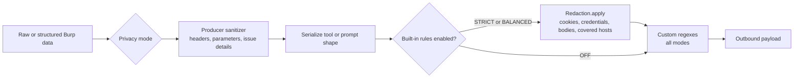

# Redaction Pipeline

The redaction system transforms covered Burp context before data is sent to AI backends or external MCP clients. It combines structured producer sanitizers with a read-time text pass; it is not a universal DLP transform.

## Pipeline Overview



## Design Goals

* Prevent sensitive values from leaving Burp unexpectedly.
* Preserve enough structure for useful security analysis.
* Support deterministic outputs when reproducibility is required.

## Privacy Modes

| Mode | Cookies | Auth Tokens | Hostnames |
| :--- | :--- | :--- | :--- |
| **STRICT** | Stripped on recognized carriers | Redacted on recognized carriers | Anonymized on wired host carriers |
| **BALANCED** | Stripped | Redacted | Preserved |
| **OFF** | Preserved | Preserved | Preserved; custom regexes still run |

## Redaction Steps

### 1. Cookie Stripping

Replaces recognized cookie values with `[STRIPPED]`. The current implementation covers:

* raw header names containing `cookie` when the remaining name characters are letters, digits, `_`, or `-`,
* structured headers through `sanitizeHeaders`, using the shared `Redaction.isCookieHeaderName` predicate,
* passive-scanner cookie sections and `(COOKIE)` parameter lines,
* Montoya parameters whose type is `COOKIE`, through `sanitizeParameters`,
* active-scanner issue-detail write sites that retain insertion-point values or payloads.

* Applies to: `STRICT`, `BALANCED`
* Skipped in: `OFF`

### 2. Auth Token Redaction

Redacts the values of authentication / session / secret headers and any inline token patterns found in the text.

**Header names matched (case-insensitive)**:

```
Authorization, Proxy-Authorization,
X-API-Key, API-Key, X-API-Secret, API-Secret, X-Client-Secret,
X-Auth-Token, Auth-Token, X-Access-Token, Access-Token,
X-Session-Token, Session-Token,
X-CSRF-Token, CSRF-Token, X-XSRF-Token
```

**Inline token patterns**:

* `Bearer <value>` → `Bearer [REDACTED]`
* `Basic <base64>` → `Basic [REDACTED]`
* JWT-shaped tokens (`eyJ…` with three base64url-encoded segments) → `[JWT_REDACTED]`

* Applies to: `STRICT`, `BALANCED`
* Skipped in: `OFF`

### 3. Sensitive Key Redaction

Rewrites values associated with recognized sensitive keys, preserving the key so request structure remains analyzable. The shared key vocabulary is applied to URL query strings, form bodies, and JSON objects.

```
?<key>=<redacted_value>
```

The vocabulary includes `access_token`, `api_key`/`apikey`, `auth`, `token`, `secret`, `password`/`pwd`, `session`, `sid`, known framework session keys, and credential-prefixed `key`/`code` forms. Bare `key` and `code` are matched only as whole keys; benign compound metadata such as `status_code`, `public_key`, and `cache_key` is intentionally preserved.

* Applies to: `STRICT`, `BALANCED`
* Skipped in: `OFF`

### 4. Body Stage and Custom Patterns

Form and JSON rules run in a bounded body-processing stage. User-defined regular expressions are compiled from **Privacy & Logging → Custom Redaction Patterns** and run after the built-in rules in every mode, including `OFF`. Unsafe or invalid expressions are rejected when settings are saved.

### 5. Host Anonymization

In `STRICT`, covered hostnames are pseudonymized using RFC 5869 HKDF with HMAC-SHA256. The configured host salt is the HKDF salt, the hostname is the input keying material, and `burp-ai-agent:host` is the context label.

```text
pseudonym = "host-" + hex(HKDF-HMAC-SHA256(salt, hostname, info))[0:12] + ".local"
```

The mapping is stable for the same salt and can be rotated per engagement.

## Important Notes

* Redaction applies to prompt/tool output data, not to active scanner network traffic.
* Every MCP tool result passes through `McpToolContext.redactIfNeeded` under the current mode. Structured producers must still sanitize typed fields before serialization; the generic text pass cannot infer every field's meaning.
* Changing mode can affect later MCP reads, but it does not mutate scanner findings already stored by Burp. Consolidation may keep their original detail.
* Rotate salt between engagements to reduce cross-project correlation.
* The built-in regex set and its carrier boundaries are **not** exhaustive. The exact current residuals are documented in [Limitations → Redaction Coverage](../privacy/limitations.md#redaction-coverage-and-known-boundaries). Teams with a hard no-secret-egress requirement should pre-sanitize traffic at an upstream proxy.

## Testing

The privacy regression suite includes:

* `RedactionTest.kt` and `RedactionPolicyTest.kt`: built-in rules, RFC 5869 vectors, the `host-<12 hex>.local` format, policy mapping, and salt stability.
* `CookieHeaderRuleOwnershipTest.kt` and `CookieHeaderNameWidthTest.kt`: shared header-name ownership, locale behavior, and the explicitly bounded punctuation class.
* `McpToolHelpersTest.kt` and `ParameterCarrierRedactionTest.kt`: structured headers, cookie-typed parameters, ordering, and all four parameter producers.
* `SerializedEmissionRedactionTest.kt`: raw HTTP embedded inside serialized JSON, logical-line boundaries, and accepted JSON-string residuals.
* `PassiveAiScannerPromptRedactionTest.kt` and `PassiveAiScannerHeaderAdmissionTest.kt`: prompt construction and the passive header admitter.
* `IssueDetailCookieCarrierTest.kt` and `PrivacyModeTooltipBoundTest.kt`: issue-detail write sites and the operator-visible forward-only boundary.
* `RedactingPolicySurvivalSweepTest.kt`: source-level tripwires for newly introduced survival assertions.

The core functional cases still cover:

* Cookie stripping and authentication-header redaction.
* Inline `Bearer`, `Basic`, and JWT patterns.
* URL, form, and JSON sensitive-key redaction.
* Host anonymization stability across calls with the same salt.
* Salt rotation (`clearMappings`) invalidates old mappings.
* `OFF` preserves built-in patterns while still applying configured custom regexes.
