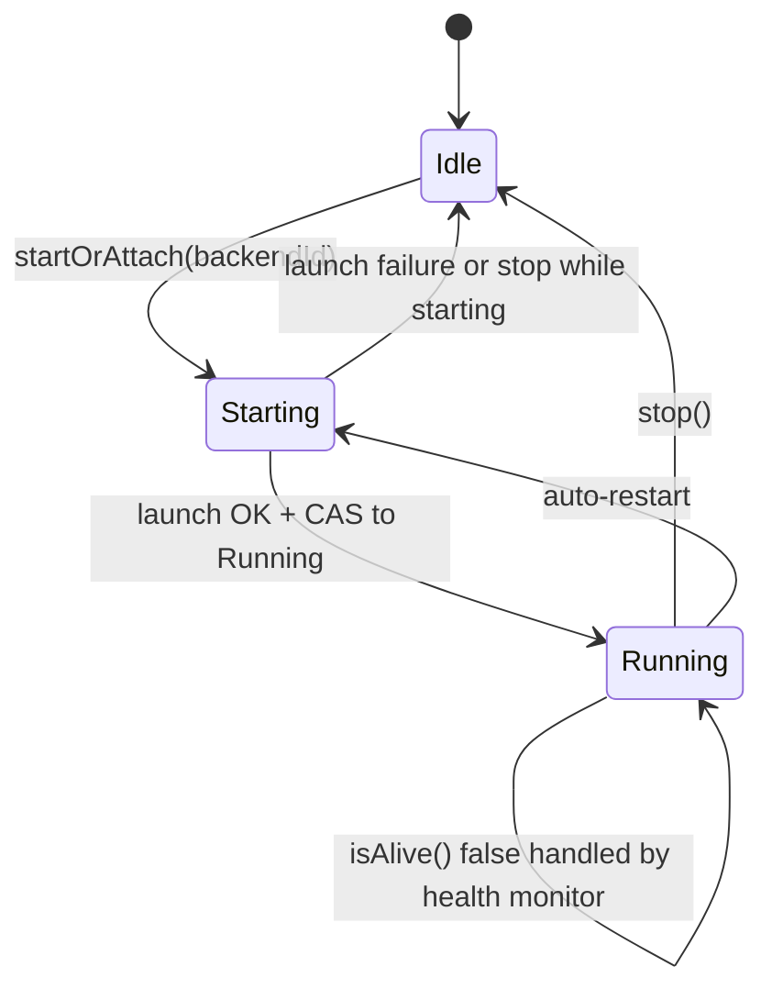
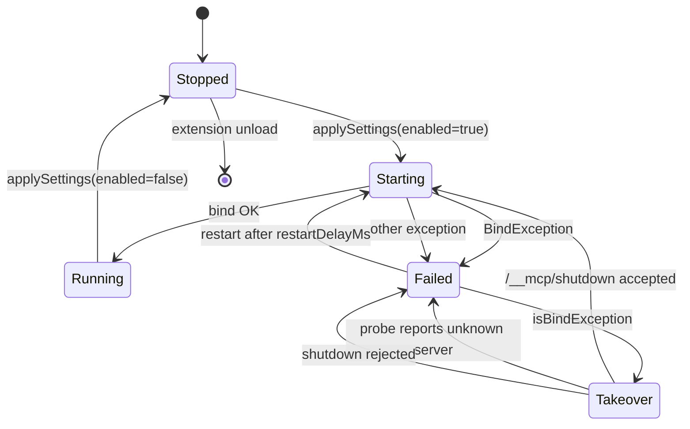

# Supervisor & Backends

The supervisors coordinate backend process lifecycle, health state, and MCP server runtime.

## Agent Supervisor

The `AgentSupervisor` controls CLI and HTTP backend sessions.

### Responsibilities

* Start or attach backend sessions.
* Run health checks and expose backend state.
* Auto-restart crashed backends when policy allows it.
* Emit operational events used by diagnostics and audit flows.

### Lifecycle

```mermaid
flowchart TD
    Start[startOrAttach()] --> Alive{Backend already alive?}
    Alive -->|Yes| Reuse[Reuse existing backend session]
    Alive -->|No| Config[Build launch config from settings]
    Config --> Kind{Backend type}
    Kind -->|CLI| Cli[Spawn subprocess and bind session ID]
    Kind -->|HTTP| Http[Connect to remote endpoint and run health check]
    Cli --> Bind[Session binding]
    Http --> Bind
    Bind --> Loop[Health monitoring loop - 2s interval]
    Loop --> Healthy{Healthy?}
    Healthy -->|Yes| Loop
    Healthy -->|No| Crash[Set status: Crashed]
    Crash --> Restart{Auto-restart enabled and budget available?}
    Restart -->|Yes| Backoff[Relaunch with bounded stepped backoff]
    Backoff --> Loop
    Restart -->|No| Stopped[Remain stopped until manual restart]
```

### Supervisor State Machine



### Use AI Gate

On every `startOrAttach`, `send`, and `sendChat` the supervisor short-circuits if `api.ai().isEnabled()` returns `false` (the Burp Pro *Use AI for extensions* toggle). This means the gate applies to **every** backend, not just the built-in Burp AI backend. See [Burp AI (Built-in)](../backends/burp-ai.md) for the end-user-visible behaviour.

### Session Management

Each launch gets a unique session ID (`session-{UUID}`) so chat history, diagnostics, and backend state remain correlated.

## MCP Supervisor

`McpSupervisor` manages the MCP server independently from AI backends.

### Features

* Health checks with bounded restart attempts (`DEFAULT_MAX_RESTART_ATTEMPTS = 4`, `DEFAULT_RESTART_DELAY_MS = 2000`).
* Existing-server detection and safe handover on occupied ports (`DEFAULT_MAX_TAKEOVER_ATTEMPTS = 3`).
* SSE and STDIO transport lifecycle.
* Optional TLS with local loopback trust handling.

### State Machine



### Port Takeover Sequence

1. Bind attempt fails with `BindException`.
2. Supervisor probes `/__mcp/health` on the same host:port.
3. If the response carries `X-Burp-AI-Agent: mcp`, the port holder is a previous Custom AI Agent server — supervisor posts `POST /__mcp/shutdown` with the current bearer token, waits 1 s, then retries the bind. Up to `DEFAULT_MAX_TAKEOVER_ATTEMPTS = 3` tries.
4. If the response does not carry the marker, takeover is aborted and the failure surfaces in the UI. No unsolicited shutdown is sent to unknown services.

## HTTP Backend Circuit Breaker

HTTP backends go through `HttpBackendSupport` which wraps all calls in a circuit breaker:

* **Failure threshold** (`CIRCUIT_FAILURE_THRESHOLD`): `5` consecutive failures.
* **Reset timeout** (`CIRCUIT_RESET_TIMEOUT_MS`): `30_000` ms before the breaker moves to half-open.
* **Half-open max attempts** (`CIRCUIT_HALF_OPEN_MAX_ATTEMPTS`): `1` — a single probe decides whether to close or reopen.
* **Retry schedule** (`retryDelayMs(attempt)`): `500, 1000, 1500, 2000, 3000, 4000` ms (stepped, capped at 4 s — **not** exponential).

When the breaker is open the backend fails fast with `"<backend> backend is temporarily unavailable (circuit open). Retry in <n>ms."` Retries inside the wrapper are logged to the [AI Request Logger](../privacy/ai-request-logger.md) as `RETRY` entries with `attempt` and `delayMs` metadata.

The built-in Burp AI backend does **not** route through this wrapper — it relies on Burp Pro's internal error handling.

## Backend Types

### CLI Backends

* Run as subprocesses from configured commands.
* Use stdout/stderr streaming for response and diagnostics.
* Include Gemini CLI, Claude CLI, Codex CLI, Copilot CLI, OpenCode CLI.
* **Windows**: npm-installed shims are resolved automatically. The launcher detects `.cmd` siblings for shell script shims and falls back to `cmd /c` wrapping when needed.
* **Output parsing**: Each CLI backend has a dedicated output parser that strips metadata, status lines, and prompt echoes from raw stdout to extract the AI response.

### HTTP Backends

* Connect to HTTP APIs of running servers.
* Optionally auto-start local services (provider-dependent).
* Include Ollama, LM Studio, and Generic OpenAI-compatible.

## Failure Handling

* **Immediate startup exit**: marked as crashed; usually indicates config/auth/command errors.
* **Runtime crash**: restart attempts follow backoff policy.
* **Crash suppression**: repeated failures disable restart loops.
* **Manual control**: restart remains available from UI.

## Diagnostics

Backend diagnostics include:

* process exit code,
* last stdout/stderr lines,
* launch configuration details,
* retry events with attempt number, backoff delay, and failure reason (logged to [AI Request Logger](../privacy/ai-request-logger.md)).

Use Burp's extension output/errors tabs and the **AI Logger** tab for investigation.

## Trace ID Propagation

The `AgentSupervisor.send()` and `sendChat()` methods accept an optional `traceId` parameter. If not provided, a trace ID is auto-generated (`agent-turn-{UUID}` or `chat-turn-{UUID}`). This trace ID is attached to all log entries for the operation (prompt, response, error), enabling end-to-end correlation in the AI Request Logger.
