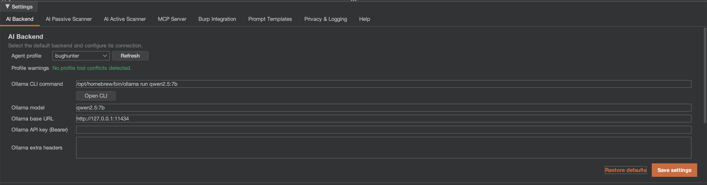

# First Run Checklist

Use this checklist after installation before starting a real assessment.

## Essential Setup

* [ ] **Extension loaded**: `AI Agent` tab is visible.
* [ ] **Backend selected**: backend set in **AI Backend** tab.
* [ ] **Backend configured**: command/URL/model/auth values are valid.
* [ ] **Backend healthy**: top status indicator shows active state.
* [ ] **Context menus available**: request right-click menu shows Custom AI Agent actions.

## MCP Server (Recommended)

* [ ] **MCP ON**: top-bar MCP toggle enabled.
* [ ] **Token recorded**: token available for external clients when needed.
* [ ] **Port free**: configured port (default `9876`) is not occupied.

## Privacy & Security


Default privacy mode is `BALANCED` (cookies stripped, tokens redacted, hosts preserved). Switch to `STRICT` for sensitive targets on cloud backends, or `OFF` only for local-model testing.


* [ ] **Privacy mode set** intentionally (`STRICT`/`BALANCED`/`OFF`).
* [ ] **Context preview dialog** confirmed at least once: right-click a proxy item, choose an AI action, and verify the modal shows privacy mode + prompt + redacted JSON before sending.
* [ ] **Audit logging** enabled if compliance traceability is needed.
* [ ] **Determinism** enabled if reproducibility is required.
* [ ] **Salt** rotated for new sensitive engagements.

## Scanners (Optional)

* [ ] **Passive scanner** configured with **Scope Only** ON.
* [ ] **Active scanner** only enabled when traffic is authorized.
* [ ] **Scope configured** in Burp Target before active checks.

## Verification Test

1. Browse through Burp Proxy.
2. Right-click a request in **Proxy -> HTTP History**.
3. Select **Extensions -> Custom AI Agent -> Find vulnerabilities**.
4. Verify a chat session opens and response streams.

If any step fails, use [Troubleshooting](../reference/troubleshooting.md).

<figure><figcaption></figcaption></figure>
