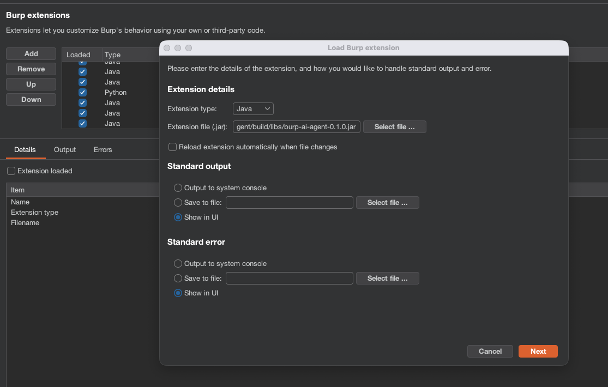

# Installation

## Prerequisites

Before installing, ensure you have the following:

1.  **Burp Suite**: Community or Professional edition (version 2023.12 or higher recommended).
2.  **Java 21**: The extension is built for Java 21 (Temurin or Oracle JDK).
    *   *Note*: Modern Burp Suite versions ship with a bundled Java runtime. You only need a separate Java installation if you are building from source or running the CLI backends in a specific environment.

## Option A: Download from GitHub Releases

1.  Go to the [GitHub Releases](https://github.com/six2dez/burp-ai-agent/releases) page.
2.  Download the latest `Burp-AI-Agent-x.x.x.jar` file.

## Option B: Build from Source

If you prefer to build from source or want the latest development version:

1.  **Prerequisites**: Install **Java 21** (Temurin or Oracle JDK) and ensure `JAVA_HOME` is set.
2.  Clone the repository:
    ```bash
    git clone https://github.com/six2dez/burp-ai-agent.git
    cd burp-ai-agent
    ```
3.  Build the fat JAR using the Gradle Shadow plugin:
    ```bash
    ./gradlew clean shadowJar
    ```
4.  The output JAR will be at:
    ```
    build/libs/Burp-AI-Agent-0.1.0.jar
    ```

> **Note**: The Shadow plugin produces a fat JAR that bundles all dependencies. The Burp Montoya API is `compileOnly` and provided by Burp at runtime.

## Load into Burp Suite

1.  Open Burp Suite.
2.  Navigate to the **Extensions** tab.
3.  Click on the **Installed** sub-tab.
4.  Click the **Add** button.
5.  In the "Extension Details" dialog:
    *   **Extension type**: Select `Java`.
    *   **Extension file**: Click "Select file..." and choose the `.jar` you downloaded.
6.  Click **Next**.



## Verify Installation

Once loaded, you should see the following:
*   **Output tab**: The extension should load without errors. You might see a "Extensions loaded" message.
*   **Top-level Tab**: A new tab named **Burp AI Agent** will appear in the main Burp navigation bar.


## The `~/.burp-ai-agent/` Directory

On first launch, the extension automatically creates a directory at `~/.burp-ai-agent/` with the following structure:

```
~/.burp-ai-agent/
├── audit.jsonl          # Audit log (created when audit logging is enabled)
├── bundles/             # Prompt bundle JSON files (determinism mode)
├── contexts/            # Context snapshot JSON files
├── backends/            # Drop-in backend JAR files (custom backends via ServiceLoader)
├── launch/              # Temporary scripts for external terminal launches
├── certs/               # Auto-generated TLS certificates for MCP server
│   └── mcp-keystore.p12
└── AGENTS/              # Agent profile Markdown files (you must copy these)
    ├── default          # Text file containing the active profile name
    ├── pentester.md     # Pentester profile (default)
    ├── bughunter.md     # Bug bounty profile
    └── auditor.md       # Compliance auditor profile
```

The extension creates all subdirectories automatically on startup. However, **agent profile files are NOT auto-generated** — you must copy them manually from the repository:

```bash
cp -r AGENTS/ ~/.burp-ai-agent/AGENTS/
```

This gives you three ready-to-use profiles: `pentester`, `bughunter`, and `auditor`. You can also create your own (see [Agent Profiles](../user-guide/agent-profiles.md)).

You may also want to place custom backend JARs in `backends/` (see [Adding a Backend](../developer/adding-backend.md)).

## Troubleshooting

*   **"Error loading extension"**: Check the "Errors" tab in the Extensions window. Common causes include incompatible Java versions (ensure you are using Java 21+ features).
*   **Tab not appearing**: Ensure the extension is checked/enabled in the "Installed" list.
*   **Permission errors**: Ensure your user has write access to `~/.burp-ai-agent/`.

## Next Steps

Now that you are installed, proceed to the [Quick Start](quick-start.md) guide to run your first analysis.