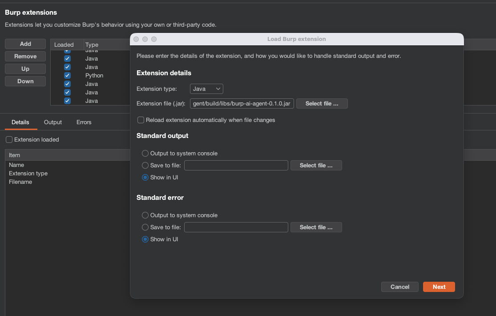
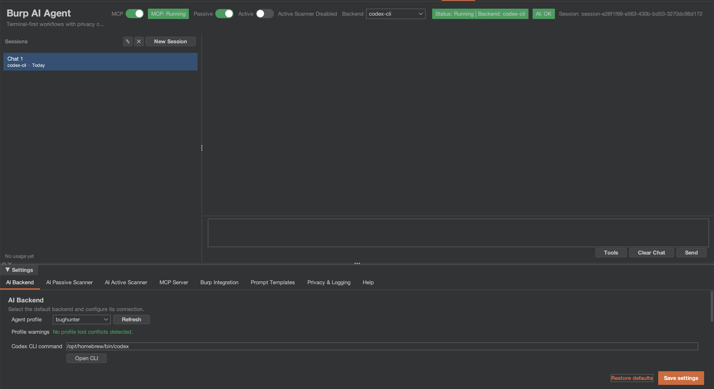

# Installation

## Prerequisites

1. **Burp Suite** Community or Professional (`2023.12+` recommended).
2. **Java 21** for building from source.

> Recent Burp versions include bundled Java runtime for extension execution. Separate Java is mainly needed for local builds.


**JDK 25 Compatibility**: TLS certificate generation for the MCP server uses JDK's built-in `keytool` command, which works on all JDK versions (8-25+) and all platforms (macOS, Linux, Windows) without additional dependencies.


## Install Path



1. Open [GitHub Releases](https://github.com/six2dez/burp-ai-agent/releases).
2. Download the latest `Custom-AI-Agent-<version>.jar` plus its `Custom-AI-Agent-<version>.jar.sha256` checksum and, optionally, the `bom.json` CycloneDX SBOM.
3. Verify the JAR integrity (see [Verify JAR Integrity](#verify-jar-integrity-sha-256)) before loading.



1. Clone repository:

```bash
git clone https://github.com/six2dez/burp-ai-agent.git
cd burp-ai-agent
```

2. Build fat JAR:

```bash
./gradlew clean shadowJar
```

3. Output path:

```text
build/libs/Custom-AI-Agent-<version>.jar
```

4. (Optional) Generate an SBOM alongside the JAR:

```bash
./gradlew cyclonedxBom --no-configuration-cache
# Output: build/reports/sbom/bom.json
```



## Verify JAR Integrity (SHA-256)

Every GitHub release since v0.6.0 ships a `*.jar.sha256` file next to the JAR and a CycloneDX `bom.json` software bill of materials. Verify the JAR before loading it:



```bash
shasum -a 256 Custom-AI-Agent-0.6.0.jar
# Compare against the contents of Custom-AI-Agent-0.6.0.jar.sha256
```



```powershell
Get-FileHash -Algorithm SHA256 Custom-AI-Agent-0.6.0.jar
```



If the two values differ, **do not load the JAR** — re-download from the official release page.

## Load into Burp Suite

1. Open **Extensions -> Installed -> Add**.
2. Select extension type `Java`.
3. Choose the JAR file.
4. Complete load wizard.



## Verify Installation

Expected indicators:

* extension loads without startup errors,
* **AI Agent** tab appears in Burp main navigation.

<figure><figcaption></figcaption></figure>

## Runtime Directory

On first start, `~/.burp-ai-agent/` is created:

```text
~/.burp-ai-agent/
├── audit.jsonl
├── bundles/
├── contexts/
├── backends/
├── cache/            # created on demand by PersistentPromptCache (per project)
├── certs/
│   └── mcp-keystore.p12
├── logs/             # created on demand by the opt-in rolling AI Request Logger
└── AGENTS/
    ├── default
    ├── pentester.md
    ├── bughunter.md
    └── auditor.md
```

The directory keeps the legacy `burp-ai-agent` name on disk to preserve upgrades for existing users; the product itself is now called **Custom AI Agent**. See [Naming & Paths](../reference/naming-and-paths.md) for the full rationale and [Configuration Directory](../reference/configuration-directory.md) for a per-entry reference.

Custom additions:

* profiles: `~/.burp-ai-agent/AGENTS/*.md` ([Agent Profiles](../user-guide/agent-profiles.md))
* backend plugins: `~/.burp-ai-agent/backends/` ([Adding a Backend](../developer/adding-backend.md))

## Troubleshooting

* Extension load failure: inspect Burp Errors/Output tabs and Java version.
* Tab missing: ensure extension is enabled.
* Permission errors: ensure write access to `~/.burp-ai-agent/`.

## Next Steps

Continue with [Quick Start](quick-start.md).
