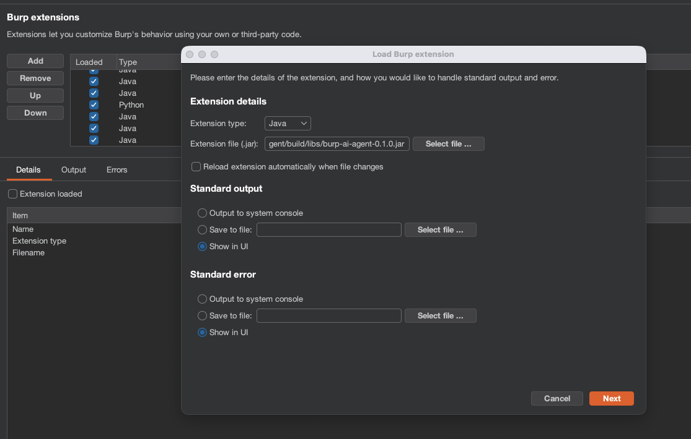
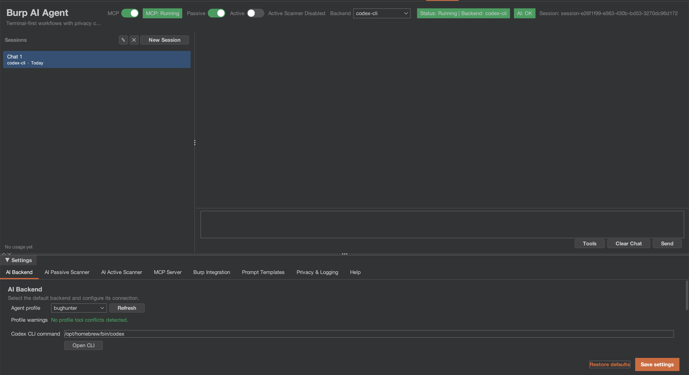

# Installation

## Prerequisites

1. **Burp Suite 2026.2 or newer**, Community or Professional. The current source compiles against Montoya API `2026.2` and uses its scan-check interfaces.
2. **Java 21** for building from source.

> Recent Burp versions include bundled Java runtime for extension execution. Separate Java is mainly needed for local builds.


MCP TLS certificate generation launches the `keytool` binary from the active Java runtime. Use the documented Java 21 toolchain (or the runtime bundled with a compatible Burp build) and ensure `keytool` is present; the current project does not establish a blanket Java 8–25 compatibility guarantee.


## Install Path




**Custom AI Agent is not on the BApp Store yet.** The [submission](https://github.com/PortSwigger/extension-portal/issues/231) is still open with PortSwigger. Install from [GitHub Releases](https://github.com/six2dez/burp-ai-agent/releases) — see the next tab.


The *store build* referenced throughout this documentation is a real build target you can produce yourself (`-PstoreBuild=true`), and it is the artifact that will be published once the submission is accepted. It registers only the 8 extension-native AI MCP tools (`status`, `issue_create`, `ai_analyze`, `ai_passive_scan`, `ai_findings_recent`, `redact_preview`, `ai_audit_query`, `ai_backends_list`). For the full set of 59 MCP tools, use the full build.



1. Open [GitHub Releases](https://github.com/six2dez/burp-ai-agent/releases).
2. Download the latest full build `Custom-AI-Agent-full-<version>.jar` plus its `*.jar.sha256` checksum and, optionally, the `bom.json` CycloneDX SBOM. These three are what a release publishes. (The store build, `Custom-AI-Agent-<version>.jar`, is **not** attached to releases — it is the artifact that will be distributed through the BApp Store once the submission is accepted, and you can build it yourself with `-PstoreBuild=true`.)
3. Verify the JAR integrity (see [Verify JAR Integrity](#verify-jar-integrity-sha-256)) before loading.


This documentation tracks the current source tree. A tagged release can lag changes on `main`; build from source when you need behavior documented as current-main hardening, and read the release notes before assuming it is present in an older JAR.




1. Clone repository:

```bash
git clone https://github.com/six2dez/burp-ai-agent.git
cd burp-ai-agent
```

2. Build a fat JAR. The default build is the **full** artifact (all 59 MCP tools, for GitHub releases); pass `-PstoreBuild=true` for the **store** artifact (only the 8 extension-native AI MCP tools, for the BApp Store):

```bash
# Full build (default) -> build/libs/Custom-AI-Agent-full-<version>.jar
./gradlew clean shadowJar

# Store build (BApp Store) -> build/libs/Custom-AI-Agent-<version>.jar
./gradlew clean shadowJar -PstoreBuild=true
```

3. Output paths:

```text
build/libs/Custom-AI-Agent-full-<version>.jar   # full build (default)
build/libs/Custom-AI-Agent-<version>.jar        # store build (-PstoreBuild=true)
```

A generated compile-time flag (`BuildFlags.STORE_BUILD`) gates which MCP tools register.

4. (Optional) Generate an SBOM alongside the JAR:

```bash
./gradlew cyclonedxBom --no-configuration-cache
# Output: build/reports/sbom/bom.json
```



## Verify JAR Integrity (SHA-256)

The current GitHub release workflow publishes a `*.jar.sha256` checksum file next to the JAR and a CycloneDX `bom.json` software bill of materials. Verify the JAR before loading it:



```bash
shasum -a 256 Custom-AI-Agent-full-<version>.jar
# Compare against Custom-AI-Agent-full-<version>.jar.sha256
```



```powershell
Get-FileHash -Algorithm SHA256 Custom-AI-Agent-full-<version>.jar
```



If the two values differ, **do not load the JAR** — re-download from the official release page.

## Load into Burp Suite

1. Open **Extensions -> Installed -> Add**.
2. Select extension type `Java`.
3. Choose the JAR file.
4. Complete load wizard.



## Verify Installation

Expected indicators:

* extension loads without startup errors,
* the extension appears as **Custom AI Agent** in **Extensions -> Installed**, and its **Custom AI Agent** tab appears in Burp main navigation.

> The extension registers its display name as **Custom AI Agent** to distinguish it from Burp's built-in **Burp AI** provider; that is the name shown in Burp's Extensions list and Suite tab, and the name intended for the still-pending BApp Store listing.

<figure><figcaption></figcaption></figure>

## Runtime Directory

On first start, `~/.burp-ai-agent/` is created:

```text
~/.burp-ai-agent/
├── audit.jsonl
├── bundles/
├── contexts/
├── backends/
├── cache/            # created on demand by PersistentPromptCache (per project)
├── certs/
│   └── mcp-keystore.p12
├── logs/             # created on demand by the opt-in rolling AI Request Logger
└── AGENTS/
    ├── default          # plain text file whose content names the active profile (no extension)
    ├── pentester.md
    ├── bughunter.md
    └── auditor.md
```

The directory keeps the legacy `burp-ai-agent` name on disk to preserve upgrades for existing users; the product itself is now called **Custom AI Agent**. See [Configuration Directory](../reference/configuration-directory.md) for a per-entry reference.

Custom additions:

* profiles: `~/.burp-ai-agent/AGENTS/*.md` ([Agent Profiles](../user-guide/agent-profiles.md))
* backend plugins: `~/.burp-ai-agent/backends/` ([Adding a Backend](../developer/adding-backend.md))

## Troubleshooting

* Extension load failure: inspect Burp Errors/Output tabs and Java version.
* Tab missing: ensure extension is enabled.
* Permission errors: ensure write access to `~/.burp-ai-agent/`.

## Next Steps

Continue with [Quick Start](quick-start.md).
