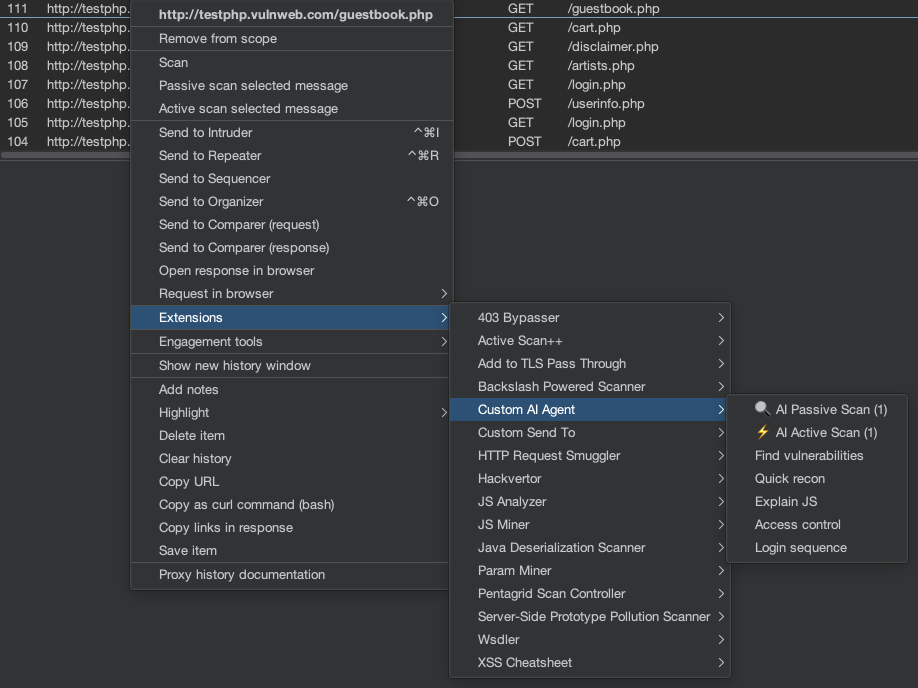
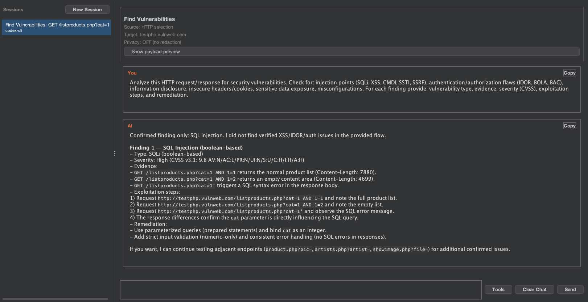
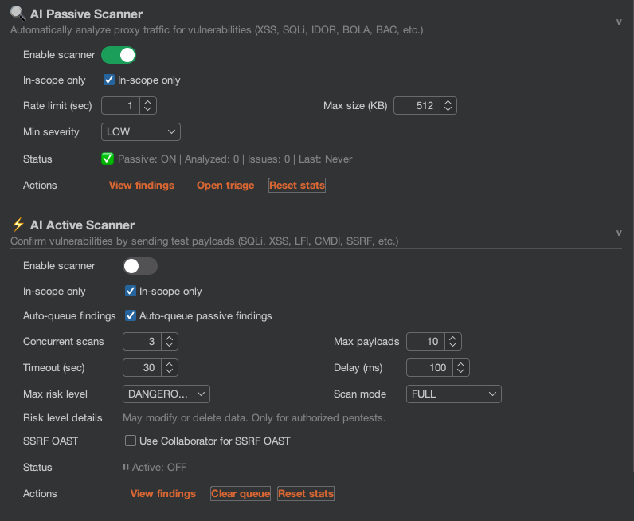

# Quick Start

This guide will get you from "Installed" to "First Vulnerability Found" in under 5 minutes.

## 1. Enable the MCP Server (Optional but Recommended)

The Model Context Protocol (MCP) server allows the plugin to expose tools.

* Click the **MCP** toggle in the top bar of the **AI Agent** tab.
* The status indicator should turn green/active.

## 2. Agent Profiles (Recommended)

On first run, the extension auto-installs the bundled profiles into `~/.burp-ai-agent/AGENTS/`. This enables role-specific AI instructions (pentester, bughunter, auditor).

To add a custom profile, drop a `*.md` file in `~/.burp-ai-agent/AGENTS/` and click **Refresh** next to the **Agent profile** dropdown in **Settings**.

## 3. Configure Your AI Backend

You need to tell the extension which AI model to use.

1. Go to **AI Agent** → **Settings** → **AI Backend**.
2. Select your preferred backend from the dropdown:
   * **Cloud**: `Gemini CLI`, `Claude CLI`, `Codex CLI` (requires API keys).
   * **Local**: `Ollama` or `LM Studio` (free, private).
3. Type the CLI command or URL in the corresponding field. See the [Backends](../backends/overview.md) section for exact values per backend.

> **Important**: If you use cloud backends (Gemini, Claude, Codex), make sure the CLI tool is installed, authenticated, and that any required environment variables (`ANTHROPIC_API_KEY`, `OPENAI_API_KEY`, etc.) are set in the environment where Burp Suite is running — not just in your terminal profile. If you launch Burp from a GUI shortcut, those variables may not be inherited.

## 4. Analyze a Request

1. Go to **Proxy** → **HTTP History** (or **Repeater**).
2. Right-click on any request you want to analyze.
3. Select **Extensions** → **Burp AI Agent** → **Find vulnerabilities**.

## 5. Review the Analysis

* The **AI Agent** tab will open (or focus).
* A new chat session will start.
* The AI will stream its analysis of the request, highlighting potential security issues like SQLi, XSS, or IDOR.

## 6. (Advanced) Enable Background Scanning

If you want the AI to work for you automatically:

1. Toggle **Passive** to **ON** in the top bar.
2. Browse your target application.
3. Check the **Target** → **Issues** tab (or the extension's findings view) for `[AI Passive]` prefixed issues.

