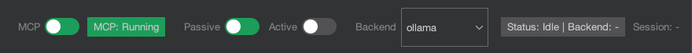
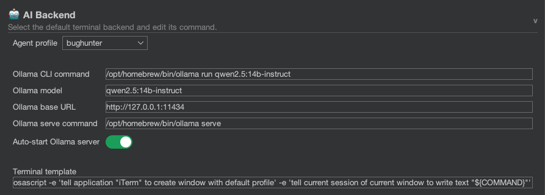
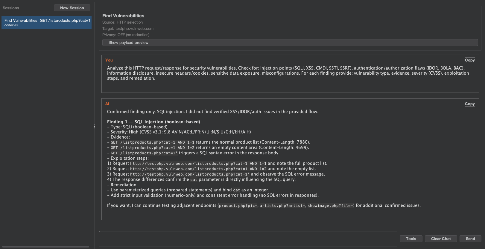
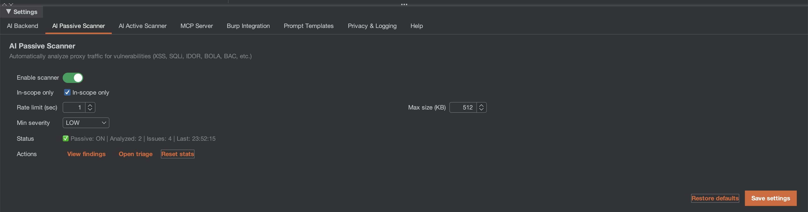

# Quick Start

This walkthrough gets from installation to first AI analysis quickly.

## 0. Pick a Backend (Prerequisites)

* **Using Burp AI built-in (Burp Pro only)**: open Burp's **Settings → Burp AI**, enable **Use AI for extensions**, and confirm there are AI credits available. No URL or key is needed on the extension side. See [Burp AI (Built-in)](../backends/burp-ai.md).
* **Using Ollama / LM Studio**: install the server locally and pull at least one model.
* **Using NVIDIA NIM / Generic OpenAI-compatible**: have the base URL, model name, and API key handy.
* **Using a CLI backend (Gemini, Claude, Codex, Copilot, OpenCode)**: the CLI must already be installed and authenticated in the same shell environment that launches Burp.

If you skip this step, the backend will show `Offline` in the top bar until the prerequisite is satisfied.

## 1. Enable MCP (Optional but Recommended)

* Click **MCP** toggle in the top bar of the **AI Agent** tab.
* Verify indicator turns active.

## 2. Select Agent Profile (Recommended)

Bundled profiles are installed automatically into `~/.burp-ai-agent/AGENTS/`.

To add custom profiles, place `*.md` files in that directory and refresh profiles in **AI Backend** settings.

## 3. Configure AI Backend

1. Open **AI Backend** tab in Settings.
2. Choose backend.
3. Set CLI command or HTTP URL/model fields.


If using cloud CLIs, required credentials must exist in the runtime environment where Burp is launched. GUI launchers often do not inherit shell env vars.


For backend-specific values, see [Backends Overview](../backends/overview.md).

## 4. Analyze a Request

1. Go to **Proxy -> HTTP History**.
2. Right-click a request.
3. Select **Extensions -> Custom AI Agent -> Find vulnerabilities**.

## 5. Review Response

A new chat session opens and streams AI analysis.

## 6. Enable Background Scanning (Advanced)

1. Toggle **Passive** ON in top bar.
2. Browse target traffic.
3. Review findings in passive scanner view and Burp issues.

<figure><figcaption></figcaption></figure>

## Next Steps

* [UI Tour](../user-guide/ui-tour.md)
* [Context Menus](../user-guide/context-menus.md)
* [Passive AI Scanner](../scanners/passive.md)
