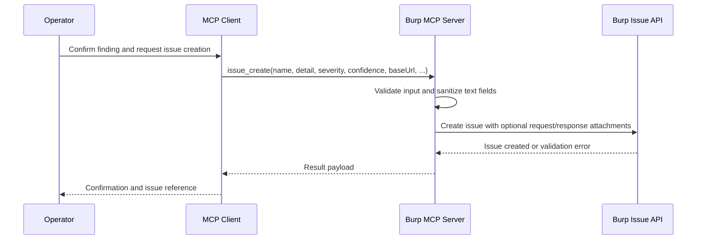

# Issue Creation (MCP)

The `issue_create` MCP tool lets an AI client create Burp issues programmatically.

## Tool Details

| Property | Value |
| :--- | :--- |
| **Tool name** | `issue_create` |
| **Category** | Issues |
| **Unsafe** | No |
| **Default enabled** | Yes |
| **Pro only** | No |

## Workflow Sequence



## Input Parameters

| Parameter | Type | Required | Description |
| :--- | :--- | :--- | :--- |
| `name` | String | Yes | Issue title (for example, `SQL Injection in login parameter`). |
| `detail` | String | Yes | Full evidence and technical narrative. |
| `severity` | String | Yes | `INFORMATION`, `LOW`, `MEDIUM`, `HIGH`. |
| `confidence` | String | Yes | `CERTAIN`, `FIRM`, `TENTATIVE`. |
| `baseUrl` | String | Yes | URL where issue was found. |
| `remediation` | String | No | Recommended remediation. |
| `background` | String | No | Optional issue background. |
| `remediationBackground` | String | No | Optional remediation background. |
| `typicalSeverity` | String | No | Typical severity override (defaults to `severity`). |
| `httpRequest` | String | No | Raw HTTP request attachment. |
| `httpResponseContent` | String | No | Raw HTTP response attachment. |
| `targetHostname` | String | No | Host for attachment context. |
| `targetPort` | Int | No | Port for attachment context (default `443`). |
| `usesHttps` | Boolean | No | HTTPS flag for attachment context (default `true`). |

## Recommended Practices

* Create issues after evidence is verified.
* Use `TENTATIVE` for suspected-only findings.
* Check duplicates before creating a new issue.
* Keep detail field evidence-based and reproducible.

## Example Usage

```json
{
  "name": "[AI] SQL Injection in user_id parameter",
  "detail": "The user_id parameter in GET /api/users is vulnerable to error-based SQL injection...",
  "severity": "HIGH",
  "confidence": "FIRM",
  "baseUrl": "https://example.com/api/users?user_id=1",
  "remediation": "Use parameterized queries and strict server-side validation."
}
```

## Integration Pattern

Typical chain:

1. Search/collect candidate requests (`proxy_http_history_regex`).
2. Validate behavior (`http1_request` / `http2_request`).
3. Summarize exploit evidence.
4. Create issue (`issue_create`).

See [Typical Workflows](../examples/typical-workflows.md).
