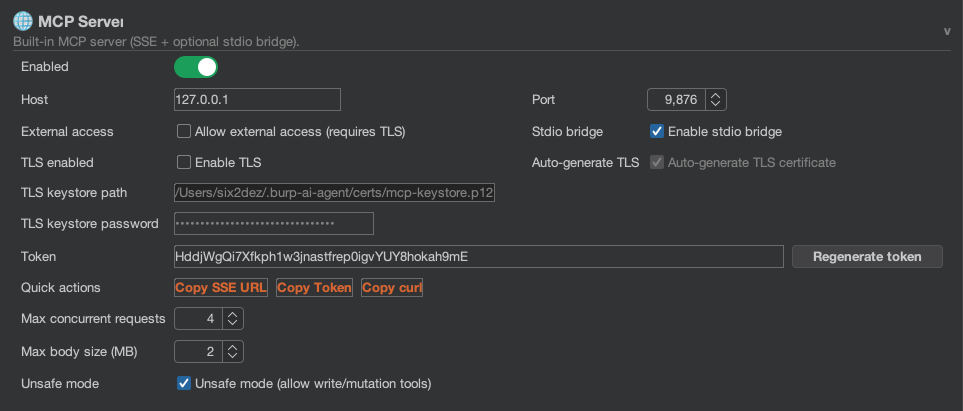

# MCP Overview

The **Model Context Protocol (MCP)** is a standard that allows AI agents to connect to data sources and tools.

## What does MCP enable?

Traditionally, Burp extensions are isolated. With MCP, **Burp Suite becomes a tool** that external AI agents can use.

### Example: AI-Driven Testing

With **Claude Desktop** (or another MCP client) connected to the Burp AI Agent's MCP server, a session might look like this:

> **You**: "Claude, check the proxy history for any requests to the `/api/login` endpoint."
>
> **Claude**: *Calls `proxy_http_history_regex` tool on Burp...* "I found 3 requests. Here they are..."
>
> **You**: "Analyze the second one for SQL injection. You can send test requests."
>
> **Claude**: *Calls `repeater_tab` to create a test... Calls `http1_request` to send a payload...* "I confirmed a timing-based SQLi."
>
> **You**: "Great, create an issue in Burp."
>
> **Claude**: *Calls `issue_create`...*

This lets an AI explore and interact with Burp under your supervision.

## Connecting Claude Desktop

To allow Claude Desktop to "drive" Burp Suite, you must configure the MCP server. Edit your Claude configuration file:

*   **macOS**: `~/Library/Application Support/Claude/claude_desktop_config.json`
*   **Windows**: `%APPDATA%\Claude\claude_desktop_config.json`

### SSE via npx (Default)

This method uses the `@modelcontextprotocol/server-sse` bridge to connect over HTTP:

```json
{
  "mcpServers": {
    "burp-ai-agent": {
      "command": "npx",
      "args": [
        "-y",
        "@modelcontextprotocol/server-sse",
        "http://127.0.0.1:9876/sse"
      ]
    }
  }
}
```

> **Prerequisite**: This requires **Node.js** (v18+) and **npx** to be installed and available in your PATH. Install Node.js from [nodejs.org](https://nodejs.org/) or via your package manager.

> **Note**: Replace `9876` with your configured port. If you enable **External Access**, your MCP client must send `Authorization: Bearer <token>` on every request.

### STDIO Transport (Alternative)

If you prefer not to use npx, enable the **STDIO Bridge** in **Settings → MCP Server → STDIO Bridge**. This transport uses standard input/output and does not require Node.js. Configure your MCP client to launch the STDIO bridge process directly. See the [STDIO Bridge](#stdio-transport) section below for details.

## Connecting Other MCP Clients

Any MCP-compatible client can connect to the Burp AI Agent. The server supports two transports:

### SSE Transport (Default)
The primary transport uses Server-Sent Events over HTTP. Connect to `http://127.0.0.1:9876/sse`.

### STDIO Transport
An alternative transport that uses standard input/output. Enable it in **Settings → MCP Server → STDIO Bridge**. This is useful for clients that prefer process-based communication instead of HTTP.

## Features

*   **SSE Server**: Runs a local Server-Sent Events server (default port `9876`) for clients to connect to.
*   **STDIO Bridge**: Optional stdin/stdout transport for process-based MCP clients.
*   **Tool Catalog**: 53+ tools exposing Burp functionality across 11 categories (History, Repeater, Scanner, Intruder, Scope, Site Map, Utilities, and more).
*   **Safety Gating**: "Unsafe" tools (those that send traffic or modify state) are disabled by default and must be explicitly enabled in settings.
*   **Request Limiting**: Configurable concurrency control (default: 4 concurrent requests, range: 1-64) to prevent overwhelming Burp.
*   **Max Body Bytes**: Configurable limit on response body size returned by MCP tools.
*   **Health Check**: Built-in health endpoint at `GET /__mcp/health` for monitoring server status.
*   **Privacy-Aware**: All data returned by MCP tools is filtered through the active privacy mode before being sent to the client.


