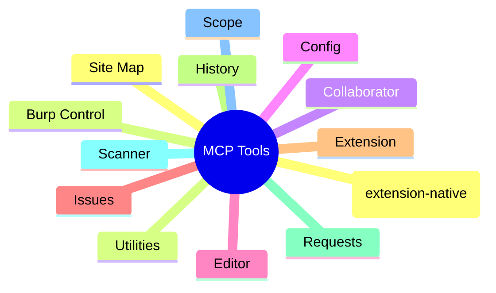

# MCP Tools Reference

Canonical reference for every MCP tool exposed by the extension. There are **59 MCP tools** in total. Each category has a summary table (safety, default exposure, Pro-only flag, one-line description) followed by per-tool input schemas.

## Extension-Native vs Generic Tools

The tools split into two groups, which the build you load decides between:

* **Extension-native (AI) tools — 8 total**: `status`, `issue_create`, `ai_analyze`, `ai_passive_scan`, `ai_findings_recent`, `redact_preview`, `ai_audit_query`, `ai_backends_list`. These are present in **both** the BApp Store build and the full build. They are marked **Native = Yes** in the tables below.
* **Generic (Montoya) tools — 51 total**: every other tool on this page (proxy history, repeater, scanner, scope, site map, intruder, Collaborator, utilities, etc.). These are present **only in the full build** (GitHub releases). The BApp Store build does not expose them — for those, run PortSwigger's official Burp MCP Server alongside this extension. They are marked **Native = No**.

The redesigned **MCP Tools** settings tab mirrors this split: tools are grouped into extension-native (AI) vs generic (Montoya), each tagged **store-build** or **full-build**, with search/filter and per-group bulk toggles.

Conventions:

* **Native = Yes** means the tool is extension-native and registered in both the BApp Store and full builds. **Native = No** means it is a generic Montoya tool, registered only in the full build.
* **Unsafe = Yes** means the tool can mutate Burp state or send traffic to targets. Tools marked unsafe are gated behind the **Enable Unsafe Tools** master switch in **Settings → MCP Server**.
* **Default enabled = Yes** means the tool is available in agent profiles without an explicit opt-in.
* **Pro only = Yes** means the tool requires Burp Suite Professional. Community-edition clients see it return an error if invoked.
* **Input fields: none** means the tool takes no parameters.

## AI (extension-native)

These tools call or support the extension's AI engine and are present in every build. The AI-calling tools (`ai_analyze`, `ai_passive_scan`) check `ai.isEnabled()` before issuing a request, so the configured AI setting is respected.

| Tool | Native | Unsafe | Default enabled | Pro only | Description |
|---|---|---|---|---|---|
| `ai_analyze` | Yes | No | Yes | No | Sends text to the active AI backend and returns the analysis result. |
| `ai_passive_scan` | Yes | No | Yes | No | Queues requests for AI passive security analysis and returns the count enqueued. |
| `ai_findings_recent` | Yes | No | Yes | No | Returns the most recent AI passive scan findings (up to `n`). |
| `redact_preview` | Yes | No | Yes | No | Applies the extension's privacy redaction engine to arbitrary text and returns the redacted result. |
| `ai_audit_query` | Yes | No | Yes | No | Returns recent AI request audit log entries (hashes only unless verbose mode is enabled). |
| `ai_backends_list` | Yes | No | Yes | No | Lists available AI backends and reports the current active backend and connection state. |

`status` and `issue_create` are also extension-native; see the **Extension** and **Issues** categories below.

### ai_analyze

| Name | Type | Required | Default |
|---|---|---|---|
| `text` | String | Yes | — |
| `jsonMode` | Boolean | No | `false` |
| `maxOutputTokens` | Int? | No | `null` |

### ai_passive_scan

| Name | Type | Required | Default |
|---|---|---|---|
| `proxyHistoryIndices` | List\<Int> | No | `emptyList()` |
| `siteMapUrl` | String? | No | `null` |
| `maxRequests` | Int | No | `10` |

### ai_findings_recent

| Name | Type | Required | Default |
|---|---|---|---|
| `n` | Int | No | `10` |

### redact_preview

| Name | Type | Required | Default |
|---|---|---|---|
| `text` | String | Yes | — |
| `mode` | String | No | `"STRICT"` |

### ai_audit_query

| Name | Type | Required | Default |
|---|---|---|---|
| `n` | Int | No | `20` |

### ai_backends_list

Input fields: none.

## Burp Control

| Tool | Native | Unsafe | Default enabled | Pro only | Description |
|---|---|---|---|---|---|
| `proxy_intercept` | No | Yes | No | No | Enables or disables Proxy intercept. |
| `task_engine_state` | No | Yes | No | No | Sets Burp's task execution engine to paused or running. |

### proxy_intercept

| Name | Type | Required | Default |
|---|---|---|---|
| `intercepting` | Boolean | Yes | — |

### task_engine_state

| Name | Type | Required | Default |
|---|---|---|---|
| `running` | Boolean | Yes | — |

## Collaborator

| Tool | Native | Unsafe | Default enabled | Pro only | Description |
|---|---|---|---|---|---|
| `collaborator_generate` | No | No | Yes | No | Generates a Burp Collaborator payload. |
| `collaborator_poll` | No | No | Yes | No | Fetches interactions for a Collaborator secret key. |

### collaborator_generate

| Name | Type | Required | Default |
|---|---|---|---|
| `customData` | String? | No | `null` |
| `options` | List\<String> | No | `emptyList()` |

### collaborator_poll

| Name | Type | Required | Default |
|---|---|---|---|
| `secretKey` | String | Yes | — |
| `includeHttp` | Boolean | No | `false` |

## Config

| Tool | Native | Unsafe | Default enabled | Pro only | Description |
|---|---|---|---|---|---|
| `project_options_get` | No | No | No | No | Outputs project-level configuration as JSON. |
| `project_options_set` | No | Yes | No | No | Sets project-level configuration from JSON. |
| `user_options_get` | No | No | No | No | Outputs user-level configuration as JSON. |
| `user_options_set` | No | Yes | No | No | Sets user-level configuration from JSON. |

### project_options_get

Input fields: none.

### project_options_set

| Name | Type | Required | Default |
|---|---|---|---|
| `json` | String | Yes | — |

### user_options_get

Input fields: none.

### user_options_set

| Name | Type | Required | Default |
|---|---|---|---|
| `json` | String | Yes | — |

## Editor

| Tool | Native | Unsafe | Default enabled | Pro only | Description |
|---|---|---|---|---|---|
| `editor_get` | No | No | No | No | Outputs the contents of the active message editor. |
| `editor_set` | No | Yes | No | No | Sets the content of the active message editor. |

### editor_get

Input fields: none.

### editor_set

| Name | Type | Required | Default |
|---|---|---|---|
| `text` | String | Yes | — |

## Issues

| Tool | Native | Unsafe | Default enabled | Pro only | Description |
|---|---|---|---|---|---|
| `issue_create` | Yes | No | Yes | No | Creates a custom audit issue in Burp's issue list. |

### issue_create

| Name | Type | Required | Default |
|---|---|---|---|
| `name` | String | Yes | — |
| `detail` | String | Yes | — |
| `baseUrl` | String | Yes | — |
| `severity` | String | Yes | — |
| `confidence` | String | Yes | — |
| `remediation` | String? | No | `null` |
| `background` | String? | No | `null` |
| `remediationBackground` | String? | No | `null` |
| `typicalSeverity` | String? | No | `null` |
| `httpRequest` | String? | No | `null` |
| `httpResponseContent` | String? | No | `null` |
| `targetHostname` | String | No | `""` |
| `targetPort` | Int | No | `443` |
| `usesHttps` | Boolean | No | `true` |

See [Issue Creation (MCP)](issue-create.md) for guidance on building well-formed issue payloads.

## Extension

| Tool | Native | Unsafe | Default enabled | Pro only | Description |
|---|---|---|---|---|---|
| `status` | Yes | No | Yes | No | Returns basic extension and Burp status. |

### status

Input fields: none.

## History

| Tool | Native | Unsafe | Default enabled | Pro only | Description |
|---|---|---|---|---|---|
| `proxy_history_annotate` | No | Yes | No | No | Adds notes/highlights to proxy history items matching a regex. |
| `proxy_http_history` | No | No | Yes | No | Displays items within the proxy HTTP history. |
| `proxy_http_history_regex` | No | No | Yes | No | Displays proxy HTTP history items matching a regex. |
| `proxy_ws_history` | No | No | Yes | No | Displays items within the proxy WebSocket history. |
| `proxy_ws_history_regex` | No | No | Yes | No | Displays WebSocket history items matching a regex. |
| `response_body_search` | No | No | Yes | No | Searches response bodies in proxy history using a regex. |

History tools that surface proxy data flow through the MCP proxy-history preprocessor (see **Settings → MCP Server → MCP Proxy History Preprocessing**).

### proxy_history_annotate

| Name | Type | Required | Default |
|---|---|---|---|
| `regex` | String | Yes | — |
| `note` | String | Yes | — |
| `highlight` | String? | No | `null` |
| `scopeOnly` | Boolean | No | `true` |
| `limit` | Int | No | `20` |

### proxy_http_history

| Name | Type | Required | Default |
|---|---|---|---|
| `count` | Int | Yes | — |
| `offset` | Int | Yes | — |

### proxy_http_history_regex

| Name | Type | Required | Default |
|---|---|---|---|
| `regex` | String | Yes | — |
| `count` | Int | Yes | — |
| `offset` | Int | Yes | — |

### proxy_ws_history

| Name | Type | Required | Default |
|---|---|---|---|
| `count` | Int | Yes | — |
| `offset` | Int | Yes | — |

### proxy_ws_history_regex

| Name | Type | Required | Default |
|---|---|---|---|
| `regex` | String | Yes | — |
| `count` | Int | Yes | — |
| `offset` | Int | Yes | — |

### response_body_search

| Name | Type | Required | Default |
|---|---|---|---|
| `regex` | String | Yes | — |
| `count` | Int | No | `5` |
| `offset` | Int | No | `0` |
| `scopeOnly` | Boolean | No | `true` |

## Requests

| Tool | Native | Unsafe | Default enabled | Pro only | Description |
|---|---|---|---|---|---|
| `comparer_send` | No | Yes | No | No | Sends one or more items to Burp Comparer. |
| `diff_requests` | No | No | Yes | No | Produces a line diff between two requests. |
| `find_reflected` | No | No | Yes | No | Finds reflected parameter values in a response. |
| `http1_request` | No | Yes | No | No | Issues an HTTP/1.1 request and returns the response. Optional in agent profiles. |
| `http2_request` | No | Yes | No | No | Issues an HTTP/2 request and returns the response. Optional in agent profiles. |
| `insertion_points` | No | No | Yes | No | Lists insertion point offsets for a request. |
| `intruder` | No | Yes | No | No | Sends a request to Intruder. |
| `intruder_prepare` | No | Yes | No | No | Creates an Intruder tab with explicit insertion points. |
| `params_extract` | No | No | Yes | No | Extracts parameters from a request. |
| `repeater_tab` | No | Yes | No | No | Creates a new Repeater tab with the specified HTTP request. |
| `repeater_tab_with_payload` | No | Yes | No | No | Creates a Repeater tab after applying placeholder replacements. |
| `request_parse` | No | No | Yes | No | Parses a raw HTTP request into method, path, headers, parameters, and body. |
| `response_parse` | No | No | Yes | No | Parses a raw HTTP response into status, headers, and body. |


`http1_request` and `http2_request` require **Enable Unsafe Tools** in the MCP Server tab. The built-in agent profiles (pentester, bughunter, auditor) list these tools as optional — no validation warning is shown when they are disabled. Custom profiles that explicitly reference these tools will warn until Unsafe Tools are enabled.


### comparer_send

| Name | Type | Required | Default |
|---|---|---|---|
| `items` | List\<String> | Yes | — |

### diff_requests

| Name | Type | Required | Default |
|---|---|---|---|
| `requestA` | String | Yes | — |
| `requestB` | String | Yes | — |

### find_reflected

| Name | Type | Required | Default |
|---|---|---|---|
| `request` | String | Yes | — |
| `response` | String | Yes | — |

### http1_request

| Name | Type | Required | Default |
|---|---|---|---|
| `content` | String | Yes | — |
| `targetHostname` | String | Yes | — |
| `targetPort` | Int | Yes | — |
| `usesHttps` | Boolean | Yes | — |

### http2_request

| Name | Type | Required | Default |
|---|---|---|---|
| `pseudoHeaders` | Map\<String, String> | Yes | — |
| `headers` | Map\<String, String> | Yes | — |
| `requestBody` | String | Yes | — |
| `targetHostname` | String | Yes | — |
| `targetPort` | Int | Yes | — |
| `usesHttps` | Boolean | Yes | — |

### insertion_points

| Name | Type | Required | Default |
|---|---|---|---|
| `content` | String | Yes | — |
| `mode` | String | No | `"REPLACE_BASE_PARAMETER_VALUE_WITH_OFFSETS"` |

### intruder

| Name | Type | Required | Default |
|---|---|---|---|
| `tabName` | String? | Yes | — |
| `content` | String | Yes | — |
| `targetHostname` | String | Yes | — |
| `targetPort` | Int | Yes | — |
| `usesHttps` | Boolean | Yes | — |

### intruder_prepare

| Name | Type | Required | Default |
|---|---|---|---|
| `tabName` | String? | Yes | — |
| `content` | String | Yes | — |
| `insertionPoints` | List\<InsertionPointRange> | No | `emptyList()` |
| `mode` | String | No | `"REPLACE_BASE_PARAMETER_VALUE_WITH_OFFSETS"` |
| `targetHostname` | String | Yes | — |
| `targetPort` | Int | Yes | — |
| `usesHttps` | Boolean | Yes | — |

### params_extract

| Name | Type | Required | Default |
|---|---|---|---|
| `content` | String | Yes | — |

### repeater_tab

| Name | Type | Required | Default |
|---|---|---|---|
| `tabName` | String? | Yes | — |
| `content` | String | Yes | — |
| `targetHostname` | String | Yes | — |
| `targetPort` | Int | Yes | — |
| `usesHttps` | Boolean | Yes | — |

### repeater_tab_with_payload

| Name | Type | Required | Default |
|---|---|---|---|
| `tabName` | String? | Yes | — |
| `content` | String | Yes | — |
| `replacements` | Map\<String, String> | Yes | — |
| `targetHostname` | String | Yes | — |
| `targetPort` | Int | Yes | — |
| `usesHttps` | Boolean | Yes | — |

### request_parse

| Name | Type | Required | Default |
|---|---|---|---|
| `content` | String | Yes | — |
| `includeBody` | Boolean | No | `false` |

### response_parse

| Name | Type | Required | Default |
|---|---|---|---|
| `content` | String | Yes | — |
| `includeBody` | Boolean | No | `false` |

## Scanner

| Tool | Native | Unsafe | Default enabled | Pro only | Description |
|---|---|---|---|---|---|
| `scan_audit_start` | No | Yes | No | Yes | Starts a Burp Scanner audit. |
| `scan_audit_start_mode` | No | Yes | No | Yes | Starts a scanner audit using active or passive mode. |
| `scan_audit_start_requests` | No | Yes | No | Yes | Starts an audit and adds HTTP requests. |
| `scan_crawl_start` | No | Yes | No | Yes | Starts a Burp Scanner crawl. |
| `scan_report` | No | Yes | No | Yes | Generates a scanner report to a path. |
| `scan_task_delete` | No | Yes | No | Yes | Deletes a crawl/audit task started via MCP. |
| `scan_task_status` | No | No | No | Yes | Gets status for a crawl/audit task. |
| `scanner_issues` | No | No | Yes | Yes | Displays scanner issues (Burp Pro only). |

### scan_audit_start

| Name | Type | Required | Default |
|---|---|---|---|
| `builtInConfiguration` | String | Yes | — |

### scan_audit_start_mode

| Name | Type | Required | Default |
|---|---|---|---|
| `mode` | String | Yes | — |
| `requests` | List\<String> | No | `emptyList()` |
| `targetHostname` | String | No | `""` |
| `targetPort` | Int | No | `0` |
| `usesHttps` | Boolean | No | `true` |

### scan_audit_start_requests

| Name | Type | Required | Default |
|---|---|---|---|
| `builtInConfiguration` | String | Yes | — |
| `requests` | List\<String> | Yes | — |
| `targetHostname` | String | Yes | — |
| `targetPort` | Int | Yes | — |
| `usesHttps` | Boolean | Yes | — |

### scan_crawl_start

| Name | Type | Required | Default |
|---|---|---|---|
| `seedUrls` | List\<String> | Yes | — |

### scan_report

| Name | Type | Required | Default |
|---|---|---|---|
| `taskId` | String? | Yes | — |
| `allIssues` | Boolean | Yes | — |
| `format` | String | Yes | — |
| `path` | String | Yes | — |

### scan_task_delete

| Name | Type | Required | Default |
|---|---|---|---|
| `taskId` | String | Yes | — |

### scan_task_status

| Name | Type | Required | Default |
|---|---|---|---|
| `taskId` | String | Yes | — |

### scanner_issues

| Name | Type | Required | Default |
|---|---|---|---|
| `count` | Int | Yes | — |
| `offset` | Int | Yes | — |

## Scope

| Tool | Native | Unsafe | Default enabled | Pro only | Description |
|---|---|---|---|---|---|
| `scope_check` | No | No | Yes | No | Checks whether a URL is in scope. |
| `scope_exclude` | No | Yes | No | No | Excludes a URL from scope. |
| `scope_include` | No | Yes | No | No | Includes a URL in scope. |

### scope_check

| Name | Type | Required | Default |
|---|---|---|---|
| `url` | String | Yes | — |

### scope_exclude

| Name | Type | Required | Default |
|---|---|---|---|
| `url` | String | Yes | — |

### scope_include

| Name | Type | Required | Default |
|---|---|---|---|
| `url` | String | Yes | — |

## Site Map

| Tool | Native | Unsafe | Default enabled | Pro only | Description |
|---|---|---|---|---|---|
| `site_map` | No | No | Yes | No | Displays items within the Burp site map. |
| `site_map_regex` | No | No | Yes | No | Displays site map items matching a regex. |

### site_map

| Name | Type | Required | Default |
|---|---|---|---|
| `count` | Int | Yes | — |
| `offset` | Int | Yes | — |

### site_map_regex

| Name | Type | Required | Default |
|---|---|---|---|
| `regex` | String | Yes | — |
| `count` | Int | Yes | — |
| `offset` | Int | Yes | — |

## Utilities

| Tool | Native | Unsafe | Default enabled | Pro only | Description |
|---|---|---|---|---|---|
| `base64_decode` | No | No | Yes | No | Base64 decodes the input string. |
| `base64_encode` | No | No | Yes | No | Base64 encodes the input string. |
| `cookie_jar_get` | No | No | Yes | No | Returns cookies from Burp's cookie jar (values redacted unless privacy is OFF). |
| `decode_as` | No | No | Yes | No | Decodes base64 content using compression codecs (gzip/deflate/brotli). |
| `hash_compute` | No | No | Yes | No | Computes a hash for input text (MD5/SHA1/SHA256/SHA512). |
| `jwt_decode` | No | No | Yes | No | Decodes JWT header/payload without verifying the signature. |
| `random_string` | No | No | Yes | No | Generates a random string of specified length and character set. |
| `url_decode` | No | No | Yes | No | URL decodes the input string. |
| `url_encode` | No | No | Yes | No | URL encodes the input string. |

### base64_decode

| Name | Type | Required | Default |
|---|---|---|---|
| `content` | String | Yes | — |

### base64_encode

| Name | Type | Required | Default |
|---|---|---|---|
| `content` | String | Yes | — |

### cookie_jar_get

| Name | Type | Required | Default |
|---|---|---|---|
| `domain` | String? | No | `null` |
| `includeSubdomains` | Boolean | No | `true` |
| `scopeOnly` | Boolean | No | `true` |
| `includeValues` | Boolean | No | `false` |

### decode_as

| Name | Type | Required | Default |
|---|---|---|---|
| `base64` | String | Yes | — |
| `encoding` | String | Yes | — |

### hash_compute

| Name | Type | Required | Default |
|---|---|---|---|
| `content` | String | Yes | — |
| `algorithm` | String | Yes | — |

### jwt_decode

| Name | Type | Required | Default |
|---|---|---|---|
| `token` | String | Yes | — |

### random_string

| Name | Type | Required | Default |
|---|---|---|---|
| `length` | Int | Yes | — |
| `characterSet` | String | Yes | — |

### url_decode

| Name | Type | Required | Default |
|---|---|---|---|
| `content` | String | Yes | — |

### url_encode

| Name | Type | Required | Default |
|---|---|---|---|
| `content` | String | Yes | — |

## Related Pages

* [MCP Overview](overview.md)
* [Security Model](security-model.md)
* [Issue Creation (MCP)](issue-create.md)
