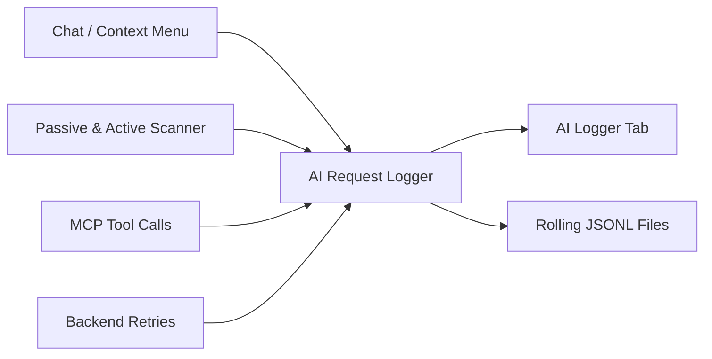

# AI Request Logger

The AI Request Logger provides real-time visibility into all AI-related activity within the extension. It captures prompts, responses, MCP tool calls, retry events, errors, and scanner operations in a unified, searchable log with correlation support.

## Overview



Every AI interaction is recorded as an `AiActivityEntry` with a consistent schema: timestamp, activity type, source, backend, detail text, duration, character counts, token usage estimates, and arbitrary metadata.

## Activity Types

| Type | Icon | Description |
| :--- | :--- | :--- |
| `PROMPT_SENT` | → | Prompt dispatched to AI backend. |
| `RESPONSE_COMPLETE` | ← | AI response fully received. |
| `MCP_TOOL_CALL` | ⚙ | MCP tool executed (from chat tool chaining or external client). |
| `RETRY` | ↻ | Backend retry attempt with backoff delay. |
| `ERROR` | ✗ | Error during AI interaction. |
| `SCANNER_SEND` | 🔍 | Scanner analysis dispatched. |

## Trace IDs (Correlation)

Every operation generates a trace ID that links related log entries together:

| Source | Trace ID Format | Scope |
| :--- | :--- | :--- |
| Chat / context menu | `chat-turn-{UUID}` | Prompt → tool chain steps → final response. |
| Agent supervisor | `agent-turn-{UUID}` | Prompt → response/error. |
| Passive and active scanner (single request) | `scanner-job-{UUID}` | Analysis dispatch → outcome. |
| Passive scanner batch analysis | `scanner-batch-{UUID}` | One AI call covering 3–5 grouped requests. Per-request events share the same trace ID so findings can be mapped back to originators. |
| Adaptive payload generation | `adaptive-payload-{VULN_CLASS}` | AI-driven context-aware payload generation. Identifier is the vulnerability class (e.g. `adaptive-payload-SQLI`) rather than a UUID so repeated generations for the same class share a trace. |

Use the **Trace** filter in the AI Logger tab to isolate all entries for a single operation. This is especially useful for debugging multi-step tool chains where a single user prompt triggers multiple MCP tool calls and follow-up AI requests.

## Metadata Fields

Log entries carry structured metadata beyond the core fields:

| Field | Present In | Description |
| :--- | :--- | :--- |
| `traceId` | All entries | Correlation identifier. |
| `operation` | Prompts, responses | Operation type (`chat_turn`, `agent_send`). |
| `status` | All entries | Outcome (`sent`, `ok`, `error`, `blocked`, `timeout`). |
| `toolId` | MCP tool calls | Tool identifier (e.g., `proxy_http_history`). |
| `policyDecision` | MCP tool calls | Gating result: `allowed`, `disabled`, `unsafe_blocked`, `pro_only`, `concurrency_limited`. |
| `argsSha256` | MCP tool calls | SHA-256 hash of tool arguments. |
| `resultSha256` | MCP tool calls | SHA-256 hash of tool result. |
| `resultChars` | MCP tool calls | Character count of tool result. |
| `step` | Tool chain entries | Step number within tool chain (1–8). |
| `attempt` | Retry entries | Retry attempt number. |
| `delayMs` | Retry entries | Backoff delay in milliseconds. |
| `reason` | Retry/error entries | Error description. |
| `issueCount` | Scanner outcomes | Number of issues created. |
| `promptSource` | Context-driven chat turns | Origin of the prompt: `FIXED`, `CUSTOM_SAVED`, or `CUSTOM_AD_HOC`. |
| `contextKind` | Context-driven chat turns | `HTTP_SELECTION` or `SCANNER_ISSUE` — which right-click menu triggered the launch. |
| `promptId` | Custom saved prompts | UUID of the saved custom prompt. |
| `promptTitle` | Custom saved prompts | Title of the saved custom prompt. |

## AI Logger Tab

The **AI Logger** tab is located in the settings panel between **Privacy & Logging** and **Help**.

### Columns

| Column | Content |
| :--- | :--- |
| Time | Timestamp (`HH:mm:ss.SSS`). |
| Type | Activity type with icon. |
| Source | Origin (`chat`, `agent`, `backend`, `mcp`, `passive_scanner`, `active_scanner`). |
| Backend | Backend identifier. |
| Operation | Operation type from metadata. |
| Status | Outcome from metadata. |
| Trace | Trace ID for correlation. |
| Detail | First 120 characters of the detail text. |
| Duration | Execution time in milliseconds. |
| Prompt | Prompt character count. |
| Response | Response character count. |

### Preset Filters

Quick filters for common investigation patterns:

| Preset | Behavior |
| :--- | :--- |
| **All** | Show all entries (no filter). |
| **Errors only** | Show only `ERROR` type entries. |
| **Slow (>=3s)** | Show entries with duration >= 3000 ms. |
| **Tool failures** | Show MCP tool calls with `status = error`. |

### Additional Filters

* **Type filter**: Filter by activity type (Prompt, Response, MCP Tool, Error, Scanner, Retry).
* **Source filter**: Filter by origin (agent, chat, backend, mcp, passive\_scanner, active\_scanner).
* **Trace filter**: Free-text search on trace ID for isolating correlated entries.

### Detail Pane

Selecting a row shows the full entry in the lower detail pane, including complete metadata, timestamps, token usage, and the full detail text.

### Controls

* **Clear**: Empties the in-memory log buffer.
* **Export JSON**: Exports all current entries as a JSON array.

## In-Memory Buffer

The logger maintains a bounded circular buffer (default 500 entries, configurable from 10 to any upper limit). When the buffer is full, the oldest entries are evicted. The buffer is thread-safe and suitable for high-throughput scanner workloads.

## Rolling JSONL Persistence

For long-running engagements or compliance needs, the logger can persist entries to rolling JSONL files on disk. This is opt-in via JVM system properties.

### Configuration

| JVM Property | Default | Description |
| :--- | :--- | :--- |
| `burp.ai.logger.rolling.enabled` | `false` | Enable rolling file persistence. |
| `burp.ai.logger.rolling.dir` | `~/.burp-ai-agent/logs` | Directory for log files. |
| `burp.ai.logger.rolling.maxBytes` | `1048576` (1 MB) | Maximum size per log file (minimum 10 KB). |
| `burp.ai.logger.rolling.maxFiles` | `5` | Maximum number of rolled files (range: 1–20). |

### How It Works

1. New entries are appended to the active file (`ai-request-log.jsonl`).
2. When the active file exceeds `maxBytes`, it is renamed to `ai-request-log.1.jsonl` and a new active file is created.
3. Older rolled files shift their index (`1 → 2`, `2 → 3`, etc.).
4. Files beyond `maxFiles` are deleted.

### Enabling via Burp

Add these JVM arguments when launching Burp Suite:

```bash
java -jar burpsuite.jar \
  -Dburp.ai.logger.rolling.enabled=true \
  -Dburp.ai.logger.rolling.dir=/path/to/logs \
  -Dburp.ai.logger.rolling.maxBytes=2097152 \
  -Dburp.ai.logger.rolling.maxFiles=10
```

## How to Enable

1. Open **Privacy & Logging** tab in Settings.
2. Toggle **AI Request Logger** ON.
3. Optionally configure **Max entries** for the in-memory buffer.
4. For file persistence, add JVM properties at Burp startup (see above).

## Related Pages

* [Audit Logging](audit-logging.md)
* [Privacy Modes](privacy-modes.md)
* [Chat & Sessions](../user-guide/chat-sessions.md)
* [Settings Reference](../reference/settings-reference.md)
