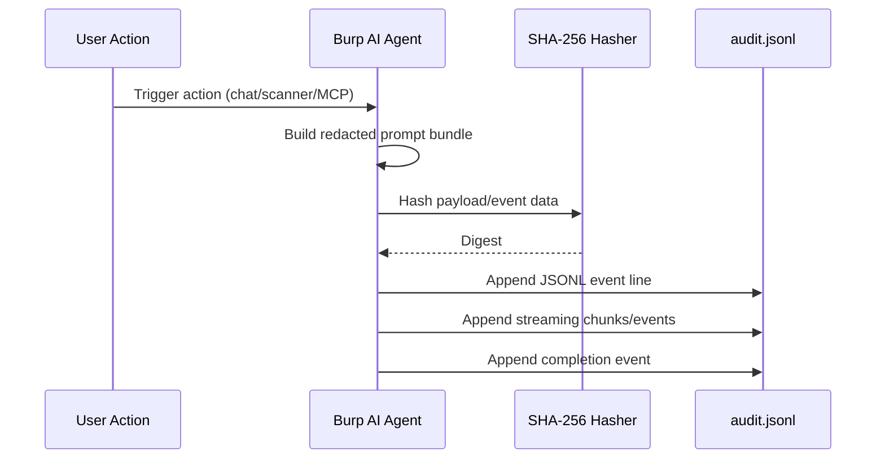

# Audit Logging

Audit logs provide a tamper-evident record of interactions between Burp context and AI backend outputs.

## Event Chain

## What Is Logged

Each event entry can include:

* timestamp,
* event type (`prompt`, `agent_chunk`, `prompt_complete`, scanner/MCP events),
* redacted prompt bundle and hashes,
* backend metadata,
* streamed response chunks.

## Log Format

Logs use **JSON Lines (`.jsonl`)**; each line is a standalone JSON object.

## Security & Integrity

* Each event includes SHA-256 payload hashing.
* With determinism enabled, identical inputs are easier to compare across runs.

## How to Enable

1. Open **Privacy & Logging** tab in Settings.
2. Toggle **Audit Logging** ON.

## File Locations

| Path | Contents |
| :--- | :--- |
| `~/.burp-ai-agent/audit.jsonl` | Main append-only event log. |
| `~/.burp-ai-agent/bundles/` | Prompt bundle snapshots. |
| `~/.burp-ai-agent/contexts/` | Context snapshot files indexed by hash. |

## Use Cases

* Compliance evidence.
* Reproducibility and review of AI-assisted findings.
* Team quality control and diagnostics.

## Related Pages

* [Privacy Modes](privacy-modes.md)
* [Determinism & Salt](determinism-salt.md)
