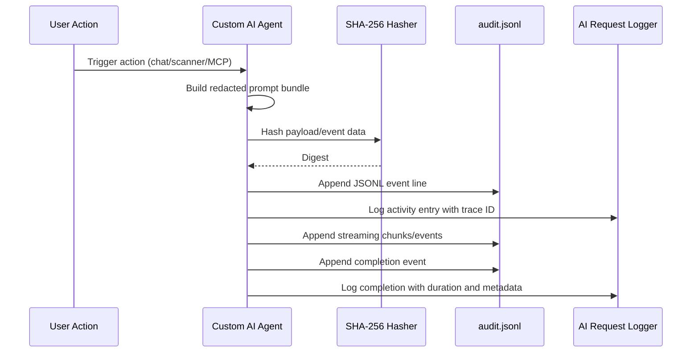

# Audit Logging

Audit logs provide a tamper-evident record of interactions between Burp context and AI backend outputs.

## Event Chain


```mermaid
sequenceDiagram
    participant User as User Action
    participant App as Custom AI Agent
    participant Hash as SHA-256 Hasher
    participant Log as audit.jsonl
    participant Logger as AI Request Logger

    User->>App: Trigger action (chat/scanner/MCP)
    App->>App: Build redacted prompt bundle
    App->>Hash: Hash payload/event data
    Hash-->>App: Digest
    App->>Log: Append JSONL event line
    App->>Logger: Log activity entry with trace ID
    App->>Log: Append streaming chunks/events
    App->>Log: Append completion event
    App->>Logger: Log completion with duration and metadata
```

## What Is Logged

Each event entry can include:

* timestamp,
* event type (`prompt`, `agent_chunk`, `prompt_complete`, scanner/MCP events),
* trace ID for correlation across related entries,
* redacted prompt bundle and hashes,
* backend metadata,
* streamed response chunks,
* launch metadata (see below).

## Launch Metadata

Every context-driven chat launch (right-click → any AI action) stamps the resulting `prompt` event and the `PromptBundle` saved under `bundles/` with:

| Field | Values | Meaning |
| :--- | :--- | :--- |
| `promptSource` | `FIXED` \| `CUSTOM_SAVED` \| `CUSTOM_AD_HOC` | Origin of the prompt. Canned actions report `FIXED`; saved library entries report `CUSTOM_SAVED`; free-form one-offs report `CUSTOM_AD_HOC`. |
| `contextKind` | `HTTP_SELECTION` \| `SCANNER_ISSUE` | Which menu the launch came from. |
| `promptId` | UUID | Identifier of the saved custom prompt (only for `CUSTOM_SAVED`). |
| `promptTitle` | string | Human-readable title of the saved custom prompt (only for `CUSTOM_SAVED`). |

These also land in the `metadata` map of matching `AiRequestLogger` entries (PROMPT_SENT, RESPONSE_COMPLETE, ERROR).

Example filter for recent custom-prompt runs:

```
tail -n 500 ~/.burp-ai-agent/audit.jsonl \
  | jq 'select(.type=="prompt" and .payload.promptSource!="FIXED")
        | {ts, title:.payload.promptTitle, source:.payload.promptSource, ctx:.payload.contextKind}'
```

## Trace ID Correlation

Every operation generates a trace ID that links all related log entries:

| Trace ID pattern | Emitted by | Links |
| :--- | :--- | :--- |
| `chat-turn-{UUID}` | `ChatPanel` | The prompt, any MCP tool chain steps, and the final response. |
| `agent-turn-{UUID}` | `AgentSupervisor` | Prompt dispatch and result outside the chat flow. |
| `scanner-job-{UUID}` | Active and passive scanner (single-request) | Scanner analysis dispatch and outcome. |
| `scanner-batch-{UUID}` | Passive scanner batch analysis (`BatchAnalysisQueue`) | A single AI call covering 3–5 grouped requests, with per-request dispatch events sharing the ID. |
| `adaptive-payload-{VULN_CLASS}` | `AdaptivePayloadEngine` | AI-driven context-aware payload generation, cached by `{vulnClass}:{techStack}` for 30 minutes. |

Trace IDs are visible in both the audit log entries and the [AI Request Logger](ai-request-logger.md) UI. The trace ID can be overridden at the supervisor level when re-driving a cached conversation, so the same UUID may appear across multiple dispatches.

## Log Format

Logs use **JSON Lines (`.jsonl`)**; each line is a standalone JSON object.

## Security & Integrity

* Each event carries a **per-event SHA-256 hash** of the serialized payload in the `payloadSha256` field. The hash is independent per record — there is no Merkle chain linking entries.
* MCP tool calls include argument and result hashes (`argsSha256`, `resultSha256`) so tampering with either the request or the response can be detected when the log line is inspected later.
* With determinism enabled, identical inputs are easier to compare across runs (see [Determinism & Salt](determinism-salt.md)).
* Because the file is append-only plaintext, rely on filesystem ACLs or disk encryption if stronger tamper-evidence is required; the hashes catch payload edits but not line deletion.

## How to Enable

1. Open **Privacy & Logging** tab in Settings.
2. Toggle **Audit Logging** ON.

## File Locations

| Path | Contents |
| :--- | :--- |
| `~/.burp-ai-agent/audit.jsonl` | Main append-only event log. |
| `~/.burp-ai-agent/bundles/` | Prompt bundle snapshots. |
| `~/.burp-ai-agent/contexts/` | Context snapshot files indexed by hash. |
| `~/.burp-ai-agent/logs/` | Rolling AI Request Logger JSONL files (opt-in). |

## Use Cases

* Compliance evidence.
* Reproducibility and review of AI-assisted findings.
* Team quality control and diagnostics.
* Trace ID-based debugging of multi-step tool chains.

## Related Pages

* [AI Request Logger](ai-request-logger.md)
* [Privacy Modes](privacy-modes.md)
* [Determinism & Salt](determinism-salt.md)
