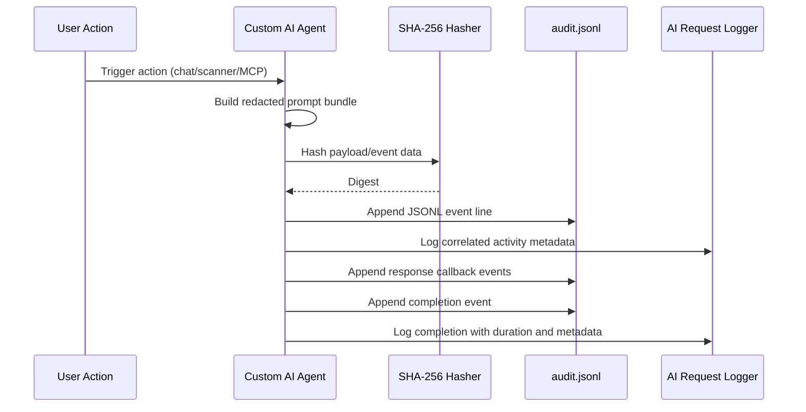

# Audit Logging

Audit logs provide a hash-annotated record of interactions between Burp context and AI backend outputs. They support review and accidental-corruption checks, but the current unkeyed hashes do not authenticate a record against an editor who can rewrite both payload and hash. Universal trace correlation lives in the separate AI Request Logger; the audit event stream does not attach a trace ID to every event.

## Event Chain


```mermaid
sequenceDiagram
    participant User as User Action
    participant App as Custom AI Agent
    participant Hash as SHA-256 Hasher
    participant Log as audit.jsonl
    participant Logger as AI Request Logger

    User->>App: Trigger action (chat/scanner/MCP)
    App->>App: Build redacted prompt bundle
    App->>Hash: Hash payload/event data
    Hash-->>App: Digest
    App->>Log: Append JSONL event line
    App->>Logger: Log correlated activity metadata
    App->>Log: Append response callback events
    App->>Log: Append completion event
    App->>Logger: Log completion with duration and metadata
```

## What Is Logged

Each event entry can include:

* timestamp,
* event type (`prompt`, `agent_chunk`, `prompt_complete`, scanner/MCP events),
* a trace ID on selected scanner/MCP event families (not on every supervisor prompt/chunk/completion event),
* redacted prompt bundle and hashes,
* backend metadata,
* response callback chunks (currently one complete chunk for built-in backends),
* launch metadata (see below).

For chat dispatches, the prompt bundle records the current `text` argument sent through `AgentSupervisor.sendChat`. It is not a full wire transcript: conversation history is supplied separately, and HTTP-capable backends can receive the active agent profile through a separate `systemPrompt` argument that is not serialized into the bundle. CLI backends instead prepend that profile to their user text. Treat the bundle as a review artifact for the captured dispatch, not as proof of every byte a provider received.

## Launch Metadata

Every context-driven chat launch (right-click → any AI action) stamps the resulting `prompt` event and the `PromptBundle` saved under `bundles/` with:

| Field | Values | Meaning |
| :--- | :--- | :--- |
| `promptSource` | `FIXED` \| `CUSTOM_SAVED` \| `CUSTOM_AD_HOC` | Origin of the prompt. Canned actions report `FIXED`; saved library entries report `CUSTOM_SAVED`; free-form one-offs report `CUSTOM_AD_HOC`. |
| `contextKind` | `HTTP_SELECTION` \| `SCANNER_ISSUE` | Which menu the launch came from. |
| `promptId` | UUID | Identifier of the saved custom prompt (only for `CUSTOM_SAVED`). |
| `promptTitle` | string | Human-readable title of the saved custom prompt (only for `CUSTOM_SAVED`). |

These also land in the `metadata` map of matching `AiRequestLogger` entries (PROMPT_SENT, RESPONSE_COMPLETE, ERROR).

Example filter for recent custom-prompt runs:

```
tail -n 500 ~/.burp-ai-agent/audit.jsonl \
  | jq 'select(.type=="prompt" and .payload.promptSource!="FIXED")
        | {ts, title:.payload.promptTitle, source:.payload.promptSource, ctx:.payload.contextKind}'
```

## Trace ID Correlation

The AI Request Logger generates and carries the following correlation IDs. Do not assume the same ID is present in every `audit.jsonl` event: current supervisor `prompt`, `agent_chunk`, and `prompt_complete` records omit it, while selected scanner/MCP audit payloads may include one.

| Trace ID pattern | Emitted by | Links |
| :--- | :--- | :--- |
| `chat-turn-{UUID}` | `ChatPanel` | The prompt, any MCP tool chain steps, and the final response. |
| `agent-turn-{UUID}` | `AgentSupervisor` | Prompt dispatch and result outside the chat flow. |
| `scanner-job-{UUID}` | Active and passive scanner (single-request) | Scanner analysis dispatch and outcome. |
| `scanner-batch-{UUID}` | Passive scanner batch analysis (`BatchAnalysisQueue`) | A single AI call covering 3–5 grouped requests, with per-request dispatch events sharing the ID. |
| `adaptive-payload-{VULN_CLASS}` | `AdaptivePayloadEngine` | AI-driven context-aware payload generation, cached by `{vulnClass}:{techStack}` for 30 minutes. |

Use the [AI Request Logger](ai-request-logger.md) UI or its optional rolling JSONL files for end-to-end trace filtering. Join audit prompt bundles by their session/backend/timestamp and launch metadata where necessary.

## Log Format

Logs use **JSON Lines (`.jsonl`)**; each line is a standalone JSON object.

## Security & Integrity

* Each event carries a **per-event SHA-256 checksum** of the serialized payload in the `payloadSha256` field. The checksum is independent per record — there is no keyed MAC, signature, external anchor, or Merkle chain linking entries.
* MCP tool calls include argument and result checksums (`argsSha256`, `resultSha256`) for correlation and comparison across records.
* With determinism enabled, identical inputs are easier to compare across runs (see [Determinism & Salt](determinism-salt.md)).
* The file is ordinary append-oriented plaintext. A process with write access can alter a payload and recompute its checksum, or delete/reorder lines. Use filesystem ACLs, append-only storage, remote log shipping, signatures, or another external integrity control when authenticity matters.

## How to Enable

1. Open **Privacy & Logging** tab in Settings.
2. Toggle **Audit Logging** ON.

## File Locations

| Path | Contents |
| :--- | :--- |
| `~/.burp-ai-agent/audit.jsonl` | Main append-oriented event log. |
| `~/.burp-ai-agent/bundles/` | Prompt bundle snapshots. |
| `~/.burp-ai-agent/contexts/` | Reserved context directory. The current runtime creates it, but no production caller writes standalone context snapshots. Context may still be embedded in prompt bundles. |
| `~/.burp-ai-agent/logs/` | Rolling AI Request Logger JSONL files (opt-in). |

## Use Cases

* Supporting compliance evidence when paired with external retention/integrity controls.
* Reproducibility and review of AI-assisted findings.
* Team quality control and diagnostics.
* Review of captured prompt metadata and response chunks; use the AI Request Logger for complete trace-ID filtering.

## Related Pages

* [AI Request Logger](ai-request-logger.md)
* [Privacy Modes](privacy-modes.md)
* [Determinism & Salt](determinism-salt.md)
