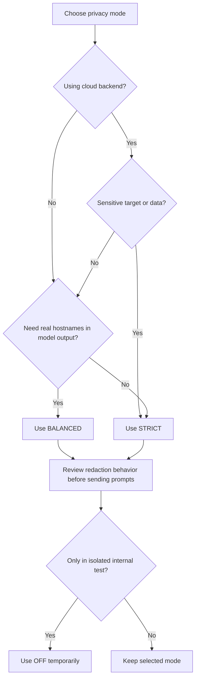

# Privacy Modes

Privacy mode controls what request/response data can leave Burp when the extension calls AI backends or returns MCP tool output.

Configure it in the **Privacy & Logging** tab in the Settings panel.


Default value is `OFF`. For real engagements, set privacy mode intentionally before sending any prompts.


## Mode Comparison

| Mode | Cookies | Auth Tokens | Hostnames | Typical Use |
| :--- | :--- | :--- | :--- | :--- |
| `STRICT` | Stripped | Redacted | Anonymized | Cloud backends with sensitive targets. |
| `BALANCED` | Stripped | Redacted | Preserved | Mixed workflows where host context is needed. |
| `OFF` | Preserved | Preserved | Preserved | Controlled internal testing only. |

## Decision Guide



## What Changes in Practice

### STRICT

* Hostnames are replaced with deterministic pseudonyms.
* Auth tokens are redacted.
* Cookies are stripped.

### BALANCED

* Hostnames stay visible.
* Auth tokens are redacted.
* Cookies are stripped.

### OFF

* Raw context is eligible for transmission.
* No automatic redaction is applied.

## Before/After Example

Raw request headers:

```http
Host: api.company.tld
Authorization: Bearer eyJhbGciOi...
Cookie: sessionid=abc123; csrftoken=xyz
```

`STRICT` output:

```http
Host: host-a3f2c1.local
Authorization: Bearer [REDACTED]
Cookie: [STRIPPED]
```

`BALANCED` output:

```http
Host: api.company.tld
Authorization: Bearer [REDACTED]
Cookie: [STRIPPED]
```

## Important Boundaries


Privacy mode does not prevent active scanner traffic from reaching the real target. It only controls prompt/tool data sent to AI clients.


* BountyPrompt tag resolution runs after redaction, so tags inherit current privacy policy.
* MCP tool responses are filtered by the same privacy mode.
* Determinism mode and salt handling affect reproducibility and anonymization stability.

## Related Pages

* [Redaction Pipeline](../developer/redaction-pipeline.md)
* [Determinism & Salt](determinism-salt.md)
* [Audit Logging](audit-logging.md)
