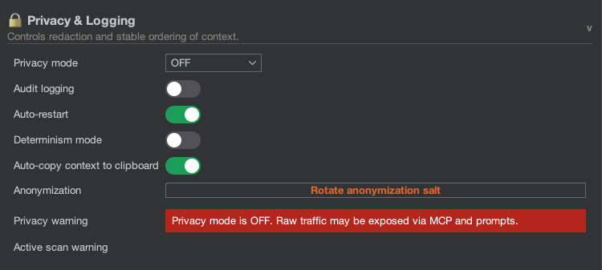

# Privacy Modes

One of the core value propositions of the Burp AI Agent is the ability to use AI safely. Privacy modes strictly control what data is allowed to leave Burp.

## Modes Explained

### 1. STRICT Mode

**"Zero Trust"** - Designed for highly sensitive engagements.

* **Redaction**:
  * **Hostnames**: Replaced with anonymized placeholders (e.g., `host-8f2a3b.local`). The mapping is stable for a given salt so the AI can still understand relationships.
  * **Auth Tokens**: Authorization headers, API keys, bearer tokens, and JWT-like strings are redacted.
  * **Cookies**: All Cookie values are scrubbed.
* **Use Case**: Sending data to a cloud backend (Claude/Gemini) where you do not want to reveal the target identity.

### 2. BALANCED Mode

**"Pragmatic Security"** - Balances context for the AI with basic hygiene.

* **Redaction**:
  * **Auth Tokens**: Redacted.
  * **Cookies**: Cookie headers are stripped.
  * **Hostnames**: **Preserved**. The AI _will_ see `bank-of-america.com`.
* **Use Case**: Using local models (Ollama) or when you have legal clearance to share the target's identity with the AI provider.

### 3. OFF (Default)

**"Raw Data"** - No filters.

* **Redaction**: None. The exact raw HTTP request is sent to the model.
* **Use Case**: Internal testing, or when you are testing your own application and want the AI to have maximum context (e.g., debugging a specific session token issue).

## Important Notes

* **Active Scanning**: The Active Scanner _always_ sends traffic to the _real_ target. Privacy modes apply to the _prompt_ sent to the AI, not the traffic the AI generates against the target.
* **Determinism**: In STRICT mode, the "Host Anonymization Salt" ensures that the same host maps to the same pseudonym until you rotate the salt, allowing the AI to correlate findings safely.
