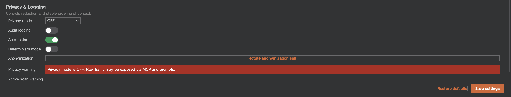

# Privacy Modes

One of the core value propositions of the Burp AI Agent is the ability to use AI safely. Privacy modes strictly control what data is allowed to leave Burp.

## Modes Explained

### 1. STRICT Mode
**"Zero Trust"** - Designed for highly sensitive engagements.

*   **Redaction**:
    *   **Hostnames**: Replaced with anonymized placeholders (e.g., `target-1.com`, `api-service-2.org`). The mapping is stable within a session so the AI can still understand relationships.
    *   **Auth Tokens**: Bearer tokens, API keys, and common secret patterns are replaced with `<REDACTED_TOKEN>`.
    *   **Cookies**: All Cookie values are scrubbed.
    *   **PII**: Attempt to identify and mask email addresses and phone numbers (best effort).
*   **Use Case**: Sending data to a cloud backend (Claude/Gemini) where you do not want to reveal the target identity.

### 2. BALANCED Mode (Default)
**"Pragmatic Security"** - Balances context for the AI with basic hygiene.

*   **Redaction**:
    *   **Auth Tokens**: Redacted.
    *   **Cookies**: Session IDs are often redacted, but non-sensitive cookies might be preserved (implementation dependent).
    *   **Hostnames**: **Preserved**. The AI *will* see `bank-of-america.com`.
*   **Use Case**: Using local models (Ollama) or when you have legal clearance to share the target's identity with the AI provider.

### 3. OFF
**"Raw Data"** - No filters.

*   **Redaction**: None. The exact raw HTTP request is sent to the model.
*   **Use Case**: Internal testing, or when you are testing your own application and want the AI to have maximum context (e.g., debugging a specific session token issue).

## Important Notes

*   **Active Scanning**: The Active Scanner *always* sends traffic to the *real* target. Privacy modes apply to the *prompt* sent to the AI, not the traffic the AI generates against the target.
*   **Determinism**: In STRICT mode, the "Host Anonymization Salt" ensures that `target-1.com` always maps to the same real host across different requests in the same session, allowing the AI to correlate findings.