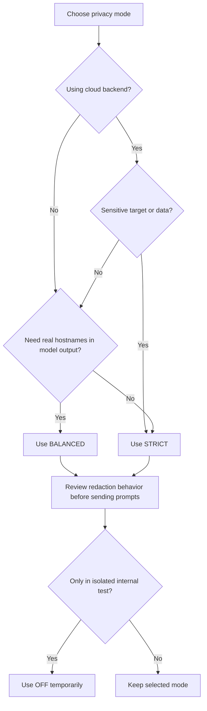

# Privacy Modes

Privacy mode controls what request/response data can leave Burp when the extension calls AI backends or returns MCP tool output.

Configure it in the **Privacy & Logging** tab in the Settings panel.


Default value is `BALANCED` (was `OFF` prior to v0.6.0). New installs and users who never explicitly chose a mode get cookie stripping and token redaction automatically. Users with an existing explicit choice keep it unchanged.


## Mode Comparison

| Mode | Cookies | Auth headers / Bearer / JWT / Basic / URL tokens | Hostnames | Typical Use |
| :--- | :--- | :--- | :--- | :--- |
| `STRICT` | Stripped | Redacted | Anonymized (SHA-256 + salt) | Cloud backends with sensitive targets. |
| `BALANCED` | Stripped | Redacted | Preserved | Default. Mixed workflows where host context is needed. |
| `OFF` | Preserved | Preserved | Preserved | Controlled internal testing on local-only models. |

## Decision Guide


```mermaid
flowchart TD
    Start[Choose privacy mode]
    Cloud{Using cloud backend?}
    Sensitive{Sensitive target or data?}
    NeedHost{Need real hostnames in model output?}

    Start --> Cloud
    Cloud -->|Yes| Sensitive
    Cloud -->|No| NeedHost

    Sensitive -->|Yes| Strict[Use STRICT]
    Sensitive -->|No| NeedHost

    NeedHost -->|Yes| Balanced[Use BALANCED]
    NeedHost -->|No| Strict

    Balanced --> Review[Review redaction behavior before sending prompts]
    Strict --> Review
    Review --> Off{Only in isolated internal test?}
    Off -->|Yes| OffMode[Use OFF temporarily]
    Off -->|No| Done[Keep selected mode]
```

## What Changes in Practice

### STRICT

* Hostnames are replaced with deterministic pseudonyms (salt-based SHA-256).
* Auth/session tokens and URL query tokens are redacted.
* Cookies are stripped.

### BALANCED

* Hostnames stay visible.
* Auth/session tokens and URL query tokens are redacted.
* Cookies are stripped.

### OFF

* Raw context is eligible for transmission.
* No automatic redaction is applied.

## Patterns Redacted (STRICT and BALANCED)

**Headers**: `Authorization`, `Proxy-Authorization`, `X-API-Key`, `API-Key`, `X-API-Secret`, `API-Secret`, `X-Client-Secret`, `X-Auth-Token`, `Auth-Token`, `X-Access-Token`, `Access-Token`, `X-Session-Token`, `Session-Token`, `X-CSRF-Token`, `CSRF-Token`, `X-XSRF-Token`.

**Inline tokens** anywhere in the text: `Bearer …`, `Basic …`, JWT-shaped values (`eyJ…` with three base64url segments).

**URL query parameters** (value redacted, key kept): `access_token`, `api_key`, `apikey`, `auth`, `token`, `key`, `secret`, `password`, `pwd`, `session`, `sid`, `code`.

## Before/After Example

Raw request:

```http
GET /api/user?api_key=abc123&session=xyz&name=alice HTTP/1.1
Host: api.company.tld
Authorization: Bearer eyJhbGciOi...
X-CSRF-Token: csrf-0f4a2b
X-Auth-Token: at-8d2c
Cookie: sessionid=abc123; csrftoken=xyz
```

`STRICT` output:

```http
GET /api/user?api_key=[REDACTED]&session=[REDACTED]&name=alice HTTP/1.1
Host: host-a3f2c1.local
Authorization: [REDACTED]
X-CSRF-Token: [REDACTED]
X-Auth-Token: [REDACTED]
Cookie: [STRIPPED]
```

`BALANCED` output:

```http
GET /api/user?api_key=[REDACTED]&session=[REDACTED]&name=alice HTTP/1.1
Host: api.company.tld
Authorization: [REDACTED]
X-CSRF-Token: [REDACTED]
X-Auth-Token: [REDACTED]
Cookie: [STRIPPED]
```

## Context Preview Dialog

When you run a right-click action that captures context automatically (proxy item, scanner issue, site-map node, etc.), the extension opens a preview dialog before anything is sent:

* Shows the current **privacy mode** prominently at the top.
* Shows the **exact prompt** that will be sent.
* Shows the **redacted JSON** that will accompany the prompt (what the AI will actually see).
* Buttons: **Send** or **Cancel**.

If you cancel, no session is created and nothing is sent. User-typed messages inside an active chat session skip this dialog because you are the author.

## Important Boundaries


Privacy mode does not prevent active scanner traffic from reaching the real target. It only controls prompt/tool data sent to AI clients.


* BountyPrompt tag resolution runs after redaction, so tags inherit current privacy policy.
* MCP tool responses are filtered by the same privacy mode.
* Determinism mode and salt handling affect reproducibility and anonymization stability.

## Related Pages

* [Redaction Pipeline](../developer/redaction-pipeline.md)
* [Determinism & Salt](determinism-salt.md)
* [Audit Logging](audit-logging.md)
