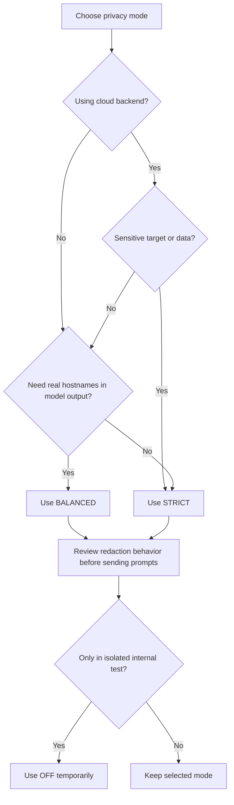

# Privacy Modes

Privacy mode selects the built-in transformations applied when the extension calls AI backends or returns MCP tool output. It reduces exposure; it is not a content-independent DLP boundary.

Configure it in the **Privacy & Logging** tab in the Settings panel.


Default is `BALANCED` — recognized cookie and credential carriers are redacted automatically. Users who explicitly choose another mode keep their choice across sessions.



The table below describes policy intent on covered carriers. Structured output shapes and scanner findings have [documented limits](limitations.md#redaction-coverage-and-known-boundaries). Inspect the action context preview and representative `redact_preview` results, and treat logs/caches as sensitive; neither view is a byte-for-byte inspector of the final provider protocol envelope.


## Mode Comparison

| Mode | Cookies | Auth headers / Bearer / JWT / Basic / URL tokens | Hostnames | Typical Use |
| :--- | :--- | :--- | :--- | :--- |
| `STRICT` | Stripped | Redacted | Anonymized with RFC 5869 HKDF/HMAC-SHA256 | Cloud backends where the documented residuals are acceptable. |
| `BALANCED` | Stripped | Redacted | Preserved | Default. Mixed workflows where host context is needed. |
| `OFF` | Preserved | Preserved | Preserved | Controlled internal testing on local-only models. User-defined custom patterns still run. |

## Decision Guide


```mermaid
flowchart TD
    Start[Choose privacy mode]
    Cloud{Using cloud backend?}
    Sensitive{Sensitive target or data?}
    NeedHost{Need real hostnames in model output?}

    Start --> Cloud
    Cloud -->|Yes| Sensitive
    Cloud -->|No| NeedHost

    Sensitive -->|Yes| Strict[Use STRICT]
    Sensitive -->|No| NeedHost

    NeedHost -->|Yes| Balanced[Use BALANCED]
    NeedHost -->|No| Strict

    Balanced --> Review[Review redaction behavior before sending prompts]
    Strict --> Review
    Review --> Off{Only in isolated internal test?}
    Off -->|Yes| OffMode[Use OFF temporarily]
    Off -->|No| Done[Keep selected mode]
```

## What Changes in Practice

### STRICT

* Hostnames in covered URL and `Host` carriers are replaced with deterministic `host-<12 hex>.local` pseudonyms using RFC 5869 HKDF with HMAC-SHA256.
* Recognized auth/session tokens and sensitive URL, form, and JSON-key values are redacted.
* Recognized cookie headers, cookie sections, and cookie-typed parameters are stripped.

### BALANCED

* Hostnames stay visible.
* Recognized auth/session tokens and sensitive URL, form, and JSON-key values are redacted.
* Recognized cookie headers, cookie sections, and cookie-typed parameters are stripped.

### OFF

* Raw context is eligible for transmission.
* Built-in cookie, token, and host transformations are disabled.
* Custom redaction regexes configured by the user still apply.

When you change Privacy Mode the **Privacy & Logging** tab surfaces an inline advisory banner that summarises the combined state (e.g. `OFF` with MCP on, `STRICT` with the active scanner on, external MCP without allowed origins). See [UI Tour → Advisory Banner (SubtleNotice)](../user-guide/ui-tour.md#advisory-banner-subtlenotice) for the level semantics.

## Built-In Patterns (STRICT and BALANCED)

**Headers**: `Authorization`, `Proxy-Authorization`, `X-API-Key`, `API-Key`, `X-API-Secret`, `API-Secret`, `X-Client-Secret`, `X-Auth-Token`, `Auth-Token`, `X-Access-Token`, `Access-Token`, `X-Session-Token`, `Session-Token`, `X-CSRF-Token`, `CSRF-Token`, `X-XSRF-Token`.

**Inline tokens** anywhere in the text: `Bearer …`, `Basic …`, JWT-shaped values (`eyJ…` with three base64url segments).

**Sensitive keys** in URL queries, form bodies, and JSON objects use a shared, case-insensitive vocabulary. It covers `access_token`, `api_key`/`apikey`, `auth`, `token`, `secret`, `password`/`pwd`, `session`, `sid`, recognized framework session keys, and credential-prefixed `key`/`code` forms such as `private_key` or `access_code`. The key is preserved and its value is replaced. Generic metadata such as `status_code`, `public_key`, and `cache_key` is deliberately not classified as a credential.

**Cookie carriers** include header names containing `cookie`, dedicated passive-scanner cookie sections, and parameters whose Montoya type is `COOKIE`. See [known boundaries](limitations.md#redaction-coverage-and-known-boundaries) for punctuation-bearing header names and structured parameter results.

**Custom patterns** are one regular expression per line in **Privacy & Logging**. They are validated on save and run in every privacy mode, including `OFF`.

## Before/After Example

Raw request:

```http
GET /api/user?api_key=abc123&session=xyz&name=alice HTTP/1.1
Host: api.company.tld
Authorization: Bearer eyJhbGciOi...
X-CSRF-Token: csrf-0f4a2b
X-Auth-Token: at-8d2c
Cookie: sessionid=abc123; csrftoken=xyz
```

`STRICT` output:

```http
GET /api/user?api_key=[REDACTED]&session=[REDACTED]&name=alice HTTP/1.1
Host: host-a3f2c19e4b72.local
Authorization: [REDACTED]
X-CSRF-Token: [REDACTED]
X-Auth-Token: [REDACTED]
Cookie: [STRIPPED]
```

`BALANCED` output:

```http
GET /api/user?api_key=[REDACTED]&session=[REDACTED]&name=alice HTTP/1.1
Host: api.company.tld
Authorization: [REDACTED]
X-CSRF-Token: [REDACTED]
X-Auth-Token: [REDACTED]
Cookie: [STRIPPED]
```

## Context Preview Dialog

When you run a right-click action that captures context automatically (proxy item, scanner issue, site-map node, etc.), the extension opens a preview dialog before anything is sent:

* Shows the current **privacy mode** prominently at the top.
* Shows the resolved action prompt before any tool preamble or separate system-role agent profile is added.
* Shows the **redacted JSON** that will accompany that manual action's prompt.
* Buttons: **Send** or **Cancel**.

If you cancel, no session is created and nothing is sent. User-typed messages inside an active chat session skip this dialog because you are the author.

## Important Boundaries


Privacy mode does not prevent active scanner traffic from reaching the real target. It only controls prompt/tool data sent to AI clients.


* BountyPrompt resolves most request/response tags from text that has already passed through `Redaction.apply`. Its parameter tag uses a separate type/name-aware sanitizer, which is why benign-name secret values have the documented residual boundary.
* MCP tool responses pass through the current read-time redaction layer; structured producers also sanitize recognized headers and cookie-typed parameters before serialization.
* Changing privacy mode does not rewrite scanner findings already stored in Burp. Re-scanning can consolidate with the existing immutable issue instead of replacing its detail.
* Determinism mode and salt handling affect reproducibility and anonymization stability.
* The preview dialog covers the manual action being confirmed. Later scanner output or MCP tool calls have their own carriers and gates.

## Related Pages

* [Redaction Pipeline](../developer/redaction-pipeline.md)
* [Determinism & Salt](determinism-salt.md)
* [Audit Logging](audit-logging.md)
* [Limitations & Hallucinations](limitations.md)
