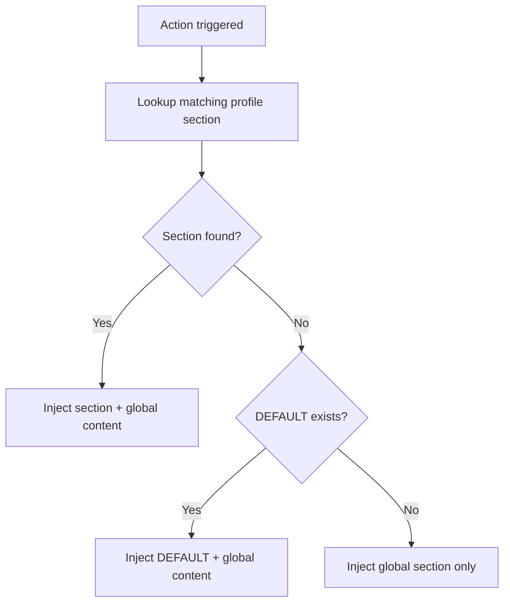

# Agent Profiles

Agent Profiles allow you to customize the AI's system instructions based on your engagement type. Profiles are Markdown files stored in `~/.burp-ai-agent/AGENTS/` that inject role-specific guidance into every AI interaction.

## Installation

On first run, the extension creates `~/.burp-ai-agent/AGENTS/` and auto-installs the bundled profiles. You should see three built-in profiles: `pentester.md`, `bughunter.md`, and `auditor.md`.

If you delete them, simply re-run Burp or drop the files back into the directory.

## How It Works

1. The **Agent profile** dropdown lists all `*.md` files in `~/.burp-ai-agent/AGENTS/` (use **Refresh** to reload).
2. The extension writes the active profile name to `~/.burp-ai-agent/AGENTS/default`.
3. When a chat session or context menu action runs, the extension loads the corresponding `.md` file and picks the matching section.
4. **Delivery depends on the backend:**
   * **HTTP backends** that advertise `supportsSystemRole = true` (Burp AI, Ollama, LM Studio, Generic OpenAI-compatible, NVIDIA NIM) receive the profile text as a dedicated **system-role message** at the start of the conversation, separate from the user prompt.
   * **CLI backends** (Gemini, Claude, Codex, Copilot, OpenCode) do not have a system-role channel, so the profile text is **prepended to the user prompt** before the command is invoked.
   * For either path, the text is labeled `System instructions (AGENTS):` so it is auditable in logs.



## Profile File Format

Profile files use a simple section-based format with `[SECTION_NAME]` headers:

```markdown
You are an expert penetration tester. Focus on identifying high-impact
vulnerabilities and providing actionable remediation advice.

[REQUEST_ANALYSIS]
When analyzing HTTP requests, prioritize:
- Authentication and authorization flaws
- Injection vulnerabilities (SQLi, XSS, command injection)
- Business logic issues

[ISSUE_ANALYSIS]
When reviewing scanner findings:
- Assess exploitability in the current context
- Provide CVSS scoring rationale
- Suggest concrete remediation steps

[JS_ANALYSIS]
When analyzing JavaScript:
- Look for hardcoded secrets and API keys
- Identify client-side validation that can be bypassed
- Map API endpoints and data flows

[DEFAULT]
Provide detailed technical analysis with evidence.
```

### Structure

* **Global section** (text before any `[SECTION]` header): Injected into every prompt regardless of action.
* **Named sections**: Injected when the corresponding context menu action triggers. The `[DEFAULT]` section is used as a fallback when no specific section matches the action.

## Section-to-Action Mapping

The extension maps context menu actions to profile sections:

| Context Menu Action | Profile Section |
| :--- | :--- |
| Find vulnerabilities | `[REQUEST_ANALYSIS]` |
| Analyze this request | `[ANALYZE_REQUEST]` |
| Explain JS | `[JS_ANALYSIS]` |
| Access control | `[ACCESS_CONTROL]` |
| Login sequence | `[LOGIN_SEQUENCE]` |
| Analyze this issue | `[ISSUE_ANALYSIS]` |
| Generate PoC & validate | `[POC]` |
| Impact & severity | `[ISSUE_IMPACT]` |
| Full report | `[FULL_REPORT]` |
| Free-form chat | `[CHAT]` |

If no matching section is found, the `[DEFAULT]` section is used. If neither exists, only the global section is injected.

## Built-in Profiles

The extension UI offers three profile presets:

| Profile | Description |
| :--- | :--- |
| `pentester` | General-purpose penetration testing focus. Emphasizes exploitation, PoC generation, and remediation. |
| `bughunter` | Bug bounty oriented. Prioritizes impact, severity, and report-ready output. |
| `auditor` | Compliance and audit focus. Emphasizes controls, regulatory frameworks, and documentation. |

## Creating Custom Profiles

1. Navigate to `~/.burp-ai-agent/AGENTS/`.
2. Create a new Markdown file (e.g., `apitester.md`).
3. Write your global instructions and any `[SECTION]` blocks you need.
4. Open **Settings** and click **Refresh** next to the **Agent profile** dropdown. Your new profile will appear automatically.

If you prefer automation, you can also edit `~/.burp-ai-agent/AGENTS/default` directly to set the active profile name (e.g., `apitester.md`).

## File Caching

The profile loader caches the parsed profile and checks the file modification timestamp on each use. If you edit a profile file while Burp is running, the changes are picked up automatically on the next AI interaction without needing to restart.

## Tips

* Keep global instructions concise (2-3 sentences) to avoid consuming too much of the model's context window.
* Use section-specific instructions for detailed guidance per action type.
* The `[DEFAULT]` section is a good place for general output formatting preferences.
* Profile instructions appear as `System instructions (AGENTS):` in the payload sent to the backend (inside the system-role message on HTTP backends, at the top of the combined text on CLI backends).


## Profile Validation

The settings UI validates profile tool references against currently enabled MCP tools.

- If a profile references tools that are disabled, unsafe-gated, or unavailable in current edition, a warning is shown.
- Validation checks tool references from bullet lists and common call formats (`/tool ...`, JSON tool calls).
- This helps prevent silent profile/tool mismatches during sessions.

### Optional Tool References

Tools referenced only in the catalog section of a profile (the "Available MCP Tools" list) are treated as informational. If these tools are disabled because they require **Unsafe mode** to be enabled, the validation warning is suppressed. This prevents noise from built-in profiles (pentester, bughunter, auditor) that list tools like `http1_request` and `http2_request` as available options without requiring them to be active.

Warnings are only shown for tools that are explicitly referenced in prompts or instructions (e.g., `/tool http1_request` or `"tool": "http1_request"`).

## Related Pages

* [Prompt Defaults](../reference/prompt-defaults.md)
* [Prompt Templates](prompt-templates.md)
