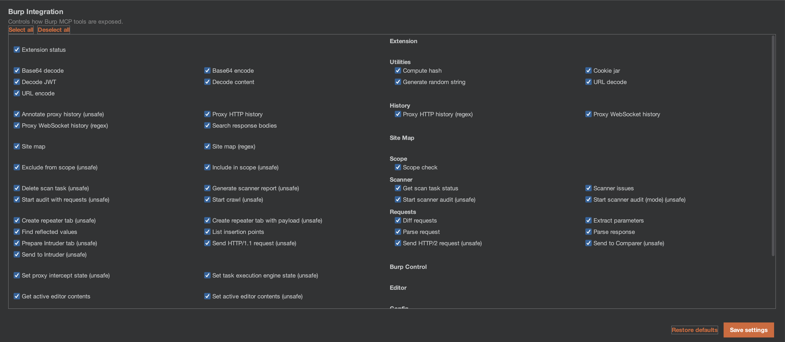

# Burp Integration

The extension integrates deeply with Burp Suite's existing tools and workflows.

## Supported Burp Tools

| Burp Tool | Integration |
| :--- | :--- |
| **Proxy History** | Right-click context menus on HTTP requests. Passive scanner monitors all proxy traffic. |
| **Repeater** | Context menus available on requests/responses. MCP tools can create Repeater tabs. |
| **Intruder** | MCP tools can send requests to Intruder and configure insertion points. |
| **Scanner** (Pro) | Issue context menus for analysis. AI ScanCheck integrates with native scanner. Active scanner uses Collaborator. |
| **Site Map** | Context menus on entries. MCP tools can browse and search the site map. |
| **Target Scope** | Scanners respect in-scope filters. MCP tools can check/modify scope. |
| **Comparer** (Pro) | MCP tools can send items to Comparer for diff analysis. |
| **Collaborator** (Pro) | Active scanner generates Collaborator payloads for out-of-band detection. |

## Burp Pro vs Community Edition

| Feature | Community | Professional |
| :--- | :--- | :--- |
| Context menu actions (requests) | Yes | Yes |
| Context menu actions (issues) | No | Yes |
| Chat & sessions | Yes | Yes |
| All AI backends | Yes | Yes |
| MCP server (49+ tools) | Yes (non-Pro tools) | Yes (all tools) |
| Passive AI Scanner | Yes | Yes |
| Active AI Scanner | Manual queue only | Full integration with native scanner |
| Scanner MCP tools | No | Yes |
| Collaborator (OAST) | No | Yes |
| Scan reports via MCP | No | Yes |

The extension gracefully detects the Burp edition at startup and disables Pro-only features on Community Edition.

## MCP Tool Toggles

The MCP server exposes 49+ tools to external AI agents. For security, you control which tools are available:

### Safe vs Unsafe Tools

*   **Safe tools** (enabled by default): Read-only operations like browsing proxy history, site map, scope checks, and utility functions.
*   **Unsafe tools** (disabled by default): Operations that modify state or send traffic — HTTP requests, Repeater tab creation, Intruder, scope modification, scanner control.

### Managing Tool Access

1.  Navigate to **Settings → MCP Server**.
2.  Use the **Tool Toggles** checkboxes to enable/disable individual tools.
3.  Use **Select All** / **Deselect All** for quick management.
4.  Toggle **Enable Unsafe Tools** to enable all unsafe tools at once.

> **Security recommendation**: Only enable unsafe tools when actively working with an MCP client you trust. Disable them when not in use.

## Native Scanner Integration (Pro)

On Burp Suite Professional, the extension registers an `AiScanCheck` with Burp's built-in active scanner. This means:

*   AI-powered scan checks run alongside Burp's default checks during active scans.
*   Findings are reported as native Burp issues with `[AI]` prefix.
*   The AI scanner respects Burp's scan configuration and scope settings.

On Community Edition, this integration is silently skipped and the AI scanner operates independently.
