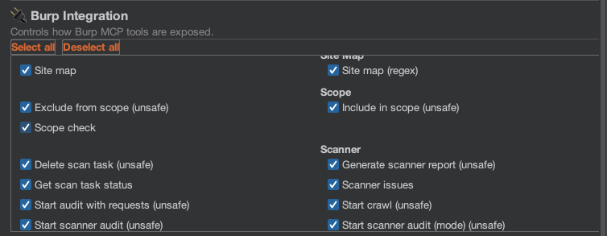

# Burp Integration

The extension integrates directly with Burp tools and workflows so AI analysis stays close to real testing data.

## Supported Burp Tools

| Burp Tool | Integration |
| :--- | :--- |
| **Proxy History** | Request context menus and passive scanner monitoring. |
| **Repeater** | Context actions on requests/responses and MCP Repeater tools. |
| **Intruder** | MCP tools can create and run Intruder setups. |
| **Scanner** (Pro) | Issue context menus, active checks, and ScanCheck integration. |
| **Site Map** | Context menus and MCP site map search/query tools. |
| **Target Scope** | Scope-aware scanner and MCP scope tools. |
| **Comparer** (Pro) | MCP `comparer_send` workflow support. |
| **Collaborator** (Pro) | Active scanner OAST payload generation and polling. |

## Burp Pro vs Community Edition

| Feature | Community | Professional |
| :--- | :--- | :--- |
| Context menu actions (requests) | Yes | Yes |
| Context menu actions (issues) | No | Yes |
| Chat & sessions | Yes | Yes |
| All AI backends | Yes | Yes |
| MCP server | Yes (non-Pro tools) | Yes (all tools) |
| Passive AI Scanner | Yes | Yes |
| Active AI Scanner | Manual queue path | Native scanner integration + queue |
| Scanner MCP tools | No | Yes |
| Collaborator OAST | No | Yes |
| Scan reports via MCP | No | Yes |

The extension detects Burp edition at startup and disables unsupported capabilities automatically.

## MCP Tool Toggles

You control MCP exposure from **Burp Integration** and **MCP Server** tabs.

### Safe vs Unsafe

* **Safe**: read-only operations, enabled by default.
* **Unsafe**: state-changing or traffic-generating operations, disabled by default.

### Managing Tool Access

1. Open the **Burp Integration** tab in Settings.
2. Enable/disable tools by category.
3. Use **Select All / Deselect All** when needed.
4. Enable **Unsafe Tools** in the **MCP Server** tab if unsafe tool toggles must be active.


Enable unsafe tools only for trusted MCP clients and only while actively using those workflows.


## Collaborator Workflow (Pro)

When **Use Collaborator (OAST)** is enabled in Active Scanner settings, the workflow is:

1. Active scanner builds a targeted OAST payload using a Burp Collaborator interaction domain.
2. Payload is inserted into selected injection points (based on risk level and scan mode).
3. Requests are sent to the target and polling runs at configured intervals.
4. DNS/HTTP callbacks are correlated to the originating scan item.
5. Confirmed OAST behavior contributes to scanner evidence and issue creation.

Typical use cases:

* blind SSRF confirmation,
* blind command injection confirmation,
* out-of-band deserialization indicators.

## Native Scanner Integration (Pro)

On Burp Pro, an `AiScanCheck` is registered into Burp's scanner pipeline.

* AI checks run alongside native checks.
* Findings appear as Burp issues (`[AI Active]` naming convention).
* Burp scope/configuration rules still apply.

On Community edition, this path is skipped and the extension uses manual queue execution.

## Related Pages

* [Active AI Scanner](../scanners/active.md)
* [Context Menus](context-menus.md)
* [MCP Security Model](../mcp/security-model.md)
