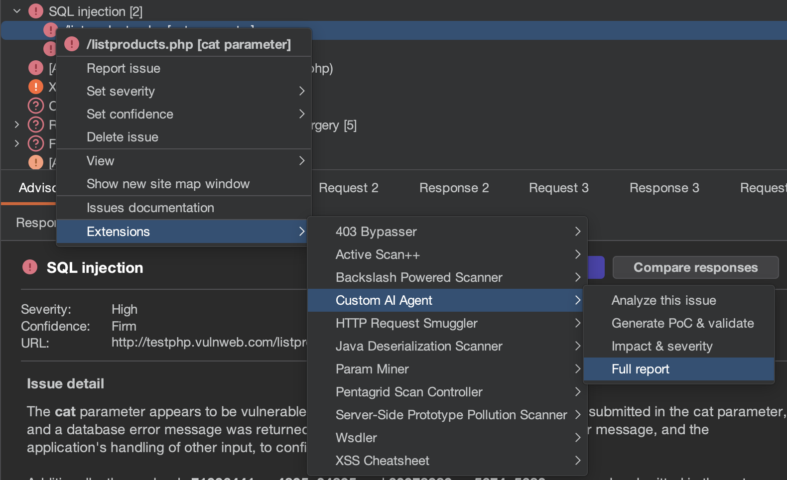

# Context Menus

The extension adds actions to Burp's right-click context menus in multiple tools. Actions are available wherever you can select HTTP requests/responses or scanner issues.

## Where Context Menus Appear

*   **Proxy → HTTP History**: Right-click any request.
*   **Repeater**: Right-click the request or response.
*   **Site Map**: Right-click any entry.
*   **Scanner → Issues** (Pro only): Right-click any finding.

## Request Actions

When you right-click on an HTTP request/response, these actions are available under **Extensions → Burp AI Agent**:

| Action | Description |
| :--- | :--- |
| **Find vulnerabilities** | Comprehensive security analysis: checks for SQLi, XSS, CMDI, SSTI, SSRF, IDOR, BOLA, BAC, information disclosure, header/cookie misconfigurations. |
| **Quick recon** | Compact 5-7 bullet summary: HTTP method, path, auth mechanism, parameters, response type, security observations. |
| **Explain JS** | Analyzes JavaScript behavior, summarizes functionality, and highlights security risks. |
| **Access control** | Generates a test plan for horizontal/vertical privilege escalation, authorization bypass, and missing access controls. |
| **Login sequence** | Drafts a login flow from the observed traffic, identifying parameters to capture and replay. |
| **AI Passive Scan** | Queues the selected request(s) for passive AI analysis in the background. |
| **AI Active Scan** | Queues the selected request(s) for active vulnerability testing. **Sends traffic to the target.** |

## Issue Actions (Burp Pro)

When you right-click on a scanner issue, these actions are available:

| Action | Description |
| :--- | :--- |
| **Analyze this issue** | Deep analysis: explains the vulnerability, identifies root cause, cites evidence from the request/response, and lists validation steps. |
| **Generate PoC & validate** | Produces step-by-step proof-of-concept with exact HTTP requests (curl format where possible), expected responses, and safe validation criteria. |
| **Impact & severity** | Assesses CIA impact, exploitability, business risk, and CVSS considerations. |
| **Full report** | Generates a structured vulnerability report: summary, root cause, evidence, impact, PoC, and remediation recommendations. |

## How It Works

1.  You right-click and select an action.
2.  The extension collects context from the selected request/response or issue.
3.  Context is passed through the [redaction pipeline](../privacy/privacy-modes.md) based on your privacy mode.
4.  The corresponding [prompt template](prompt-templates.md) is combined with the redacted context.
5.  The prompt is sent to the active AI backend.
6.  The AI response streams into a new chat session in the Burp AI Agent tab.

## Multiple Selections

You can select multiple requests in Proxy History or Site Map and apply context menu actions to all of them at once. This is useful for:
*   Batch passive scanning of many endpoints.
*   Queuing multiple targets for active scanning.
