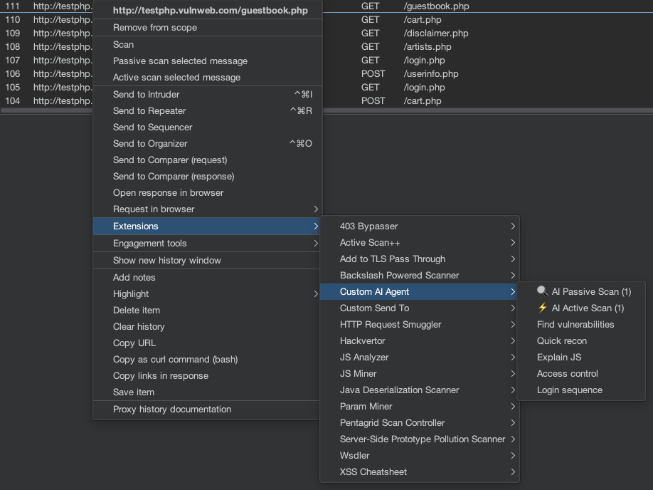
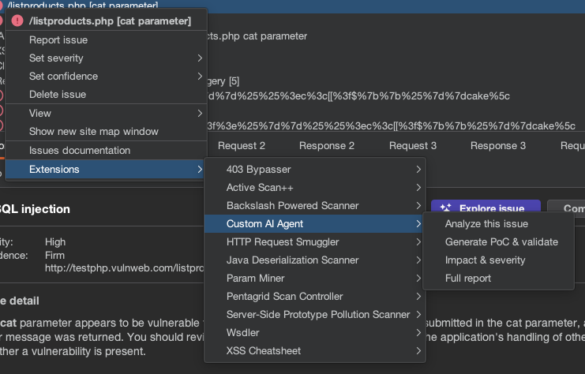

# Context Menus

The extension adds actions to Burp right-click menus in tools where HTTP traffic or scanner findings are selected.

## Where Context Menus Appear

* **Proxy -> HTTP History**: Right-click any request.
* **Repeater**: Right-click the request or response.
* **Site Map**: Right-click any entry or directory/root node. When a tree node is selected (not an individual request), the extension falls back to querying the full site map under that node, with labels showing "(site map - N)" to indicate broader scope.
* **Scanner -> Issues** (Pro only): Right-click any finding.

## Request Actions

When you right-click HTTP request/response items, these actions are available under **Extensions -> Custom AI Agent**:

| Action | Description |
| :--- | :--- |
| **AI Passive Scan** | Queues selected request(s) for passive AI analysis in the background. |
| **AI Active Scan** | Queues selected request(s) for active testing. Sends traffic to the target. |
| **Test 403 Bypass** | Queues selected 403-status requests for active bypass testing using IP spoofing headers, path manipulation, and HTTP method switching. Sends traffic to the target. |
| **Extract JS Endpoints** | Extracts API endpoints from JavaScript responses using regex pattern matching. Shows results in a scrollable dialog. |
| **Targeted tests** | Submenu for focused active checks (SQLi, XSS, SSRF, IDOR, etc.). Sends traffic to the target. |
| **BountyPrompt** | Curated submenu of tag-aware prompts loaded from JSON files. Uses selective context extraction before model invocation. |
| **Find vulnerabilities** | Broad security analysis for injection, auth/access, disclosure, and misconfiguration classes. |
| **Analyze this request** | Compact endpoint summary (method, route, auth, params, response type, security notes). |
| **Explain JS** | JavaScript behavior and risk analysis. |
| **Access control** | Authorization test plan for horizontal/vertical privilege escalation paths. |
| **Login sequence** | Login flow extraction and replay guidance from observed traffic. |
| **Custom prompts** | Submenu of your saved custom prompts (filtered by applicability tag) plus a `Custom…` entry that opens a free-form editor. See [Custom Prompt Library](#custom-prompt-library) below. |



## BountyPrompt Submenu

The **BountyPrompt** submenu is grouped by category:

* **Detection**: API key exposure, CSRF assessment, security headers, vulnerable software, sensitive errors, vulnerable file upload endpoints.
* **Recon**: Endpoint extraction from observed traffic.
* **Advisory**: Suggested follow-up attack vectors.

Menu entries show the selected item count, for example `Security Headers Analysis (3)`.

If BountyPrompt integration is disabled or no curated prompts are loadable from the configured directory, the submenu appears disabled with a tooltip.

## Custom Prompt Library

The **Custom prompts** submenu surfaces saved free-form prompts plus an ad-hoc editor. It appears in both the request/response context menu and the scanner issue context menu. Prompts are filtered by applicability tag (`HTTP_SELECTION`, `SCANNER_ISSUE`, or both) and by the per-entry `Show in context menu` flag.

### Launching a saved prompt

Click any entry in the submenu to run it against the selected context. The flow is:

1. Context capture runs the same way as canned actions (privacy mode redaction, body-size limits).
2. The **Context Preview** dialog opens with the saved prompt and the redacted JSON. **No** extra excerpt preview step — custom-prompt flows use only the exact-send preview.
3. On **Send**, a new chat session opens titled `Custom: <prompt title>` and the response streams in.

### Running an ad-hoc prompt

Pick **Custom…** at the bottom of the submenu to open the free-form editor:

* Multi-line `Prompt` text area.
* Optional **Start from a saved prompt** dropdown (only shown if you have saved prompts tagged for the current context). Picking one fills the text area; you can then edit before sending.
* `Next: preview & send` opens the exact-send preview; `Cancel` aborts.

Ad-hoc prompts do not persist — if you want to reuse, save them from **Settings → Prompt Templates**.

### Managing saved prompts

Open **Settings → Prompt Templates → Custom prompt library**. Each entry has:

| Field | Meaning |
| :--- | :--- |
| **Title** | Menu label and session-title stem. Truncated to 50 chars in the submenu. |
| **Prompt text** | Free-form text sent as the user prompt. No variable substitution in v1 (see below). |
| **HTTP request/response menu** tag | Show in the HTTP context menu. |
| **Scanner issue menu** tag | Show in the scanner-issue context menu. |
| **Show in context menu** | Master toggle. Hidden entries stay in the library but are not exposed in menus. |

Buttons: `Add`, `Edit`, `Duplicate`, `Delete`, `Move Up`, `Move Down`. The list order is the menu order — no auto-sort.

The library is persisted globally (per Burp extension, not per project) as JSON under settings schema v3. Malformed JSON loads as an empty library with an error in Burp's extension log.

### Launch metadata

Every custom-prompt launch carries `promptSource` (`CUSTOM_SAVED` or `CUSTOM_AD_HOC`), `contextKind` (`HTTP_SELECTION` or `SCANNER_ISSUE`), and — for saved prompts — `promptId` (UUID) and `promptTitle`. These are recorded in:

* `AuditLogger` prompt bundles in `~/.burp-ai-agent/bundles/`
* The `prompt` records in `~/.burp-ai-agent/audit.jsonl`
* The `AiRequestLogger` metadata map visible in the AI Logger panel

Filter a jsonl tail for custom launches:

```
tail -n 200 ~/.burp-ai-agent/audit.jsonl \
  | jq 'select(.type=="prompt" and .payload.promptSource!="FIXED") | .payload'
```

Canned actions continue to work unchanged, now stamped with `promptSource=FIXED` plus the correct `contextKind`.

### No variable substitution in v1

Placeholders such as `$URL`, `$REQUEST`, `$RESPONSE` are **not supported** in v1. The prompt text travels through a different path than the context JSON, so interpolating the raw request/response into the prompt string would bypass the `PrivacyMode` redaction pipeline. If variable substitution is added later it will resolve against the already-redacted capture, not the raw HTTP message.

## Targeted Tests Submenu

Examples:

* SQLi
* XSS (Reflected/Stored/DOM)
* SSRF
* IDOR / BOLA
* Path Traversal / LFI
* Command Injection
* SSTI
* XXE
* Open Redirect
* **Custom...** — Opens a multi-select dialog with all 55+ vulnerability classes. Includes Select All / Deselect All buttons for quick selection. *Not to be confused with the `Custom…` entry under the `Custom prompts` submenu, which opens a free-form prompt editor; see [Custom Prompt Library](#custom-prompt-library).*

## Issue Actions (Burp Pro)

When you right-click scanner issues, these actions are available:

| Action | Description |
| :--- | :--- |
| **Analyze this issue** | Detailed analysis with root cause, evidence, and validation flow. |
| **Generate PoC & validate** | Step-by-step proof-of-concept with expected responses and success criteria. |
| **Impact & severity** | CIA impact, exploitability, business risk, and CVSS-style reasoning. |
| **Full report** | Structured vulnerability report for delivery. |
| **Custom prompts** | Submenu of saved custom prompts tagged for scanner issues plus a `Custom…` free-form editor. See [Custom Prompt Library](#custom-prompt-library) below. |



## Execution Flow

1. Select one or more requests/responses or scanner issues.
2. Trigger a context menu action.
3. The extension collects selection context.
4. Privacy mode redaction is applied.
5. Context payload size controls are applied (manual request/response body truncation + optional compact JSON serialization).
6. Action prompt/template is composed.
7. **Context Preview Dialog** opens (see below).
8. If confirmed, the prompt is sent to the selected AI backend.
9. Response streams into a chat session.

For BountyPrompt actions, tag resolution runs after redaction and before prompt composition.

## Context Preview Dialog

Before any auto-captured context leaves the plugin, a modal confirmation opens showing exactly what the AI will see.

| Field | What it shows |
| :--- | :--- |
| **Action** | The menu action that triggered the capture (e.g. `Analyze this request`). |
| **Privacy mode** | Current mode plus a one-line hint: STRICT, BALANCED (cookies and tokens redacted, hosts kept), or OFF (no redaction; raw traffic will be sent). |
| **Prompt** | The exact prompt text that will be sent, after template resolution. |
| **Context** | The exact redacted JSON envelope that will accompany the prompt. |

Two buttons at the bottom:

* **Send** — proceeds with the request, creates the chat session, streams the response.
* **Cancel** (default focus) — aborts. No session is created and nothing leaves the plugin.

The dialog applies to context captured from menus (proxy items, scanner issues, site-map nodes, Repeater). Messages you type inside an existing chat session do not open the dialog because you are the author of that text.

## Context Size Controls for Manual Actions

The **AI Passive Scanner** settings tab includes manual context controls that also affect context-menu actions:

* **Req body chars (manual)** and **Resp body chars (manual)** bound the request/response body content captured for prompt context.
* **Manual context JSON** toggles compact vs pretty JSON serialization for the context envelope.

These controls reduce token usage for non-local models while keeping request/response headers and core metadata intact.

## Multiple Selections

You can select multiple requests in Proxy History or Site Map and run actions across all selected items. This is useful for:

* Batch passive scanning.
* Batch queuing for active scanning.
* Running the same BountyPrompt action across related endpoints.

## Active Scan Safety and Queue Visibility

For active scan actions, the context flow enforces safety and visibility:

* Confirmation dialogs before queueing active tests.
* Target validation before enqueue.
* Queue state visibility (current and maximum queue size).
* Explicit warning when no target is queued (filtered target or full queue).

## Next Steps

* [Chat & Sessions](chat-sessions.md)
* [Passive AI Scanner](../scanners/passive.md)
* [Active AI Scanner](../scanners/active.md)
