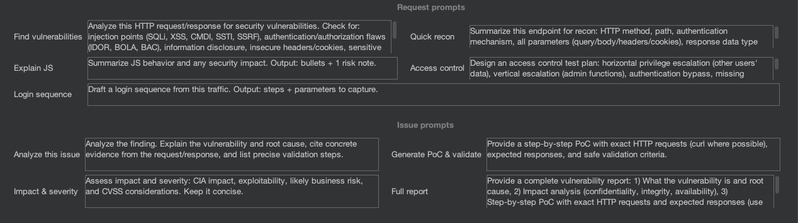

# Prompt Templates

Prompt templates define the default text for each context menu action. They are the instructions sent to the AI along with the selected request/response or issue context. Edit them in **Settings → Prompt Templates**.

## Guide: Prompt Engineering for Pentesters

The quality of the AI's response depends heavily on how you structure the prompt. Consider these techniques when editing templates:

### Role Prompting
Start with a clear role definition:
> *"Act as a senior offensive security expert specialized in web application penetration testing."*

This primes the AI to respond with the appropriate depth and terminology.

### Evidence-Based Reasoning
Instruct the AI to cite specific evidence:
> *"Always cite specific header values, parameter names, or response patterns to justify your findings."*

This reduces hallucination and produces more actionable output.

### Output Formatting
Request structured data:
> *"Provide your findings in Markdown format with sections for Vulnerability Type, Evidence, Severity (CVSS), and Remediation."*

### Step-by-Step PoC
For exploit generation, request structured steps:
> *"Break the PoC into: 1. Attack vector, 2. Payload, 3. Expected response, 4. Success indicator."*

### Scope Limiting
Prevent the AI from speculating beyond the data:
> *"Only report findings supported by evidence in the provided request/response. Do not speculate about vulnerabilities you cannot verify."*

## Request Prompts

These templates are used when you right-click on HTTP requests/responses:

| Template | Used By | Purpose |
| :--- | :--- | :--- |
| **Find Vulnerabilities** | "Find vulnerabilities" action | Comprehensive security analysis covering injection, auth, info disclosure, and misconfigurations. |
| **Quick Recon** | "Quick recon" action | Concise endpoint summary (5-7 bullets). |
| **Explain JS** | "Explain JS" action | JavaScript behavior analysis and security risk notes. |
| **Access Control** | "Access control" action | Authorization test plan for privilege escalation. |
| **Login Sequence** | "Login sequence" action | Login flow extraction from traffic. |

## Issue Prompts

These templates are used when you right-click on scanner issues (Burp Pro):

| Template | Used By | Purpose |
| :--- | :--- | :--- |
| **Analyze this Issue** | "Analyze this issue" action | Deep analysis with root cause, evidence, and validation steps. |
| **Generate PoC & Validate** | "Generate PoC & validate" action | Step-by-step PoC with curl requests and expected responses. |
| **Impact & Severity** | "Impact & severity" action | CIA impact, exploitability, business risk, and CVSS assessment. |
| **Full Report** | "Full report" action | Complete vulnerability report ready for client delivery. |

## Customization

To customize a template:

1.  Navigate to **Settings → Prompt Templates**.
2.  Find the template you want to edit.
3.  Modify the text in the text area.
4.  Changes take effect immediately for new context menu actions.

> **Tip**: You can reset a template to its default by clearing the text field. The extension will fall back to the built-in default.

## Best Practices

*   **Keep templates focused**: Each template should serve a single purpose. Don't try to combine vulnerability analysis with PoC generation in one template.
*   **Include output format**: Tell the AI exactly how you want the response structured (Markdown, bullets, tables).
*   **Test with real data**: After editing a template, test it on a real request to verify the output quality.
*   **Version control**: Consider backing up your custom templates if you've invested significant effort in tuning them.
