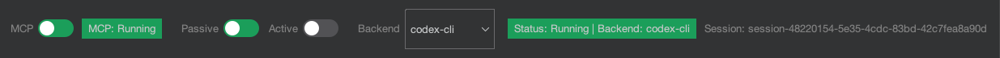
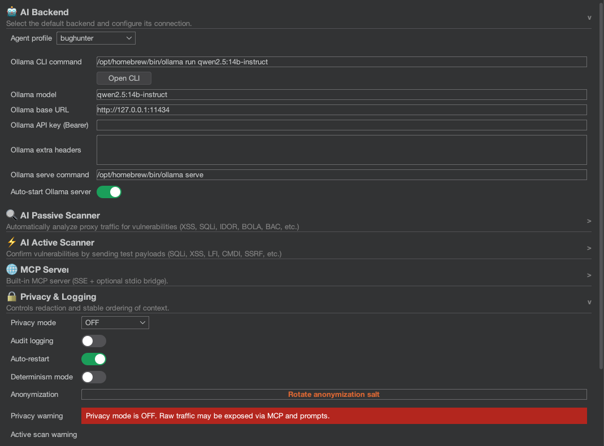

# UI Tour

This section describes every UI area and what it does.

## Top Bar

The top bar provides quick access to the most important controls:

| Control | Description |
| :--- | :--- |
| **MCP** toggle | Starts/stops the MCP server. Green = running. |
| **Passive** toggle | Enables/disables background passive analysis of proxy traffic. |
| **Active** toggle | Enables/disables active scanning (risk-based). See warnings in [Active Scanner](../scanners/active.md). |
| **Backend** selector | Dropdown to choose the AI backend for new sessions. |
| **Status** indicator | Shows backend state (Running, Stopped, Crashed) and MCP server status. |

## Chat Panel

The main interaction area where you communicate with the AI:

*   **Session list**: Left sidebar showing all chat sessions with title, timestamp, and backend used.
*   **Chat area**: Displays conversation with AI responses rendered as formatted **Markdown** (headers, code blocks, tables, lists).
*   **Input field**: Type prompts or paste context. Supports multi-line input.
*   **Tools button**: Inserts MCP tool commands into the input field for forcing specific tool calls.
*   **Context preview**: Shows the redacted context that will be sent to the AI, so you can verify what data leaves Burp.
*   **Streaming**: AI responses stream in real time as they are generated, not as a single block.

## Settings Panel

Accessible via the gear icon or settings sub-tab. Organized into collapsible accordion sections:

| Section | What It Controls |
| :--- | :--- |
| **AI Backend** | Backend selection, CLI commands, HTTP URLs, model names, auto-start, timeouts. |
| **Privacy & Logging** | Redaction mode (STRICT/BALANCED/OFF), determinism, host salt, audit logging toggle. |
| **MCP Server** | Host, port, TLS, external access, STDIO bridge, token, tool toggles, request limits. |
| **Passive AI Scanner** | Rate limit, scope filtering, max size, min severity, findings view. |
| **Active AI Scanner** | Concurrency, payloads per point, timeout, delay, risk level, scan mode, collaborator, auto-queue from passive. |
| **Prompt Templates** | Editable default prompts for all context menu actions. |
| **Help** | Quick links to documentation, MCP setup guide, and version info. |

## Privacy Pill

A small indicator in the UI showing the active privacy mode:
*   **STRICT**: Displayed with a prominent visual indicator to remind you that data is being heavily redacted.
*   **BALANCED**: Moderate indicator.
*   **OFF**: Warning-style indicator to alert you that no redaction is active.

## Dependency Banner

If required dependencies are missing (e.g., a CLI tool not found in PATH), a banner appears at the top of the settings panel with guidance on how to resolve the issue.

## Findings Panel

When scanners are active, the extension provides findings dialogs showing:
*   Passive findings with severity, confidence, and detail.
*   Active findings with confirmed vulnerability evidence.
*   Status metrics (requests analyzed, issues found, queue size).
