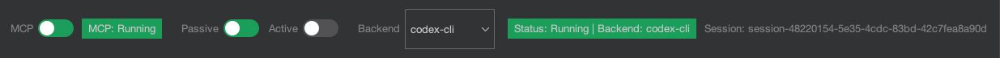

# UI Tour

This page explains each major area of the Custom AI Agent interface.

## Top Bar

| Control | Description |
| :--- | :--- |
| **MCP toggle** | Starts/stops MCP runtime. |
| **Passive toggle** | Enables/disables passive scanner. |
| **Active toggle** | Enables/disables active scanner. |
| **Backend selector** | Backend for new sessions (available only). |
| **Status indicator** | Health state (`AI: OK`, `AI: Degraded`, `AI: Offline`). |

## Chat Panel

* Session list and per-session metadata.
* Usage stats (messages, chars, token estimates).
* Markdown-rendered streaming responses.
* Input box (`Enter` send, `Shift+Enter` newline).
* **Tools** menu for MCP-assisted prompts.
* Context preview and cancellation controls.
* Markdown export per session.

## Settings Panel

The panel is docked at the bottom of the AI Agent tab and can be resized/collapsed.

| Tab | Purpose |
| :--- | :--- |
| **AI Backend** | Backend commands/URLs/models/auth and health testing. |
| **AI Passive Scanner** | Scope/rate/size controls, dedup/cache, context caps, findings. |
| **AI Active Scanner** | Concurrency, risk level, scan mode, queue controls, Collaborator. |
| **MCP Server** | Host/port/TLS/token/limits/unsafe-tool master switch. |
| **Burp Integration** | Per-tool MCP toggles by category. |
| **Prompt Templates** | Built-in template editing and BountyPrompt controls. |
| **Privacy & Logging** | Privacy mode, determinism, salt, audit logging, AI request logger. |
| **AI Logger** | Real-time AI activity log with filters, trace correlation, and export. |
| **Help** | Quick docs and setup references. |

<figure><figcaption></figcaption></figure>

## Privacy Indicator

Visual pill indicates active mode (`STRICT`, `BALANCED`, `OFF`) so you can confirm policy before sending prompts.

## Context Preview Dialog

Every right-click action that auto-captures context (proxy item, scanner issue, site-map node, Repeater) opens a modal before anything leaves the plugin. The modal shows the action, current privacy mode, the exact prompt, and the exact redacted JSON that will be sent. Confirm with **Send** or abort with **Cancel**. See [Context Menus → Context Preview Dialog](context-menus.md#context-preview-dialog) for details.

## Keyboard Shortcuts

* `Cmd/Ctrl + N`: new session
* `Cmd/Ctrl + W`: delete session
* `Cmd/Ctrl + L`: clear chat
* `Cmd/Ctrl + E`: export chat
* `Esc`: toggle settings panel

## Findings Panels

Scanner dialogs expose findings, severity/confidence, and queue/runtime metrics.

## Next Steps

* [Context Menus](context-menus.md)
* [Chat & Sessions](chat-sessions.md)
* [Burp Integration](burp-integration.md)
